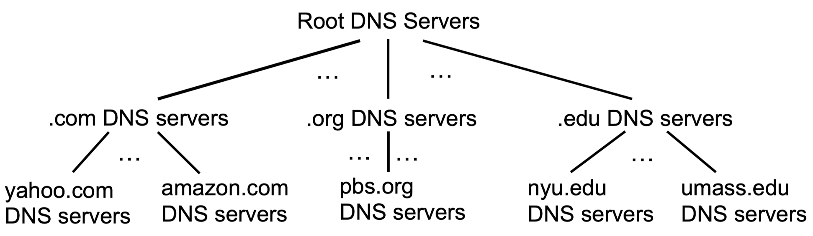

# 2.应用层

## 基本概念

### 客户端-服务器模式

客户（client）和服务器（server）是指通信中所涉及的2个应用进程


### P2P模式

对等 (P2P, Peer to Peer) 方式

对等方式是指两个进程在通信时并不区分服务的请求方和服务的提供方，只要两个主机都运行P2P软件，它们就可以进行平等、对等的通信

P2P方式从本质上看仍然是使用了C/S方式，但强调的是通信过程中的对等，这时每一个P2P进程既是客户同时也是服务器

P2P实体的特征：

1. 不需要总是在线

   虽然每个程序也扮演服务器角色，但与“客户端-服务器”中不同，不需要始终在线

2. 实体可以随时进入与退出

   可以动态改变IP地址，需要额外的管理开销

3. 任意两个实体之间可以直接通信

4. 易于扩展

   每个结点都贡献自己的计算资源，也消耗一部分资源


## WWW、Web对象、URL、静态Web对象、动态Web对象

> 只需掌握名词意思

WWW：WWW=World Wide Web=万维网，Web对象通过URLs定位，服务器与客户端之间执行HTTP协议

Web对象（包括：静态对象和动态对象）：可以是HTML文档、图像文件、视频文件、声音文件、脚本文件等

URL（统一资源定位符，Uniform resource locators）编址：协议类型：//主机名：端口//路径和文件名，不仅可以指向web对象，也可以指向别的对象，如ftp，本地file

静态web对象与静态网页：文本，表格，图片，图像和视频等多媒体类型的信息（实现语言：标记语言，如：HTML, XML, PHP)，包含字体、颜色和布局等风格类型的信息（实现语言：层叠样式表CSS）

动态web对象与动态网页：交互信息，比如，用户注册信息、登录信息等（实现：PHP/JSP等语言+MySQL等数据库）


## HTTP

HTTP为无状态协议，服务器端不保留之前请求的状态信息
无状态协议：效率低、但简单
有状态协议：维护状态相对复杂，需要维护历史信息，在客户端或服务器出现故障时，需要保持状态
的一致性等，比较复杂，http放弃有状态协议

但是HTTP从非持久连接逐渐演化为了持久连接

### HTTP1.x执行过程

非持久连接和持久连接：


HTTP 2：服务器可以主动推送消息：确认客户端存活、预测资源请求

HTTP 3：主要是传输层变化，与应用层关系不大，将TCP替换UDP + QUIC

### 报文格式

>请求报文：Method 字段的取值只要求掌握GET与POST 的作用
>响应报文：掌握典型状态码

请求报文：

请求报文由三个部分组成，即开始行（请求报文中开始行又称请求行）、首部行和实体主体


GET与POST方法的比较：POST方法也可以用于请求URL资源，但是GET方法参数在请求行URL，通常浏览器或服务器对URL长度有限制（2048字符），因此参数长度有限；POST方法的参数在实体主体中，参数长度没有限制


响应报文：

响应报文由三个部分组成，即开始行（响应报文中开始行又称状态行）、首部行和实体主体


### 缓存

> 缓存部分：启发式策略不要求

分为浏览器缓存和代理服务器缓存

询问式策略：通过特殊的关键字头询问原始服务器，Web副本对应的原始Web页是否已更新

询问式策略：通过特的关键字头询问原始服务器，Web副本对应的原始Web页是否已更新

客户端：在发送的HTTP请求中指定缓存的时间，请求头包含If-modified-since： <date>

服务器：如果缓存的对象是最新的
• 在响应时无需包含该对象，响应头包含HTTP/1.1 304 NotModified,
• 否则服务器响应 HTTP/1.1 200 OK <data>


### Cookie

由于HTTP是无状态协议，需要用cookie保持用户状态

HTTP在响应的首部行里使用一个关键字头set-cookie：选择的cookie号具有唯一性
后继的HTTP请求中使用服务器响应分配的cookie：Cookie文件保存在用户的主机中，内容是服务器返回的一些附加信息，由用户主机中的浏览器管理Web服务器建立后端数据库，记录用户信息，cookie作关键字

例如：
• Set-Cookie: SID=31d4d96e407aad42; Path=/; Domain=example.com
• Cookie: SID=31d4d96e407aad42


存放在浏览器上的Cookies一般包含5个字段

• 域指明Cookie来自何方，每个域为每个客户分配Cookie有数量限制

• 路径标明服务器的文件树中哪些部分可以使用该Cookie

• 内容采用“名字=值”的形式，是Cookie存放内容的地方，可以达到4K容量，内容只是字符串，不是可执行程序

• 过期代表过期时间

• 安全指示浏览器只向使用安全传输连接的服务器返回Cookie

Cookie技术好处：

•用Cookie在某网站标识用户信息，查找用户以前浏览网站记录
•用Cookie记录用户购物清单
•用Cookie可以保存4K内容，跟踪用户浏览网站的喜好
•用Cookie跨站点跟踪用户点击广告

Cookie技术坏处：

•能跟踪用户网络浏览痕迹，泄露用户隐私
•Cookie跟踪用户以前浏览过哪些网站，跟踪用户频繁浏览哪类网站
• Cookie收集用户信息，用户网络交互时关注的关键词

Cookie**<u>容易嵌入间谍程序，这是个误区</u>**，Cookie文件保存的只是文本串，没有可执行程序


## DNS
> 具体域名不考、域名管理机构不考
> 报文格式只需了解3个部分，每部分具体字段不要求（考试会给出）

域名系统（DNS,Domain Name System）：将域名映射成IP地址

1. 可以基于域名查询IP地址
2. 可以基于IP地址，反向查询域名

DNS提供的是与网络层有关的功能，但以应用层技术的方式实现，将复杂功能在网络边缘实现

多个域名映射到同一IP ：一台主机可能有多个名字（别名），以便于记忆，其中一个是叫“规范名” 最正确，最权威

一个域名对应多个IP：同一域名可以由多个主机进行服务，所以DNS起了延迟优化与负载均衡的作用


### 域名服务器

Internet的DNS：层次化、分布式数据库，若干个域名服务器（Domain Name Server），也叫名字服务器（Name Server）

分布式的好处
•避免单点故障
• 能够处理海量流量




三级域及以下的名字服务器也统称为本地域名服务器（Local DNS Server） 或 迭代域名服务器

•每一个Internet服务提供者ISP（Internet Service Provider），都至少有一个本地DNS服务器（又称递归服务器），距离用户主机较近
•最简单的部署层次是只有一层本地域名字服务器，即三级域名字服务器
•实际部署中，解析请求路径上的递归服务器/本地域名服务器可能有多层

**<u>本地DNS服务器就是想要查询DNS的主机对应的DNS服务器</u>**


### 域名解析过程

当某一应用进程需要进行域名解析时，该应用进程将域名放在DNS请求报文（UDP数据报，目标端口号为53）发给本地DNS服务器

**<u>本地DNS服务器</u>**得到查询结果后，将对应IP地址放在应答报文中返回给应用进程

域名查询有递归查询（recursive query）和迭代查询（或循环查询，iterative query）两种方式
• 主机向本地DNS服务器的查询一般采用递归查询
•本地DNS服务器向更上层域名服务器可以采用递归查询，但一般优先采用迭代查询
•实际中，请求方与服务器有一定自主权选择哪种方式


DNS报文格式分为三部分：基础结构（报文首部）、问题、资源记录（RR, Resource Record，只有响应报文才会出现）

报文类型分为查询请求（query）和查询响应（reply）两类，请求和响应的报文结构基本相同


### DNS 安全

DNS协议设计之初没有过多考虑安全问题
导致DNS存在以下缺陷：几乎所有DNS流量都是**<u>基于UDP明文</u>**传输的，DNS的资源记录未加上任何的认证和加密措施

DNSSEC安全机制：

在DNSSEC的使用中
• 域名服务器用自己的私有密钥对资源记录（Resource Record, RR）进行签名
• 解析服务器用域名服务器的公开密钥对收到的应答信息进行验证
• 如果验证失败，表明这一报文可能是假冒的，或者在传输过程、缓存过程中被篡改了


1. **请求 `test.net` 的DS记录**：
   - 解析器向管理 `.net` 的服务器请求 `test.net` 的DS（委派签名，子域的公钥DNSKEY的哈希值）记录。
   - `.net` 的服务器返回 `test.net` 的DS记录和该DS记录的RRSIG（由 `.net` 的私钥签名）。

2. **解析器验证DS记录**：
   - 使用 `.net` 的公钥（一个可信的锚点）来验证DS记录的RRSIG。
   - 如果验证成功，这表明DS记录是真实的。

3. **请求 `www.test.net` 的信息**：
   - 解析器请求管理 `test.net` 的服务器提供 `www.test.net` 的信息。

4. **返回 `www.test.net` 的A记录和RRSIG**：
   - `test.net` 的服务器返回 `www.test.net` 的A记录和这个A记录的RRSIG（由 `test.net` 的私钥签名）。

5. **请求 `test.net` 的DNSKEY记录**：
   - 解析器请求 `test.net` 的DNSKEY记录。

6. **返回 `test.net` 的DNSKEY记录和RRSIG**：
   - `test.net` 的服务器返回它的DNSKEY记录和这个DNSKEY记录的RRSIG。

验证过程：

- **验证 `test.net` 的DNSKEY**：使用DS记录来验证 `test.net` 的DNSKEY。
- **验证 `www.test.net` 的A记录**：使用 `test.net` 的DNSKEY来验证A记录的RRSIG。

在这个过程中，解析器通过一系列步骤验证了从不同层级的DNS服务器接收到的DNS记录的真实性。这种验证机制是建立在信任链上的，从可信的锚点（如 `.net` 的DNSKEY）开始，逐步验证下一级域（如 `test.net`）的DNSKEY和其他记录。通过这种方式，DNSSEC确保了在域名解析过程中数据的安全性和可靠性。


**<u>我的总结：</u>**

我们会收到来自 `test.net` dns服务器的对 `www.test.net` 的dns解析报文和这个报文的签名，也就是：

从原数据 `A` 和 `RRSIG = t = RSA(SHA256(A), key_private)` 我们得到：`A'` 和 `t'`

我们需要验证：`RSA(A') == RSA'(t', key_public)` 就可以说明原数据 `A` 没有被篡改

但是万一 `key_public` 也被篡改了，那我们这样检测就不一定能确定 `A` 被篡改了，因为别人可以用自己的私钥生成数据 `A` ，这样我们一算就发现满足上述这个等式了，三个变量都是被篡改过的了

所以我们要确认 `key_public` 没有被篡改过，那么验证 `SHA256(key_public)` 是对的即可

以下使用 `.net` 的公钥验证 `.test.net` 的公钥 `key_public` 是对的


假设我们能够确认 `.net` 的公钥是对的，那我们可以从 `.net` 的dns服务器申请 `.test.net` 的dns服务器的公钥的哈希值，也就是：

从原数据 `DS = SHA256(key_public)`  和 `RRSIG = t = RSA(SHA256(DS), key_private_of_.net)` 我们得到 `DS'` 和 `t'`

我们需要验证：`RSA(DS') == RSA'(t', key_public_of_.net)` 就可以说明原数据 `DS` 没有被篡改

那么我们验证 `DS == SHA256(key_public)` 即可说明 `key_public` 没有被篡改


当然，实际过程是从上往下，我的描述是从下往上，只是为了方便说明思路


## 电子邮件

### 电子邮件系统的组成


### 各个协议的功能


SMTP的不足：
•不包括认证
• 传输ASCII而不是二进制数据
• 邮件以明文形式出现

SMTP定义了如何传输邮件，但邮件本身也需遵循特定格式，首部（header）必须含有一个From：首部行和一个To：首部行，还可以包含 Subject：等其他可选的首部行，消息体（body）邮件正文

RFC 5322—Internet邮件格式
• 基本ASCII电子邮件使用RFC 5322
•最新修订的Internet邮件格式，其前身是RFC 822

RFC 5322为SMTP 提供指导：在使用SMTP传输电子邮件时，邮件的格式必须符合 RFC 5322的规定。这意味着 SMTP 服务器在处理邮件时，会参照 RFC 5322来解析和验证邮件的结构和头部信息。


MIME (Multipurpose Internet Mail Extensions) 多用途Internet邮件扩展
• 基本格式的多媒体扩展
• 可传输多媒体消息和二进制文件


为什么不能使用SMTP获取邮件？
•接收方的用户代理不能使用SMTP从传输代理获取邮件，因为取邮件是一个拉操作
•而SMTP 是一个推协议，需要推送目标在线
•通过引入最终交付（邮件访问）协议来解决这个问题。

最终交付（邮件访问）协议：从邮件服务器的邮箱中获取邮件
• POP3:Post Office Protocol-Version 3，第三版邮局协议
• IMAP: Internet Message Access Protocol,Internet邮件访问协议
• Webmail （HTTP）：基于Web的电子邮件


POP3由RFC1939定义，**<u>POP3使用客户/服务器</u>**工作方式，在接收邮件的用户PC机中必须运行POP客户程序，而在用户所连接的ISP的邮件服务器中则运行POP服务器程序。是一个非常简单的最终交付协议，当用户代理打开一个到端口110上的TCP连接后，客户/服务器开始工作
POP3的三个阶段：
•认证（Authorization）：处理用户登录的过程
•事务处理（Trnsactions）：用户收取电子邮件，并将邮件标记为删除
• 更新（Update）：将标为删除的电子邮件删除


IMAP—Internet邮件访问协议［RFC 2060］
• 用于最终交付的主要协议
• IMAP是较早使用的最终交付协议一POP3（邮局协议，版本3）的改进版
• 邮件服务器运行侦听端口143的IMAP服务器
•用户代理运行一个IMAP客户端
•客户端连接到服务器并开始发出命令

**<u>IMAP服务器把每个邮件与一个文件夹联系起来：</u>**
•当邮件第一次到达服务器时，它与收件人的INBOX文件夹相关联
•收件人能够把邮件移到一个新的、用户创建的文件来中，阅读邮件，删除邮件等

**<u>IMAP允许用户代理获取邮件某些部分</u>**，例如，一个用户代理可以只读取一个邮件的首部，或只是一个多部分MIME邮件的一部分，用户代理和其邮件服务器之间使用低带宽连接（如一个低速调制解调器链路）的时候，用户可能并不想取回邮箱中的所有邮件，其要避免可能包含如音频或视频片断的大邮件

IMAP的缺点是如果用户**<u>没有将邮件复制到自己的PC上</u>**，则邮件一直是存放在IMAP服务器上。因此用户需要经常与IMAP服务器建立连接


Webmail-基于Web的电子邮件
• 提供电子邮件服务的IMAP和SMTP替代方案
•使用Web作为界面，用户代理就是普通的浏览器
• 用户及其远程邮箱之间的通信通过HTTP进行


## P2P

### 基本概念

每个实体都是一个对等结点（peer），去中心化的连接与传输


P2P协议中，资源索引都是最关键的问题
•目标：给定资源，查询拥有资源的peer
• Peer可以随时加入或者退出，也可以动态更改IP地址

中心化索引的问题
单点故障
性能瓶颈

解决方案：Query Flood（洪泛请求）
每个peer独立建立索引，记录自身拥有的资源
Peer之间形成一个图（graph）
•图中的边为**<u>TCP连接</u>**
•通常每个peer建立小于10个连接
•注意：peers与TCP连接形成的网络，又被成为**<u>Overlay网络</u>**，有别于IP网络
查找资源：
•每个peer向邻居peer查询，如果邻居peer没有该资源，则邻居peer向自身邻居递归查询，一旦查询到结果，沿查询路径返回最初的查询发起者

问题：产生大量网络消息，可扩展性有限


解决方案：混合索引，介于中心化索引与洪泛索引之间
将Overlay网络组织为层次化结构
•存在超级结点
•每个普通结点连向至少1个超级结点
•超级结点之间可以任意建立连接
普通结点与超级结点间，使用中心化索引
•超级结点扮演中心化服务器
•超级结点记录“资源->网络位置”映射
超级结点间采用去中心化的洪泛方式查询索引


### BitTorrent

BitTorrent是基于P2P思想的文件分发的一个协议，不是纯P2P架构，所有正在交换某个文件的peer，组成一个torrent（种子）

中心化的跟踪器（Tracker）：
• 一个独立服务器
•维护着一个正在主动上传和下载该内容的所有其他对等用户列表
• 对等方可以通过Tracker（跟踪器）找到其他对等方

文件被划分为256Kb大小的块（chunk），从跟踪器获取peer列表，同其他peer交换文件块，节点动态加入和退出，但是获取整个文件后，存在自私离开可能


### 分布式哈希表

分布式哈希表 （distributed hash tables, DHTs）不需要中心化追踪器，就能查询每个key在哪个peers上，DHT是一个概念，具体有多种实现方式

基本思想：
• 对所有peers地址，以及keyi算哈希值
•哈希值取模后，排列在一个圆环上
•每个key由圆环上顺时针方向的下一个peer负责存储
•若查询失败，则继续沿着顺时针方向查询


新增Peer位于位置5：
1. 通知位置3与0上的Peers进行更新
2. 从Peer O将数据4与5迁移到新peer

问题1：负载均衡
•由于哈希值的不确定性，结点分布可能不均衡
问题2:Peer之间能力不一样
解决方案：将每个peer划分成更多虚拟结点


假设结点1存储资源最多
划分前：
数据4、5、6、7、0都存在结点0，结点1只存数据1
划分后：
结点1存储数据1、4、5、6


## Socket编程

### TCP

服务器：

```c
#include <stdio.h>
#include <stdlib.h>
#include <string.h>
#include <unistd.h>
#include <netinet/in.h>
#include <sys/socket.h>

#define PORT 8080  // 服务器监听的端口
#define BUFFER_SIZE 1024

int main() {
    int server_fd, new_socket;
    struct sockaddr_in address;
    int addr_len = sizeof(address);
    char buffer[BUFFER_SIZE] = {0};

    // 创建套接字
    if ((server_fd = socket(AF_INET, SOCK_STREAM, 0)) == 0) {
        perror("socket failed");
        exit(EXIT_FAILURE);
    }

    // 设置套接字选项，防止端口被占用
    int opt = 1;
    if (setsockopt(server_fd, SOL_SOCKET, SO_REUSEADDR | SO_REUSEPORT, &opt, sizeof(opt))) {
        perror("setsockopt");
        exit(EXIT_FAILURE);
    }

    address.sin_family = AF_INET; // 使用IPv4
    address.sin_addr.s_addr = INADDR_ANY; // 绑定到所有可用接口
    address.sin_port = htons(PORT); // 设置端口号

    // 绑定套接字到指定IP和端口
    if (bind(server_fd, (struct sockaddr *)&address, sizeof(address)) < 0) {
        perror("bind failed");
        exit(EXIT_FAILURE);
    }

    // 开始监听端口
    if (listen(server_fd, 3) < 0) {
        perror("listen");
        exit(EXIT_FAILURE);
    }

    // 接受连接
    if ((new_socket = accept(server_fd, (struct sockaddr *)&address, (socklen_t*)&addr_len)) < 0) {
        perror("accept");
        exit(EXIT_FAILURE);
    }

    // 读取数据
    read(new_socket, buffer, BUFFER_SIZE);
    printf("Received: %s\n", buffer);

    // 回送数据
    send(new_socket, buffer, strlen(buffer), 0);
    printf("Echoed back: %s\n", buffer);

    // 关闭套接字
    close(new_socket);
    close(server_fd);
    return 0;
}

```


客户端：

```c
#include <stdio.h>
#include <stdlib.h>
#include <string.h>
#include <unistd.h>
#include <arpa/inet.h>
#include <sys/socket.h>

#define PORT 8080  // 服务器端口
#define BUFFER_SIZE 1024

int main() {
    int sock = 0;
    struct sockaddr_in serv_addr;
    char buffer[BUFFER_SIZE] = {0};
    char *message = "Hello TCP Server!";

    // 创建套接字
    if ((sock = socket(AF_INET, SOCK_STREAM, 0)) < 0) {
        printf("\n Socket creation error \n");
        return -1;
    }

    serv_addr.sin_family = AF_INET;
    serv_addr.sin_port = htons(PORT);

    // 将地址转换为二进制形式
    if (inet_pton(AF_INET, "127.0.0.1", &serv_addr.sin_addr) <= 0) {
        printf("\nInvalid address/ Address not supported \n");
        return -1;
    }

    // 连接到服务器
    if (connect(sock, (struct sockaddr *)&serv_addr, sizeof(serv_addr)) < 0) {
        printf("\nConnection Failed \n");
        return -1;
    }

    // 发送消息
    send(sock, message, strlen(message), 0);
    printf("Message sent: %s\n", message);

    // 接收回声
    read(sock, buffer, BUFFER_SIZE);
    printf("Echo received: %s\n", buffer);

    // 关闭套接字
    close(sock);
    return 0;
}

```


### UDP

服务器：

```c
#include <stdio.h>
#include <stdlib.h>
#include <unistd.h>
#include <netinet/in.h>
#include <string.h>
#include <sys/socket.h>

#define PORT 8080  // 服务器监听的端口
#define BUFFER_SIZE 1024

int main() {
    int sockfd;
    char buffer[BUFFER_SIZE];
    struct sockaddr_in servaddr, cliaddr;

    // 创建套接字
    if ((sockfd = socket(AF_INET, SOCK_DGRAM, 0)) < 0 ) {
        perror("socket creation failed");
        exit(EXIT_FAILURE);
    }

    memset(&servaddr, 0, sizeof(servaddr));
    memset(&cliaddr, 0, sizeof(cliaddr));

    servaddr.sin_family = AF_INET; // IPv4
    servaddr.sin_addr.s_addr = INADDR_ANY; // 绑定到所有可用接口
    servaddr.sin_port = htons(PORT); // 设置端口号

    // 绑定套接字
    if (bind(sockfd, (const struct sockaddr *)&servaddr, sizeof(servaddr)) < 0 ) {
        perror("bind failed");
        exit(EXIT_FAILURE);
    }

    int len, n;
    len = sizeof(cliaddr);

    // 接收数据
    n = recvfrom(sockfd, (char *)buffer, BUFFER_SIZE, 0, (struct sockaddr *) &cliaddr, &len);
    buffer[n] = '\0';
    printf("Received: %s\n", buffer);

    // 回送数据
    sendto(sockfd, (const char *)buffer, strlen(buffer), 0, (const struct sockaddr *) &cliaddr, len);
    printf("Echoed back: %s\n", buffer);

    // 关闭套接字
    close(sockfd);
    return 0;
}

```


客户端：

```c
#include <stdio.h>
#include <stdlib.h>
#include <unistd.h>
#include <string.h>
#include <arpa/inet.h>
#include <sys/socket.h>

#define PORT 8080
#define BUFFER_SIZE 1024

int main() {
    int sockfd;
    char buffer[BUFFER_SIZE];
    char *message = "Hello UDP Server!";
    struct sockaddr_in servaddr;

    // 创建套接字
    if ((sockfd = socket(AF_INET, SOCK_DGRAM, 0)) < 0 ) {
        perror("socket creation failed");
        exit(EXIT_FAILURE);
    }

    memset(&servaddr, 0, sizeof(servaddr));

    servaddr.sin_family = AF_INET; // IPv4
    servaddr.sin_port = htons(PORT); // 设置端口号
    servaddr.sin_addr.s_addr = INADDR_ANY; // 目的地址

    int n, len;
    len = sizeof(servaddr);

    // 发送消息
    sendto(sockfd, (const char *)message, strlen(message), 0, (const struct sockaddr *) &servaddr, len);
    printf("Message sent: %s\n", message);

    // 接收回声
    n = recvfrom(sockfd, (char *)buffer, BUFFER_SIZE, 0, (struct sockaddr *) &servaddr, &len);
    buffer[n] = '\0';
    printf("Echo received: %s\n", buffer);

    // 关闭套接字
    close(sockfd);
    return 0;
}

```


## 流媒体

### 三种服务模式

常见的流媒体服务
• 媒体点播：提前录制好，边下载边播放（起始时延<10s；类VCR操作（例如拖动进度条）＜1~2s）
• 媒体直播：边录制边上传，边下载边播放（大规模直播往往有数秒的时延）
• 实时交互：双方或多方实时交互式通信（时延<400ms可接受，VR则需要<25ms）

### RTSP、RTP、RTCP 功能（工作过程不要求）

实时传输协议 RTP （Real-time Transport Protocol）
•使用**<u>UDP</u>**，快
•RTP 为实时应用提供端到端的数据传输，但**<u>不提供任何服务质量的保证</u>**
• RTP 对多媒体数据块，**<u>不做任何处理</u>**，处理指编码、解码、缓存等，这些都是媒体播放器负责

实时传输控制协议 RTCP （RTP Control Protocol）
• RTCP 是**<u>与 RTP 配合</u>**使用的控制协议
• RTCP 的主要功能：**<u>服务质量的监视与反馈、媒体间的同步</u>**、播组中成员的标识
• RTCP 分组也使用 **<u>UDP</u>** 传送
•可将多个 RTCP 分组封装在一个 UDP 用户数据报中
•RTCP 分组周期性地在网上传送，它带有发送端和接收端对服务质量的统计信息报告
**<u>RTP与RTCP很少直接使用，大多作为其他流媒体协议的基础</u>**

实时流式协议RTSP （Real-Time Streaming Protocol）
RTSP**<u>本身并不传送数据</u>**，是一个多媒体播放控制协议，通用性好
• 没有定义音频/视频的编码方案
• 没有规定音频/视频在网络中传送时应如何封装在分组中
• 没有规定音频/视频流在媒体播放器中应如何缓存
RTSP对播放情况进行控制，如：暂停/继续、后退、前进等，又称为“互联网录像机遥控协议"
RTSP是**<u>有状态的协议</u>**，它**<u>记录用户所处于的状态（初始化状态、播放状态或暂停状态）</u>**
RTSP控制分组**<u>既可在TCP上传送，也可在UDP上传送</u>**，使用UDP时，底层就是使用RTP+RTCP