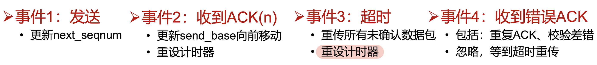

# 3.传输层

## 传输层基本概念

传输层应提供进程之间通信的抽象，传输层=将快递从发送者手里取走，交给对应的接收者网络层= 两校快递站之间的传递，主机间通信与应用程序间通信的区别

传输层可以通过差错恢复、重排序等手段提供可靠、按序的交付服务，但无法提供延迟保证、带宽保证等服务

### 套接字

是app开发者和操作系统之间的api

### 端口号

由于tcp，udp是基于网络层的协议，所以其本身只需要比网络层多用端口号，所以tcp和udp报文中只包含端口号

端口号的分类：
• 熟知端口：0~1023，由公共域协议使用，http, server: 80
•注册端口：1024~49151，需要向IANA注册才能使用
•动态和/或私有端口：49152~65535，一般程序使用

### ★复用与分用

（发送端） 复用（multiplexing）：传输层从多个套接字收集数据，交给网络层发送 

（接收端）分用（demultiplexing）：传输层将从网络层收到的数据，交付给正确的套接字

UDP分用：

UDP套接字使用 <IP地址，端口号> 二元组进行标识

接收方传输层收到一个UDP报文段后：
•检查报文段中的目的端口号，将UDP报文段交付到具有该端口号的套接字
•＜目的IP地址，目的端口号>相同的UDP报文段被交付给同一个套接字，与<源IP地址，源端口号＞无关
•ip报文段中的源IP地址，udp报文段中的源端口号，被接收进程用来发送响应报文

> 也就是如果两个不同的地方（不同的源ip源port）给同一个目的port发，会传到同一个套接字
>
> 这也与UDP套接字只有服务套接字没有监听和连接套接字相印证，因为每一个连接套接字相当于对于每一个源ip源port开一个新的套接字，而UDP对于所有的源ip源port都传输到同一个套接字

TCP分用：

一个TCP服务器为了同时服务很多个客户，使用两种套接字

监听套接字：
•服务器平时在监听套接字上等待客户的连接请求，该套接字具有众所周知的端口号

连接套接字： 监听与连接套接字使用一个端口号
•服务器在收到客户的连接请求后，创建一个连接套接字，但使用原监听端口号
•每个连接套接字只与一个客户通信，即只接收具有以下四元组的报文段：
•源IP地址 =客户IP地址，源端口号=客户套接字端口号
•目的IP地址=服务器IP地址，目的端口号=服务器监听套接字的端口号

连接套接字需要使用<源IP地址，目的IP地址，源端口号，目的端口号>四元组进行标识，服务器使用该四元组将TCP报文段交付到正确的连接套接字

### 传输粒度与报文边界

UDP：以报文为单位进行传输，应用可以感知报文边界 

TCP：字节流传输，应用感知不到报文边界

## UDP

### UDP提供的服务

1. 对网络层接口进行最简单的封装：网络层＋多路复用与分解
2. 报文完整性检查（可选）：检测并丢弃出错的报文

### UDP报文段结构

### UDP checksum

将数据划分为一系列16-bit整数，将所有整数相加，如果相加结果最高位为1（16比特溢出），则将1加到低位16bit部分，将最终结果取反

计算UDP校验和时，要包括伪头、UDP头和数据三个部分

UDP伪头信息**<u>取自IP报头</u>**，包括：
•源IP地址，目的IP地址
•UDP的协议号
• UDP报文段总长度

计算校验和包含伪头信息，是为了避免由于IP地址错误等造成的误投递

**<u>UDP校验和是可选的</u>**，若不计算校验和，该字段填入0

UDP校验和校验的时候，接收方对UDP报文（包括校验和）及伪头求和，若**<u>结果为0xFFFF</u>**，认为没有错误

UDP校验和检测失败？即checksum仍有可能检测不出错误
•如：两个16位整数，在同一个bit位发生0-1翻转
•此时，由应用层负责发现、处理错误

为什么使用checksum？
•传输层发生错误**<u>概率非常小</u>**：链路层一般有检测、纠错功能，已经将大部分网络传输过程中的错误处理了；并且传输层错误一般来自于**<u>主机</u>**软件bug or 硬件故障->小概率事件
•计算开销小

### UDP缓冲区？

通常端系统的实现（如Linux）：无发送缓冲区、有接收缓冲区

发送方：从应用层获取的数据，传输层加上UDP头部后直接交给网络层
•长消息的分片、缓冲依赖于网络层、链路层提供

接收方：每个socket一个缓冲区，存储着来自不同发送方的报文
• 每次获得一个报文，下一次接收可能得到的是来自另一个发送方的报文
• 因此，应用层是可以感知到报文边界

### 为什么需要UDP？

1. 应用可以尽可能快地发送报文：
   •无建立连接的延迟
   •不限制发送速率（不进行拥塞控制和流量控制）
2. 报头开销小
3. 协议处理简单

### UDP适合哪些应用？

容忍丟包但对延迟敏感的应用：
• 如流媒体

以单次请求/响应主的应用：
• 如DNS

若应用要求基于UDP进行可靠传输：
• 由应用层实现可靠性

## ★一般性可靠传输

### 完美信道：rdt 1.0

### 有错但不丢包信道：rdt 2.0, rdt 2.1, rdt 2.2

自动重传请求（ARQ, Automatic Repeat reQuest）：基于反馈的重传
•三要素：（接收方）差错检测、（接收方）反馈、（发送方）重传

rdt 2.0：

发送方：发送一个数据包后暂停，等待ACK或NAK到达后发送下一个包

接收方
•若检测数据包有错，返回NAK
•否则，完成接收后，回复ACK

rdt2.0是最简单的ARQ协议，但是ACK与NAK的内容是不重要的：哑帧（dummy frame）

此类协议又称停-等式协议（stop-and-wait）：发送1个报文后就停下，等待后再发

rdt 2.0的缺陷：如果ACK或NAK出错，发送方不知道接收方的状况

rdt 2.1：如果ACK或NAK出错，发送方直接重传

使用序号seq区分当前数据包是否是前一次发送的重传

**<u>注意默认没有顺序错误，所以只可能接收到正确的包或者上一个包的重传，不可能出现接收到上上个包的重传的情况，所以只用01的seqnum即可</u>**

rdt 2.2：NAK就不再需要

当ACK出错或ACK.seq ！= seq，发送方进行重传

### 有错且丢包信道：rdt 3.0

仍然假设没有乱序！

发送方增加一个计时器（timer），如果经过一段时间没有收到确认，发送方将超时，于是再次发送该数据包

一个超时重传导致之后过早重传的例子：

### 停等式协议的效率

停止等待协议的发送工作时间是F/R，空闲时间是RTT
信道利用率 （line utilization）=F/（F+R•RTT）
当F/R<RTT 时：信道利用率＜50%

长肥网络（LFN,Long Fat Network）：如果 一个网络的带宽-延迟乘积（bandwidth-delay product）较高（>105 bits，约12kB），则可以被认为是长肥网络

在一个transit time=270ms的长肥信道中，利用率很低：每一帧的发送时间是1毫秒（1000 bits/（1,000,000 bits/sec）.由于传播延迟较长，发送者在541毫秒之后才能收到确认，信道利用率1/541

停止等待协议的问题是只能有一个没有被确认的帧在发送中，假如将链路看成是一根管道，数据是管道中流动的水，那么在传输延迟较长的信道上，停-等协议无法使数据充满管道，因而信道利用率很低

一种提高效率的方法：可以使用更大的帧，但是帧的最大长度受到信道比特错误率（BER，Bit Error Ratio）的限制，帧越大，在传输中出错的概率越高，将导致更多的重传

## ★一般性可靠传输的性能优化

### 流水线传输

根据“反馈+重传”的不同，有2种方法：回退N步（Go-back-N,GBN）、选择重传（Selective Repeat, SR)

限制最多有N个未确认数据包，N由多种机制共同决定，与后续内容有关：流量控制、拥塞控制

### 回退N算法（GBN）

思想
•当接收端收到一个出错帧或乱序帧时，丢弃所有的后继帧，并且不为这些帧发送确认
•发送端超时后，重传所有未被确认的帧

要点
•发送方保存所有未确认数据包，构成一个先进先出队列，seq值连续，只需维护seq的上下界
• 接收端无需保存数据包，只要记住下一个期望收到的seq

优劣
•优点：减轻接收端负担
•缺点：重传包数量大，增加发送端与信道负担

发送方保存所有未被确认数据包（最多N个）
• send_base：当前第一个未确认数据包
• next _seqnum：下一个发送数据包的seq值

ACK不是下一个想收到的（与 lab 要求的不同），就是已经收到的

### 选择重传算法（SR）

设计思想
• 接收方对每个数据包独立确认
•若发送方发出连续的若干包后，收到对其中某一包的ACK错误，或某一包的定时器超时，则只重传该出错包或计时器超时的数据包

要点
•发送端需要对每个包维护计时器
•接收端需要缓存已经接收的数据包，以便按顺序交付给上一层

优劣
•优点：减少重传数量
•缺点：接收端缓存、发送端逐包计时器，增加存储开销，减少带宽开销

复用seq对选择重传的影响：

解决方案：窗口大小不能超过seq取值空间的一半（证明）：举这个例子，两个窗口可能产生错位

思考题：在回退n中是否有这种要求（去年考题）：也有类似的要求，但是有所放宽，窗口大小要**<u>小于</u>**seq取值空间

### 一种极端场景（来自22年上课同学）

## ★TCP可靠传输

TCP 在不可靠的IP服务上建立可靠的数据传输

基本机制：流水线传输
-发送端：流水线式发送数据、等待确认、超时重传
-接收端：进行差错检测、确认接收

ACK值为下一个期望的字节序号，而非当前已经收到的最后一个字节，并且放在正常数据包里（捎带，piggyback）

乱序处理：协议没有明确规定实现方式

- 接收端不缓存：可以正常工作，处理简单，但效率低
- 接收端缓存：效率高，但处理复杂

双向传输的ack和seq例子：

一个高度简化的TCP协议：仅考虑可靠传输机制

<u>**发送方：**</u>
<u>**• 定时器的使用：仅对最早未确认的报文段使用一个重传定时器（与GBN类似）**</u>
<u>**• 重发策略：仅在超时后重发最早未确认的报文段（与SR类似，因为接收端缓存了失序的报文段）**</u>

<u>**接收方：**</u>
<u>**• 确认方式：采用累积确认，仅在正确、按序收到报文段后，更新确认序号；其余情况，重复前一次的确认序号（与GBN类似）**</u>
<u>**• 失序报文段处理：缓存失序的报文段（与SR类似）**</u>

> 除了缓存，别的都是最简单的处理

### TCP发送端
事件1：收到应用数据：
• 创建并发送TCP报文段
•若当前没有定时器在运行（没有已发送、未确认的报文段），启动定时器

事件2：超时：
•重传包含最小序号的、未确认的报文段
• 重启定时器

事件3：收到ACK：
• 如果确认序号大于基序号（已发送未确认的最小序号）：
• 	推进发送窗口（更新基序号）
•	 如果发送窗口中还有未确认的报文段，重启定时器，否则终止定时器

TCP通过采用以下机制减少了不必要的重传：
• 只使用一个定时器且只重发第一个未确认报文，避免了超时设置过小时重发大量报文段
• 利用流水式发送和累积确认，可以避免重发某些丢失了ACK的报文段

### TCP发送端优化1：如何设置超时值

平均RTT的估算方法（指数加权移动平均）：EstimatedRTT = (1 - a)EstimatedRTT + aSampleRTT，典型地，a = 0.125

瞬时RTT和平均RTT有很大的偏差：
• 需要在EstimtedRTT 上加一个“安全距离”，作为超时值
• 安全距离的大小与RTT的波动幅度有关

估算SampleRTT 与 EstimatedRTT的偏差（称DevRTT) :DevRTT = (1- ß)\*DevRTT +  ß\*|SampleRTT-EstimatedRTT]，典型地， ß= 0.25

设置重传定时器的超时值：TimeoutInterval = EstimatedRTT + 4*DevRTT

TCP确认的二义性问题：
• 重传的TCP报文段使用与原报文段相同的序号
•发送端收到确认后，无法得知是对哪个报文段进行的确认

二义性带来的问题：
• 对重传报文段测量的SampleRTT，可能不准确

解决方法1： 直接不算重传的
• 忽略有二义性的确认，只对一次发送成功的报文段测量SampleRTT，并更新EstimtedRTT
•当TCP重传时，停止测量SampleRTT

解决方法1的问题：
•重传意味着超时值可能偏小了，需要增大
•若简单忽略重传报文段（不更新EstimtedRTT），则超时值也不会更新，超时设置过小的问题没有解决

解决方法2：Karn算法
• 采用定时器补偿策略，发送方每重传一个报文段，就直接将超时值增大一倍（不依赖于RTT的更新）
• 若连续发生超时事件，超时值呈指数增长（至一个设定的上限值）

Karn算法结合使用RTT估计值和定时器补偿策略确定超时值：
• 使用EstimatedRTT估计初始的超时值
• 若发生超时，每次重传时对定时器进行补偿（超时值加倍），直到成功传输一个报文段为止
• 若收到上层应用数据、或某个报文段没有重传就被确认了，用最近的EstimatedRTT估计超时值

### TCP发送端优化2：快速重传

仅靠超时重发丟失的报文段，恢复太慢！

发送方可利用重复ACK检测报文段丟失：
•发送方通常连续发送许多报文段
•若仅有个别报文段丢失，发送方将**<u>收到多个重复序号的ACK</u>**
•多数情况下IP按序交付分组，重复ACK极有可能因丟包产生

快速重传：在定时器到期前重发丟失的报文段

TCP协议规定：当发送方收到对同一序号的3次重复确认时，立即重发包含该序号的报文段

### TCP接收端

接收端只需区分两种情况：
• 收到期待的报文段：发送更新的确认序号
• 其它情况：重复当前的确认序号

### TCP接收端优化1:推迟确认

为减小通信量，TCP允许接收端**<u>推迟确认</u>**：
• 接收端可以在收到若干个报文段后，发送一个累积确认的报文段（类似GBN）

推迟确认带来的问题：
•若延迟太大，会导致不必要的重传
• 推迟确认造成RTT估计不准确

TCP协议规定：
• 推迟确认的时间最多为500ms
• 接收方至少每隔一个报文段使用正常方式进行确认

TCP接收端的事件和处理：

## TCP 报文结构

> 不显式考，但会在其他部分涉及

初始序号的选取：每个TCP实体维护一个32位计数器，该计数器每4微秒增1，建立连接时从中读取计数器当前值（依赖具体实现，见连接管理）

## TCP 连接建立与关闭

建立一条TCP连接需要确定两件事：
• 双方都同意建立连接（知晓另一方想建立连接）
• 初始化连接参数（序号，MSS等）

### 两次握手建立连接：可能失败

SYN报文重传可能产生问题：服务器误以为客户端又想建立别的连接

失败的根本原因：客户端确认”服务器在线”，但服务器没有确认“客户端也在线”

### TCP三次握手建立连接

1. SYNbit=1, Seg=x
2. SYNbit=1, Seq=y
   ACKbit=1; ACKnum=x+1
3. ACKbit=1, ACKnum=y+1

1. 客户TCP发送SYN 报文段（SYN=1,ACK=0）
   •给出客户选择的起始序号
   • 不包含数据

2. 服务器TCP发送SYNACK报文段（SYN=ACK=1）（服务器端分配缓存和变量）
•给出服务器选择的起始序号
•确认客户的起始序号
• 不包含数据
2. 客户发送ACK报文段（SYN=0，ACK=1）（客户端分配缓存和变量）
• 确认服务器的起始序号
• **<u>可能包含数据</u>**

### 起始序号的选择

为什么起始序号不从0开始？若在不同的时间、在同一对套接字之间建立了连接，则新、旧连接上的序号有重叠，旧连接上重传的报文段会被误以为是新连接上的报文段

可以随机选取起始序号吗？若在不同的时间、在**<u>同一对套接字</u>**之间建立了连接，且新、旧连接上选择的**<u>起始序号x和y相差不大</u>**，那么新、旧连接上传输的序号仍然可能重叠

基于时钟的起始序号选取算法：
•每个主机使用一个时钟，以二进制计数器的形式工作，每隔∆T时间计数器加1
•新建一个连接时，以本地计数器值的最低32位作为起始序号
• 该方法确保连接的起始序号随时间单调增长

∆T取**<u>较小</u>**的值（4微秒）：
• 确保发送序号的增长速度，不会超过起始序号的增长速度，所以必然不会重合

使用较长的字节序号（32位）：
• 确保序号回绕的时间远大于分组在网络中的最长寿命

### 关闭TCP连接

客户端、服务器都可以主动关闭连接
•通过在TCP segment中设置FIN bit= 1

FIN消息需要被确认，原理：
•一旦发送FIN，就不能再发送数据，只能接收数据
•一旦收到对方的FIN之后，知道对方不再发送消息，可以在己方数据发送完后安全关闭

四次握手过程：
•2端各自发送FIN，也各自确认对方的FIN

优化：
•FIN与ACK可以一起发送

4次握手均可能丟包，处理方式：重传

客户端或者服务器端下线
•另一端不断重试
•重试失败若干次后：（取决于操作系统实现）放弃连接，or 等待重新建立连接

### TCP握手协议的安全隐患：SYN洪泛攻击

TCP的问题：
•服务器在收到SYN段后，发送SYNACK段，分配资源
•若未收到ACK段，服务器超时后重发SYNACK段
•服务器等待一段时间（称SYN超时）后丢弃未完成的连接，SYN超时的典型值为30秒～120秒

SYN洪泛攻击：
•攻击者采用伪造的源IP地址，向服务器发送大量的SYN段，却不发送ACK段
•服务器为维护一个巨大的半连接表耗尽资源，导致无法处理正常客户的连接请求，表现为服务器停止服务

### TCP握手协议的安全隐患：TCP端口扫描

TCP端口扫描的原理：
• 扫描程序依次与目标机器的各个端口进行TCP通信
• 根据获得的响应来收集目标机器信息

#### SYN扫描：

发送端向目标端口发送SYN报文段
•若收到SYNACK段，表明目标端口上有服务在运行
•若收到RST段，表明目标端口上没有服务在运行
•若什么也没收到，表明路径上有防火墙，有些防火墙会丟弃来自外网的SYN报文段

#### FIN扫描

FIN扫描：试图绕过防火墙，发送端向目标端口发送FIN报文段
• 若收到ACK=1、RST=1的TCP段，表明目标端口上没有服务在监听
• 若没有响应，表明有服务在监听（RFC973的规定）：你的seq number不对，服务器直接忽略
•有些系统的实现不符合RFC 973规定，如在Microsoft的TCP实现中，总是返回ACK=1、RST=1的TCP段

## TCP 流量控制

TCP接收端有一个接收缓存：
•接收端TCP将收到的数据放入接收缓存
•应用进程从接收缓存中读数据
•进入接收缓存的数据不一定被立即取走、取完
•如果接收缓存中的数据未及时取走，后续到达的数据可能会因缓存溢出而丢失

流量控制：
•发送端TCP通过调节发送速率，不使接收端缓存溢出

### 为什么UDP不需要流量控制？

因为UDP不保证交付：
• 接收端UDP将收到的报文载荷放入接收缓存
• 应用进程每次从接收缓存中读取一个完整的报文载荷
•当应用进程消费数据不够快时，接收缓存溢出，报文数据丢失，UDP不负责任

### 为什么GBN与SR时不需要流量控制？
在GBN与SR中，我们**<u>假设</u>**“正确、按序到达的分组被**<u>立即交付</u>**给上层”
•因此发送方根据确认序号就可以知道哪些分组已经被移出接收窗口
•但是，现实中的TCP：收到的数据等待应用程序读取

### TCP如何进行流量控制？

通过使用**<u>接收窗口</u>**

RcwWindow =RcvBuffer-(LastByteRcvd - LastByteRead)=RcvBuffer-（传输层接收的最后一个字节-应用层拿走的最后一个字节）

接收方将RcvWindow放在报头中，向发送方通告接收缓存的可用空间发送方限制未确认的字节数不超过接收窗口的大小

即：LastByteSent-LastByteAcked=发送方发送的-接收方ack的=发送但是没确认 ≤ RcvWindow

### 非零窗口

发送方/接收方对零窗口的处理：
•发送方：当接收窗口为0时，发送方必须停止发送
•接收方：当**<u>接收窗口变为非0</u>**时，**<u>接收方应通告</u>**增大的接收窗口

在TCP协议中，触发一次TCP传输需要满足以下三个条件之一：
• 应用程序调用
•超时
• 收到数据

对于接收方，只有第三个条件能触发传输

但是当发送方停止发送后，接收方不再收到数据，如何触发接收端发送“非零窗口通告”呢？

TCP协议规定：
•发送方收到“零窗口通告”后，可以发送“**<u>零窗口探测</u>**”报文段
•从而接收方可以发送包含接收窗口的响应报文段

### 糊涂窗口

当数据的发送速度很快、而消费速度很慢时
• 接收方不断发送微小窗口通告
• 发送方不断发送很小的数据分组
• 大量带宽被浪费

解决方案：
• 接收方启发式策略
• 发送方启发式策略

#### 接收方策略

Clark策略：
•通告零窗口之后，仅当窗口大小显著增加之后才发送更新的窗口通告，即窗口较小时，一直反馈零窗口
•什么是显著增加：窗口大小达到缓存空间的一半或者一个MSS（1460），取两者的较小值

与推迟确认结合：
•推迟发送ACK（但最多推迟500ms，且至少每隔一个报文段使用正常方式进行确认）
•寄希望于推迟间隔内有更多数据被消费

#### 发送方策略
发送方避免糊涂窗口综合症的策略：
•发送方应**<u>积聚足够多的数据再发送</u>**，以防止发送太短的报文段

问题：发送方应等待多长时间？
•若等待时间不够，报文段会太短
•若等待时间过久，应用程序的时延会太长
•更重要的是，TCP不知道应用程序会不会在最近的将来生成更多的数据

Nagle算法的解决方法：
•在新建连接上，当应用数据到来时，组成一个TCP段发送（那怕只有一个字节）
•如果有未确认数据，后续到来的数据放在发送缓存中
•当（1）数据量达到一个MSS且窗口大小大于等于MSS，或（2）**<u>收到所有已发数据的确认</u>**，用一个TCP段将缓存的字节全部发走

Nagle算法的优点：
•适应网络延时、MSS长度、发送方速度的各种组合
• 常规情况下不会降低网络的吞吐量

Nagle算法缺点：
•增加延迟，尤其与延迟确认共同使用时
• 不考虑接收端是否真的消费了数据

## ★TCP拥塞控制

### 流量控制与拥塞控制的异同

流量控制：限制发送速度，使不超过**<u>接收端</u>**的处理能力
拥塞控制：限制发送速度， 使不超过**<u>网络</u>**的处理能力

拥塞控制的常用方法，两种方法：

网络辅助的拥塞控制
•路由器向端系统提供显式的反馈，例如：
•设置拥塞指示比特
•给出发送速率指示

端到端拥塞控制
•网络层不向端系统提供反馈
•端系统通过观察丢包和延迟，自行推断拥塞的发生
• 传统TCP采用此类方法

TCP使用端到端拥塞控制机制，三个问题：
•发送方如何感知网络拥塞？丟包事件：重传定时器超时、发送端收到3个重复的ACK
•发送方采用什么机制来限制发送速率？发送方使用拥塞窗口cwnd**<u>限制已发送未确认</u>**的数据量
•发送方感知到网络拥塞后，采取什么策略调节发送速率？AIMD：乘性减 （Multiplicative Decrease），加性增（Additive Increase）

实际的拥塞策略由慢启动、拥塞避免、快速恢复3部分组成，近似实现AIMD

### 慢启动

与直接设定很高的cwnd相比，与无拥塞控制TCP按接收窗口发送数据的策略相比，采用慢启动后发送速率的增长较慢

慢启动：在新建连接上指数增大cwnd，直至检测到丟包 or 达到足够大发送速率（此时终止慢启动）

慢启动应当每经过一个RTT，将cwnd加倍，但是不知道RTT多大

所以慢启动的具体实施：
• 每收到一个ACK段，cwnd增加一个MSS（大致等价于每个RTT加倍）
• 只要发送窗口允许，发送端可以立即发送下一个报文段

慢启动指数增长到一定程度后，进入拥塞避免阶段

### 拥塞避免

将指数增长改成线性增长

cwnd=cwnd + MSS*(MSS/cwnd)，相当于每收到一个包，就加MSS的总包数分之一，这样收到一个RTT中的所有包之后就加了一个MSS

**<u>cwnd/MSS = 一个RTT内几个包</u>**

例子：MSS = 1460字节，cwnd = 14600字节
• 收到第一个ACK,cwnd增加1/10*MSS
•收到10个ACK后，cwnd大约增加MSS

### 区分慢启动与拥塞避免：用ssthresh

维护ssthresh阈值变量：

• 当cwnd <ssthresh，为慢启动阶段，cwnd指数增长
•当cwnd >= ssthresh，为拥塞避免阶段，cwnd线性增长
• ssthresh与cwnd一样，也根据网络状态动态调整

### 丢包之后？

超时和收到3个重复的ACK，它们反映出来的网络拥塞程度是一样的吗？当然不一样！
•超时：说明网络传输能力很差
• 收到3个重复的ACK：说明网络仍有一定的传输能力

因此，可以采用不同的方式处理超时与3个重复ACK

### Tahoe 算法与Reno 算法区别

1988年，TCP Tahoe 提出了（1）慢启动、（2）拥塞避免、（3）3个重复ACK判断丟包
•不区分收到3个重复ACK与超时，两种情况都重新开始慢启动

1990年，TCP Reno （RFC 5681）在 Tahoe 的基础上增加了（4）快速恢复

• 收到3个重复的ACK：进入快速恢复阶段
• 将ssthresh降低至cwnd/2
•将cwnd降至当前cwnd/2+3MSS
•采用新机制调节cwnd，直到再次进入慢启动或拥塞避免阶段

• 超时：重新开始慢启动
• 将ssthresh降低至cwnd/2
• cwnd=1MSS
•使用慢启动增大cwnd至ssthresh

### 快速恢复

当收到3个重复ACK时，才进入快速恢复阶段，此时cwnd比ssthresh大3MSS，因为接收到了3个新的重复ACK，**<u>相当于情形1进行了3次，就要加3</u>**，另外快速恢复只重传那个不停ack的包一次！

情形1：继续收到该重复ACK
•每次将cwnd增加1个MSS，为了保证一直能进行传输，不能停止传输。**<u>增加速度是固定的，不是指数增长</u>**，这是因为一直是一个ack，相当于cwnd限制了每次收到ack只能发一个新包，而不是慢启动那样收到一个ack能发两个新包

情形2：收到新ACK
• 降低cwnd至ssthresh
• 进入拥塞避免阶段

情形3：超时
•和之前一样，重新慢启动

### AIMD吞吐量

令W=发生丟包时的拥塞窗口，此时有：
throughput = W/RTT

发生丟包后调整cwnd=W/2（忽略+3），此时有：
throughput=W/2RTT

假设在TCP连接的生命期内，RTT 和 W几乎不变，有：
Average throughout=0.75 W/RTT

### AIMD公平性

### TCP公平性更复杂的情形

若相互竞争的TCP连接具有**<u>不同的参数</u>**（RTT、MSS等），不能保证公平性

若应用（如web）可以建立**<u>多条并行TCP连接</u>**，不能保证带宽在应用之间公平分配，比如：
•一条速率为R的链路上有9条连接
•若新应用建立一条TCP连接，获得速率 R/10
•若新应用建立11条TCP，可以获得速率 0.55R！

## 新型传输层技术

### BIC 与 CUBIC

> 算法基本思想

BIC算法发现这么多的拥塞控制算法都在努力找一个合适的cwnd，本质就是一个搜索的过程，因此BIC算法的核心思想使用二分查找来搜索合适的cwnd

Linux在采用CUBIC之前的默认算法

思想：
•如果发生丢包的时候，窗口的大小是W1，那么要保持线路满载却不丢包，实际的窗口最大值应该在W1以下，初始化Wmax=W1
•如果丢包后将窗口乘性减到了W2后，成功收到重传报文的ACK，那么实际的窗口值应该在W2以上（Wmin），初始化Wmin=W2

ACK驱动的查找：每经过一个RTT，若无丢包发生，便将窗口设置到Wmax和Wmin的中点，一直持续到接近Wmax，更新Wmin=中点，Wmax不更新

#### cwnd的二分查找方法，有可能因为网络波动，可以超过之前的 Wmax 也没有丢包

while (Wmin <= Wmax) {
inc = (Wmin+Wmax)/2 - cwnd;
if (inc > Smax)
inc = Smax;
else if (inc < Smin)
inc = Smin;
cwnd = cwnd + inc * MSS / cwnd;
if (no packet losses)
Wmin = cwnd;
else
break;}

#### 超过Wmax怎么办

既然cwnd度过了Wmax都没有丢包，说明新的Wmax还没有达到
BIC采取了一种非常简单直接的方法：按照逼近Wmax的路径倒回去，即采用与之对称的方案

**<u>cwnd = cwnd + inc * MSS / cwnd;</u>**

**<u>cwnd/MSS = 一个RTT内几个包</u>**

#### BIC的不公平性

#### Why CUBIC?

原因1：延迟ACK以及ACK丢失的问题，BIC算法实际实现要比理论情况复杂很多

原因2：BIC容易导致不公平性

#### CUBIC

核心思想：
•窗口增长函数仅仅取决于当前距离上次丢包经过的时间t
•从而，窗口增长完全独立于网络的时延RTT

CUBIC的RTT独立性质使得CUBIC能够在多条共享瓶颈链路的TCP连接之间保持良好的RTT公平性

CUBIC将BIC算法连续化，用三次函数拟合BIC算法曲线（CUBIC名字的由来）

### BBR：Bottleneck Bandwidth and Round-trip propagation time

> 算法优化目标（与传统 TCP 的差异），算法过程不要求

观测除了丟包之外更精准的拥塞情况

传统TCP拥塞控制：认为BDP + BtlneckBufSize是最优窗口大小

BBR：认为BDP是最优窗口大小
• 相比于传统TCP，BBR的目标更有优势
•相同的吞吐量
• 更低的延迟、更小的丢包风险

### DCTCP：面向数据中心的TCP

> 发送端、接收端、交换机各自任务（发送端计算公式不要求，如考到题目中会给出）

将缓冲区队列长度维持在一个较低的水平

根据网络拥塞程度精细地减小发送窗口：
•一旦发现拥塞，发送窗口减至原窗口的（1-a/2），a反映了拥塞程度
• 传统TCP中 a总为1

拥塞程度的衡量：ECN标记（explicit congestion notification）
• 当交换机队列的瞬时长度超过某个阈值时，交换机在报文头设置ECN标记
• 使用显式的拥塞反馈能够更好地控制突发流量

在ECN标记下，发送端、接收端、交换机各自任务：

#### 发送端

每个RTT更新一次发送窗口
a <- （1-g）a + aF，这个值反应了拥塞程度，其中F=# of marked ACKs / Total # of ACKs
Cwnd <- (1 - a / 2) * Cwnd

#### 接收端

仅当ECN报文出现或消失时才立即发送ACK，否则采取Delay ACK的策略

#### 交换机

当队列长度超过K时，给随后到来的包标记ECN

### QUIC

> 网络体系架构与优势，实现方式不要求

基于QUIC的传输架构
• QUIC替代TCP、TLS和部分HTTP的功能

QUIC实现在用户态中
• 底层基于UDP实现
• 拥塞控制是模块化的可以方便地使用各种TCP拥塞控制算法，如CUBIC等

优势：

1. QUIC第一段数据随密钥同时发送，建连仅需1RTT

2. QUIC：多字节流
   • 一个QUIC连接，可以用于传输多个字节流（streams）
   •每个QUIC报文，甚至可以包含来自多个stream的数据

3. QUIC利用了各个流相互独立的特性，仅保持了流内部数据的有序性（部分有序），减少了不必要的等待

4. 明确的包序号和更精确的RTT：

   1. 一个packet包含多个stream的frame，因此，QUIC分离确认接收与向上层交付数据
      • Packet Number:ACK中确认packet接收
      • Offset： 判断数据重复与顺序
   2. QUIC的packet number单调递增，对于重传包也会递增packet number
      每个packet number只会出现一次，ACK没有歧义！所以QUIC接收端记录收到包与发出ACK之间的时延，并发馈给发送端，方便发送端更准确地测量RTT

5. IP地址/端口切换无需重新建立连接

   QUIC使用Connection ID来表示每个连接，IP地址或端口的变化不影响对原有连接的识别，客户IP地址或端口发生变化时，QUIC可以快速恢复

6. QUIC易于部署和更新

   整个QUIC包被加密传输
   • 保护用户数据隐私
   • 避免被中间设备识别和修改

   QUIC在用户态实现
   •与操作系统解耦，从而能和应用一同快速迭代
   •如：预留接口，用户自定义拥塞控制

### 其余补充传输层技术不考