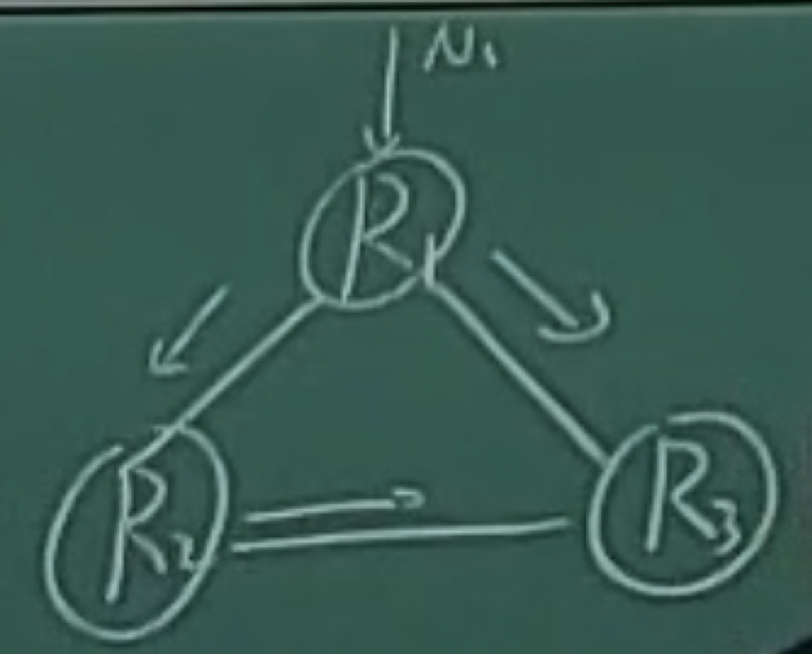

# 4.网络层

## 网络层基本概念

> ATM 相关内容不要求

网络层向传输层提供的接口类型？“面向连接”（电路交换）OR“无连接“（分组交换）

### 网络层关键功能

无论哪种网络层服务模型，都依赖于2个核心功能：

转发
• 将数据报从路由器的输入接口传送到正确的输出接口
•核心：转发函数
•类比：旅行时穿过一个城市（城市内部各个车站、机场间移动）

路由
• 选择数据报从源端到目的端的路径
• 核心：路由算法与协议
•类比：规划出发城市到目的城市的旅行路线（城市间移动）

### 数据平面 VS 控制平面

网络层的转发与路由功能，又把网络层进一步划分为数据平面与控制平面，是软件定义网络（SDN）技术兴起后，新引入的术语

数据平面：转发功能
• 单个路由器上局部功能
• 每个路由器独立对收到的
数据报文执行转发功能

控制平面：路由功能
• 全网计算：涉及多个路由器
• 2种实现方式：
•传统路由算法：多个路由器分布式协作计算
•软件定义网络（SDN）：由中心化控制器负责计算后，通知各个路由器

### 数据平面

执行转发函数：（输入端口，分组的目的地址）->（输出端口）

### （传统）单个路由器上的控制平面

每个交换机运行一个路由算法模块，互相协作完成全网“主机-主机”路径计算

### （SDN） 中心化控制平面

一个远程控制器与各个路由器交互
•每个路由器上维护一个轻量级控制代理（control agent，CA）负责交互，但不需要复杂计算能力
• 控制器本身是一个逻辑上的中心系统，实际上可能是由多个物理服务器组成的集群

## 路由器架构

路由器是互联网最主要的网络设备，包含2个核心功能
•控制平面（路由）：运行各种路由协议，学习去往不同目的的转发路径：路由表
•数据平面（转发）：根据上述路由表，将收到的IP分组转发到正确的下一跳链路

### 控制平面

路由器可同时运行多个路由协议
路由器也可不运行任何路由协议，只使用静态路由和直连路由
路由管理根据路**<u>由优先级，选择最佳路由</u>**，形成核心路由表
控制层**<u>将核心路由表下发到数据层，形成转发表</u>**（FIB）

若存在多个“去往同一目的IP”的不同类型路由，路由器根据优先级选择最佳路由，优先级数值越小，优先级越高

路由种类 路由优先级
直连路由 0
静态路由 1
eBGP路由 20
OSPF路由 110
RIP路由 120
iBGP路由 200

### 路由器数据平面

路由器中IP报文转发过程：
•链路层解封装，IP头部校验
• 获取报文目的IP地址
•用目的IP地址，基于最长前缀匹配规则查询转发表
•查询失败，丢弃报文
•查询成功
•IP头部“TTL"字段值減1，重新计算IP头部“校验和”
•获取转发出接口和下一跳链路层地址
•重新进行链路层封装，发送报文
注：普通IP报攻转发过程中，路由器不查看传输层及以上层协议的内容

IP报文在路由器转发前后的变化：
•链路层封装更新，IP头部“TTL”减1，IP头部“校验和”更新

数据报在不同硬件单元的处理：
输入端口：接口卡（interface card）
•**<u>物理层处理、链路层解封装</u>**
•转发表查询（该工作在输入接口卡处理）
•通过交换结构将报文排队发往目的接口卡（发送过快将产生拥塞）
交换结构
•从输入接口卡发往输出接口卡
输出端口：接口卡（interface card）
•从交换结构接收报文（排队进行后续处理，到达太快将产生拥塞）
•**<u>链路层封装、物理层处理</u>**
• 从输出接口发送报文

基于报文头部字段，在转发表中查找对应的输出端口，通过交换结构（switch fabric）最终传输到对应输出端口
•每个输入端口在内存里维护**<u>转发表</u>**
• 又称"匹配-动作（match-action）"模式

**<u>基于转发表的转发策略</u>**有2种
基于目的地址的转发
• 只根据目的IP地址
• 传统交换机中常用（受限于芯片计算能力）
通用转发
• 可以根据数据报文中任意字段的组合

### 输入端口：最长前缀匹配

为什么不用区间法？

现代网络的性能要求极高
•转发表查找需要在纳秒级时间内完成，因此使用TCAMS
现代路由器的转发表实现
• 基于ternary content addressable memories (TCAMs)
TCAM优势：
•可以对所有地址并行匹配，无论转发表多大只消耗1个时钟周期
•每个bit支持3类匹配值：0，1，dont care
• Cisco Catalyst交换机：TCAM支持百万级表项：一个IP和一百万个表项匹配，然后返回最长的那个

### 输入端口：排头阻塞（Head-of-the-Line blocking, HOL blocking）
队列中的报文，导致后续报文也需等待，即便后续报文对应的输出端口是空闲的

### 交换结构：共享内存

交换流程
•报文到达输入端口时，产生中断信号通知路由处理器
•路由处理器将报文复制到内存中，查询对应输出端口，再将报文复制到输出端口

性能瓶颈：内存拷贝

### 交换结构：共享总线

实现方式
•输入端口通过转发表后，给报文附加上“标签”，表明输出端口
•带标签的报文通过总线广播至所有输出端口
•每个输出端口通过标签判断报文是不是属于自己的，不属于则忽略

性能：总线1次只能广播1个报文，交换速率受总线带宽制约

### 交换结构：纵横式Crossbar

使用2N条总线连接N个输入端口与N个输出端口

优势：不重叠的交换路径，最多可以并行n工作，但是不能保证完全可以并行

### 输出端口

缓冲队列：交换结构的数据超过发送数据时
•与输入端口不同，**<u>可以不是FIFO模式</u>**

队列调度：从缓冲队列中选择数据报文
• 性能考虑：选择对网络性能最好的
• 公平性考虑：网络中立原则

输出端口的缓冲队列，也可能造成排队延迟甚至丟包

### 输出端口：缓冲区大小

RFC 3439建议：“典型” RTT （250 ms） 乘以链路带宽C
•若C=10 Gpbs，缓冲区大小25 Gbit
实际建议：交换机的报文分为N个流，则缓冲区大小为
RTT * C/√N
•流：相同网络地址的报文构成1个流
•二元组流：源IP地址+目的IP地址
•五元组流：源IP地址+目的IP地址＋源端口号+目的端口号＋传输层类型（TCP or UDP）

### 输出端口：调度机制

先进先出（FIFO）调度：根据入队顺序发送
• 简单，但仍有问题需要考虑
•缓冲区溢出时，如何选择丢弃报文
• Tail drop： 丟弃新来的报文
•Priority drop：根据优先级丢弃报文
• Random drop：随机丢弃

基于优先级调度（priority scheduling）：将数据报文分为不同优先级
•根据数据报文头部字段判断优先级（如IP地址，端口号）
•具体优先级由安全或者性能因素考虑
•总是先发送高优先级报文
实现：多个队列对应不同优先级
•为简化芯片设计，不采用复杂数据结构（如二叉堆），访问内存太多，对硬件设计不友好
缺点：公平性

轮询调度（round robin scheduling）
•将报文分类，进入多个队列
•在队列间轮询，若队列中存在报文，则发送

红色是一个队列，绿色是一个队列，因此不连续发送12，更公平一些

加权公平队列（weighted fair queuing, WFQ）
•更一般化的轮询方式
•每个队列拥有权重值
•轮询时考虑权重：权重高的队列，轮询到的次数更多

## IPV4报文格式

> IPV4报文格式各个字段不显式考，但会在其他部分涉及

版本：4bit，表示采用的IP协议版本
首部长度：4bit，表示整个IP数据报首部的长度
区分服务：8bit，该字段一般情况下不使用 
总长度：16bit，表示整个IP报文的长度，能表示的最大字节为2^16-1=65535字节
标识：16bit，IP软件通过计数器自动产生，每产生1个数据报计数器加1；在ip分片以后，用来标识同一片分片
标志：3bit，目前只有两位有意义；MF，置1表示后面还有分片，置0表示这是数据报片的最后1个；DF，不能分片标志，置0时表示允许分片
片偏移：13bit，表示IP分片后，相应的IP片在总的IP片的相对位置

生存时间TTL（Time To Live）：8bit，表示数据报在网络中的生命周期，用通过路由器的数量来计量，即跳数（每经过一个路由器会减1）
协议：8bit，标识上层协议（TCP/UDP/ICMP..）
首部校验和：16bit，对数据报首部进行校验，不包括数据部分
源地址：32bit，标识IP片的发送源IP地址
目的地址：32bit，标识IP片的目的地IP地址
选项：可扩充部分，具有可变长度，定义了安全性、严格源路由、松散源路由、记录路由、时间戳等选项
填充：用全0的填充字段补齐为4字节的整数倍

## IPV4报文分片

MTU（Maximum Transmission Unit），最大传输单元
•链路MTU
• 路径MTU （Path MTU）

分片策略
•允许途中分片：根据下一跳链路的MTU实施分片
• 不允许途中分片：发出的数据报长度小于路径MTU（路径MTU发现机制）

重组策略
•途中重组，实施难度太大
•目的端重组 （Internet采用的策略）
•重组所需信息：原始数据报编号、分片偏移量、是否收集所有分片

偏移以8字节作为单位

原始报文和分片报文具有相同的IP标识 （IP头部字段，标识：16bit，IP软件通过计数器自动产生，每产生1个数据报计数器加1；在ip分片以后，用来标识同一片分片）

IPv4分组在传输途中可以多次分片：源端系统，中间路由器，但是无论是否途中分片，IPv4分片只在目的IP对应的目的端系统进行重组

IPV6分片机制有较大变化（见IPV6部分的介绍）

## IP 地址

> 不考分类地址与特殊 IP 地址

IP地址按接口分配
接口之间通过链路层技术互相连接

IP地址：网络上的每一台主机（或路由器）的**<u>每一个接口都会分配</u>**一个唯一的32位的标识符
由两个字段组成：**<u>网络号（网络地址，全0主机地址）+主机号（主机地址）</u>**
网络号相同的这块连续IP地址空间称为地址的前缀，或**<u>网络前缀</u>**：比网络号少一些0

### 特殊IP地址

CIDR (Classless Inter-Domain Routing)
•网络地址可以是任意长度
•表示：将32位的IP地址划分为前后两个部分，并采用斜线记法，即在IP地址后加上“/”，然后再写上网络前缀所占位数

比如 200.23.16.0/23

### 分类编址下的子网划分

此时网络地址固定长度，但是为了更有效地利用IP地址空间。子网划分允许组织将其分配的IP地址范围分成更小的部分，可以更加灵活地分配给网络中的不同部分。

在进行子网划分时，网络管理员会借用一些主机位来作为子网位，这样就可以定义多个子网：

### CIDR地址聚合下的子网划分

CIDR子网内的地址，可以进一步划分为多个子网
•对外只暴露1个CIDR网络地址
• 这种地址的聚合常称为地址聚合 （address aggregation）或路由聚合 （route aggregation），把许多具有相同前缀的地址整合到一起

问题：200.23.18.0/23的数据报，该发往Fly-By-Night-ISP还是ISPs-R-Us？最长前缀：发往ISPs-R-Us

## ★路由器转发

问题：200.23.18.0/23的数据报，该发往Fly-By-Night-ISP还是ISPs-R-Us？最长前缀：发往ISPs-R-Us

最长前缀匹配 （Longest prefix match）

CIDR+路由聚合，需要最长前缀匹配，即IP地址与IP前缀匹配时，总是选取子网掩码最长的匹配项，主要用于路由器转发表项的匹配，也应用于ACL规则匹配等

IP地址：200.23.22.161（11001000 00010111 00010110 10100001），接口0
IP地址：200.23.24.170 ( 11001000 00010111 00011000 10101010），接口1

## ARP
> 掌握功能、交互流程

每个接口除了IP地址，还有硬件地址，即MAC地址

IP数据报经过不同链路时，IP 数据报中封装的IP地址不发生改变，而Mac帧中的硬件地址是发生改变的。

问题：报文转发根据IP地址还是MAC地址？

之前不是说最长前缀吗？那个是利用IP转发，但是有的时候用IP，有的时候用MAC：子网内部使用MAC地址转发，使用ARP协议将IP映射为MAC地址

具体操作流程：

IP数据包转发：从主机A到主机B
• **<u>检查目的IP地址的网络号部分</u>**
• 确定主机B与主机A属相同IP网络
•将IP数据包封装到链路层帧中，直接发送给主机B
•封装时，在帧头部填写A与B的MAC地址

问题：给定B的IP地址，如何获取B的MAC地址？因为IP是公开的，但是MAC地址不是

A已知B的IP地址，需要获得B的MAC地址（物理地址）
如果A的ARP表中缓存有B的IP地址与MAC地址的映射关系，则直接从ARP表获取
如果A的ARP表中末缓存有B的IP地址与MAC地址的映射关系，则A广播包含B的IP地址的ARP query分组，在局域网上的所有节点都可以接收到ARP query，B接收到ARP query分组后，将自己的MAC地址发送给A，然后A在ARP表中缓存B的IP地址和MAC地址的映射关系，超时时删除

### ARP工作流程

广播+单播

A创建IP数据包（源为A、目的为E）
在源主机A的路由表中找到路由器R的IP地址223.1.1.4
• R通常称为A的子网网关
A根据R的IP地址223.1.1.4，使用ARP协议获得R的MAC地址

A创建数据帧（目的地址为R的MAC地址），数据帧中封装A到E的IP数据包
A发送数据帧，R接收数据帧
R查找转发表，修改目的MAC地址（也许ARP查询），转发

### ARP安全问题

ARP Spoofing攻击：**<u>发送ARP响应来改变</u>**某个IP的ARP表，让这个IP发向某个IP的数据包都发给我
• 攻击者随意地发送ARP请求或ARP响应（可以使用任意源IP地址与MAC地址）
•ARP协议是无状态的：即使受害者之前没发过ARP请求，收到一个ARP响应时，也会更新ARP表
•受害者后续数据将被发往攻击者提供的MAC地址
•攻击者可以修改自己的IP转发功能，将截获的受害者数据继续转发，不拦截，发送和接受者都不知道有人中间拦截了信息

## DHCP

> 掌握功能、交互流程

IPv4地址如何获取？当主机加入IP网络，允许主机从DHCP服务器动态获取IP地址

新加入网络的主机：DHCP客户端，申请该网络IP地址，端口68发出请求
DHCP服务器：端口67监听

### DHCP工作过程

DHCP 客户从UDP端口68以**<u>广播</u>**形式向服务器发送发现报文(DHCP DISCOVER)
DHCP 服务器**<u>广播或单播</u>**发出提供报文（DHCP OFFER）
DHCP 客户从多个DHCP服务器中选择一个，并向其以**<u>广播</u>**形式发送DHCP请求报文（DHCP REQUEST）
被选择的DHCP服务器**<u>广播或单播</u>**发送确认报文（DHCP ACK）

DHCP服务不只返回客户机所需的IP地址，还包括：
• 缺省路由器IP地址
•DNS服务器IP地址
•网络掩码

### DHCP安全问题

DHCP耗竭攻击（DHCP StarvationAttack)

攻击者短时间内发送大量DHCP请求，将子网内可用IP地址全部占用后续主机无法获取新IP地址

流氓DHCP(Rogue DHCP attack)（通常在DHCP耗竭攻击之后）

攻击者启动自己的DHCP服务，给网络中的其他主机提供虚假的配置，包括DNS服务器IP与网关IP

## NAT

> 掌握功能、交互流程

网络地址转换（NAT）用于解決IPv4地址不足的问题，是一种将私有（保留）地址转化为公有IP地址的转换技术
私有IP地址：
• A类地址：10.0.0.0--10.255.255.255
• B类地址：172.16.0.0--172.31.255.555
• C类地址：192.168.0.0--192.168.255.255

### NAT 工作机制

所有从本地网络发出的报文具有相同的单一源IP地址：138.76.29.7

NAT根据不同的IP上层协议进行NAT表项管理
• TCP, UDP

传输层TCP/UDP拥有16-bit 端口号字段
•所以一个WAN侧地址可支持60,000+个并行连接

## ICMP

> 如何实现 PING与 Traceroute（了解流程，不要求具体编码值）

ICMP：互联网控制报文协议，是传输层协议，IP上层协议
•ICMP 允许主机或路由器报告差错情况和提供有关异常情况的报告
•由主机和路由器用于网络层信息的通信
•ICMP 报文携带在IP 数据报中：IP上层协议号为1

ICMP报文类型
•ICMP 差错报告报文：终点不可达：不可达主机、不可达网络，无效端口、协议
•ICMP 询问报文：回送请求/回答（ping使用）

### ICMP报文格式

ICMP报文的前4个字节包含格式统一的三个字段：类型、代码、检验和
相邻的后四个字节内容与ICMP的报文类型有关

类型、代码的对应：

### 差错报告报文

### Ping

PING (Packet InterNet Groper)
• PING 用来测试两个主机之间的连通性
•PING 使用了ICMP 回送请求与回送应答（类型为8或0）报文

思考：
如何利用Ping命令返回的TTL值（报文剩余跳数），来判断对方主机操作系统的类型？
TTL初始值是多少？
初始值与OS有关，大致可以猜出来对面TTL初始值，因为消耗的跳数不会很大，如图TTL=53，大概知道对面是Linux

### Traceroute

如何知道整个路径上路由器的地址？使用TraceRT命令

源向目的地发送一系列UDP段（不可能的端口号）
•第一个 TTL =1
• 第二个TTL=2，等等

当第n个数据报到达第n个路由器，路由器丢弃数据报，并向源发送一个ICMP报文（类型11，编码0，TTL过期），此时报文的源IP地址就是该路由器的IP地址

UDP段最终到达目的地，主机目的地返回ICMP"端口不可达（因为发送的UDP含有不可能的端口号）”分组（类型3，编码3），当源得到该ICMP，停止

## 网络路由：★距离向量
>  距离向量与链路状态掌握算法，具体的对应协议（RIP 与OSPF）不要求

每个结点x维护信息
•到达每个邻居结点v的开销：c（x,v）
•距离向量（DV）：Dx = ［Dx（y）：y ∈ N］，该结点x到网络中所有其他结点y的最小代价的估计

每个邻居结点v的距离向量，即对于所有邻居v，结点x保存D=［Dw（y）：Y ∈ N］

### 距离向量算法特点

异步：结点迭代频率不需要一致

迭代：每次某个结点上的迭代有2种触发
•本地链路代价发生改变
• 收到来自邻居的DV更新

分布式：结点直接互相协作
•每个结点当且仅当DV信息发生变化时通知其他结点
• 邻居结点根据需要通知自己的邻居

### 链路状态改变：代价变小

好消息快速传播

### 链路状态改变：代价变大

求y-x:

y-x=y-z-(old)x=6

z-x=z-y-x=z-y-z-(old)x=7

y-x=y-z-x=y-z-y-z-(old)x=8

……

### 链路状态改变：毒性逆转

毒性逆转 （poison reverse） 方法
如果某结点a到达c的下一跳为b，则a将通知b：“Da（c）=inf"

a——b——c，a告诉b我去不了c，所以b就不会回到a再去c

毒性逆转无法解决一般性的无穷计数问题

初始情况：

a: bd=2

b: ad=2

c: ad=∞, bd=∞（由于毒性逆转）

然后cd断开

由于c告诉a说cd=∞，那么a不能走a-c-a-c-d叠加一下到d

但是由于a认为bd=2，因此a认为ad可以是ab+bd=3

同理，由于b认为ad=2，因此b认为bd可以是ba+ad=3

ab两个节点就如此不停互相传输错误信息

## 网络路由：★链路状态

>  距离向量与链路状态掌握算法，具体的对应协议（RIP 与OSPF）不要求

每个结点都知道网络拓扑与链路开销
• 通过链路状态广播得到
• 所有结点都有相同的信息

每个结点计算以自己为源节点，到其他所有结点的最短路径
•生成该结点的转发表

### Dijkstra 算法例子

### 1.发现邻居，了解他们的网络地址

### 2.设置到每个邻居的成本度量
开销/度量/代价：
•自动发现设置或人工配置
•度量：带宽、跳数、延迟、负载、可靠性等

常用度量：链路带宽（反比）
•例如：1-Gbps以太网的代价为1，100-Mbps以太网的代价为10

可选度量：延迟
•发送一个echo包，另一端立即回送一个应答
•通过测量往返时间RTT，可以获得一个合理的延迟估计值

### 3.构造一个分组，分组中包含刚收到的所有信息
构造链路状态分组 （link state packet, LSP）
•发送方标识
•序列号
•年龄（存活时间）
•邻居列表：包含邻居与对应的链路开销

### 4.将LSP分组发送给其他的路由器
每个LSP分组包含一个序列号，且递增
路由器记录所收到的所有（源路由器、序列号）对
当一个新分组到达时，路由器根据记录判断：
• 如果是**<u>新分组，洪泛广播</u>**
• 如果是重复分组，丢弃
• 如果是过时分组，拒绝

### 5.计算到其他路由器的最短路径： Dijkstra算法

## 距离向量（DV）和链路状态（LS）比较

消息数量

DV：取决于收敛速度，链路代价不变时，收敛需要最多O（nE）条消息

LS：n个结点，E条链路，一共发送O（nE）条消息

收敛速度

DV：不确定，可能无穷计数问题

LS：消息传播完毕，每个结点O（n2）或O（nlogn）时间完成计算

可靠性：路由器或链路故障处理

DV： 影响大
• 传播计算后的结果，如果是错误的，可能会造成无穷计数问题
•取决于邻居的计算结果

LS：影响小
•传播链路开销
• 每个结点独立计算

## 网络路由：层次路由

层次路由产生原因：过于庞大的路由表存储、查找困难，路由信息交互开销高

互联网由大量不同的网络互连，每个管理机构控制的网络是自治的，所以产生了**<u>自治系统AS</u>**

自治系统（AS,Autonomous System），比如中国联通、中国移动
•一个管理机构控制之下的网络
•一个AS内部通常使用相同的路由算法/路由协议，使用统一的路由度量（跳数、带宽、时延…）
•不同的AS可以使用不同的路由算法路由协议
•每个AS有一个全球唯一的ID号：AS ID

自治系统内可以进一步划分层次

自治系统内部使用内部网关路由协议，Interior Gateway Protocols （IGP）
• 每个自治系统域内路由算法可不同
• 典型IGP协议：OSPF，RIP，IS-IS,IGRP，EIGRP⋯

自治系统之间之间使用外部网关路由协议，Exterior Gateway Protocols （EGP）
• 各自治系统域之间的路由需统一
• 典型EGP协议：BGP

### 层次路由的效果

<u>**路由协议**</u>
<u>**•内部网关协议 IGP：有RIP和、OSPF、ISIS 等多种具体的协议**</u>
<u>**•外部网关协议 EGP：目前使用的协议就是 BGP**</u>

## AS内部路由：OSPF（对应链路状态算法）

OSPF将AS内路由器进一步划分为区域

区域内部同步完整的区域内链路，区域之间只同步区域间链路

使用层次结构的区域划分，上层的区域叫做主干区域 （backbone area），其他区域都必须与主干区域相连

非主干区域之间不允许直接发布区域间路由信息

区域也不能太大，在一个区域内的路由器最好不超过200个

## AS内部路由：RIP（对应距离向量算法）

路由选择协议RIP（Routing Information Protocol）是基于距离矢量算法的协议，使用跳数衡量到达目的网络的距离
•RIP 认为一个好的路由就是它通过的路由器的数目少，即“距离短”
•RIP 允许一条路径最多只能包含 15 个路由器

RIP协议的基本思想
• 仅和相邻路由器交换信息
• 路由器交换的内容是自己的路由表
• 周期性更新：30s

## AS之间路由：BGP

BGP-外部网关路由协议

边界网关协议BGP （Border Gateway Protocol）
•目前互联网中唯一实际运行的自治域间的路由协议

BGP功能
• eBGP：从相邻的AS获得网络可达信息
•iBGP：将网络可达信息传播给AS内的路由器
• 基于网络可达信息和策略决定到其他网络的“最优”路由

1c同时运行eBGP, iBGP, IGP (比如OSPF或者RIP) 的内部和外部网关协议

### 路由通告

BGP会话：两个BGP路由器通过TCP连接交换BGP报文
• 通告到不同网络前缀的路径，即路径向量协议
• 路径向量：由一系列AS组成的序列

过程：

AS3的路由器3a向AS2的路由器2c**<u>使用eBGP</u>**通告路径〞AS3，X”，AS3向AS2承诺它会向X转发数据包

AS2的路由器2c从AS3的路由器3a接收到路径“AS3，X"，**<u>通过iBGP传播给AS2的所有路由器</u>**

根据AS2策略，AS2的路由器2a**<u>通过eBGP</u>**向AS1的路由器1c通告从AS3接收到路径“AS2,AS3，X"

一个路径通告信息经过的结点数是自治系统数的量级，每一个自治系统边界路由器的数目是很少的，20个左右
一个AS在 BGP 刚刚运行时，向相邻AS获取整个BGP路由表
• 以后只需要在发生变化时更新有变化的部分 增量更新，不是Ospf那样的周期性更新

BGP为每个AS提供：
• 从邻居AS获取网络可达信息（eBGP协议）
• 传播可达信息给所有的域内路由器（iBGP协议）
• 根据“可达信息”和“策略”决定路由

### 路由策略

路由器可能从多个对等体收到针对同一目的IP的路由
需要选择一条最佳路由，选择规则：自上向下，依次排序
• 本地偏好值属性：政策决策
•最短的AS-PATH
•最近的NEXT-HOP路由器
• 附加标准⋯
•最低路由器ID

BGP路由策略：AS间策略：

路由器使用策略决定接受或拒绝接收到的路由通告
路由器也会基于策略决定是否向其他相邻AS通告路径信息

例如：X连接到两个提供者网络（dual-homed）
•X为用户网络，X不希望从B到C的数据包经过X
•X则不向B通告到C的路由

A向B通告路径AW，B通告到目的W的路径为BAW，但是B是否向C通告路径BAW？
• 由于W和C都不是B的用户，B要迫使C通过A路由到W
• B只路由来自于或到达其用户的数据包

BGP路由策略：AS内策略：

各个AS决定
实际常用：“热土豆（Hot Potato）策略"
•选择最近的BGP出口，即最小化报文在本AS停留时间

## 广播

广播（Broadcasting）：源主机同时给全部目标地址发送同一个数据包

### 方法1：给每个主机单独发送一个数据包
•效率低、浪费带宽
•Server需要知道每个目的地址

### 方法2：多目标路由 （multi-destination routing）
•在需要转发的路由器线路复制一次该数据报
•网络利用率高
•Server依然需要知道所有的目的地址

### 方法3：泛洪（flooding）
• 一种将数据包发送到所有网络节点的简单方法
• 将每个进入数据包发送到除了进入线路外的每条出去线路

用途
•保证性：一种有效广播手段，可确保数据包被传送到网络中每个节点
•容错性：即使大量路由器被损坏，也能找到一条路径（如果存在）
•简单性：仅需知道自己的邻居

环路可能导致广播风暴，即使利用跳数来限制，也会出现成倍爆炸

解决方法：受控制的泛洪（每个路由器进行有选择的泛洪）

1. 序号控制泛洪（sequence-number-controled flooding）
    ①广播数据包X从接口1到达路由器R
    ②R查看数据包来源S和广播序号n，比对R的序号表
    ③序号表中有该数据包的记录吗？
        是，丢弃（曾经已经收到并转发过）
        否，在序号表中记录，并在接口2和3转发

2. 逆向路径转发 (reverse path forwarding, RPF)
   假设R的路由表中表示了到达各网络的最优路径
   ①广播数据包X从接口1到达路由器R
   ②R查看数据包来源S，比对R的路由表
   ③X的来源是N1吗？
   是-> X是从最佳路径来的，向接口2和接口3转发
   否->X是重复包，丟弃

   

    R3仍然会接收到重复的数据包，但是不会产生回路了

### 方法4：生成树 （spanning tree）
•源节点向所有属于该生成树的特定链路发送分组
•改进了逆向路径转发
•没有环路
•最佳使用带宽
•最少副本，消除了冗余分组
•—个路由器可以不必知道整颗树，只需要知道在一颗树中的邻居即可

## 组播

> 组播部分只要求掌握基本步骤，生成树算法不考

组播 （multicasting）：源主机给网络中的一部分目标用户发送数据包

例：服务器希望将体育直播视频发送给某些网络中的个别用户，怎么办？

组播（multicasting）路由算法的目标：
•为每个组建立转发树（到达该组所有成员的路径树）
•每个组成员应当只收到多播分组的一个拷贝
•非本组成员不应收到多播分组
•从源节点到每一个组成员节点的路径应当是最佳的（最短路径）

### 组播路由：步骤1

确定组成员：边缘路由器通过与主机交互，了解到从它的某个端口可以到达哪些组的成员—主机与路由器之间的组成员关系协议

IGMP (Internet Group Management Protocol)
•主机可以加入或者退出组播组
•路由器查询该子网的组播组成员

常用组播地址段：224.0.0.0/24
局域网组播地址（一跳子网内使用）
• 224.0.0.1 LAN上所有设备
• 224.0.0.2 LAN上所有路由器
• 224.0.0.5 LAN上所有OSPF路由器
• 224.0.0.251 LAN上所有DNS服务器

### 组播路由：步骤2

生成树——路由器与路由器之间的协议
•建立在我们已经学习过的广播路由方案基础之上
• 数据包沿生成树发送
• 源点树：为每个组播源计算生成树
•核心树：多个组播源共享组成共享树

构建源点树协议：MOSPF、DVMRP、PIM-DM

但是基于源点树（source-based trees） 存在的问题：
•大型网络中，组播源很多时，路由器需生成多颗棵树，工作量巨大
•路由器需要大量空间来存储多颗树

选择一部分结点作核心，所有流量先汇聚到核心，再进行分发

实线为核心树实际使用的链路，虚线为没有用到的链路

存在的问题：
•可能无法达到最优
• 如果只有一个发送者，将发送者作为核心是最优的

例如，组播源Server2的数据，如果采用基于源点树的方法，可能到达目的主机所需跳数更少

组播的应用：

音频/视频会议
共享电子白板
数据分发
实时数据组播：音频视频点播、网络收看体育比赛直播、股票行情•
游戏与仿真：同时有大量参与者的网络游戏

## 选播

选播 （Anycast）：和报警找警察局很相似
•将数据包传送给最近的一个组成员
•在有多个服务器的情况下，用户希望快速获得正确信息，而不在乎从哪个服务器获得
•与单播、广播、组播的区别

选播的典型应用：DNS
•在没有指定DNS服务器的情况下，用户将始终连接到“最接近”（从路由协议角度来看）服务器，可以減少延迟，并提供一定程度的负载平衡
•可以提供一定程度的高可用性，一旦服务器发生故障，用户请求将无缝转发到下一个最接近的DNS实例，而无需任何手动干预或重新配置
•可以水平缩放，如果一台服务器负载过重，只需在一个位置部署另一台服务器，以承担一部分重载服务器的请求，且不需要客户端配置

## 软件定义网络：流量工程

流量工程：根据对传输流量的预测，规划流量的传输路径
•目的：提高带宽利用率、避免拥塞

基于最短路的路由对单个路由器局部最优，但未必全局最优，全局最优通常需要线性规划、网络流算法

回题1：如何让 u-to-z 的流量经过路径uvwz,x-to-z 的经过路径xwyz？

方案a：采用基于最短路的传统路由，调整路径代价（如：将ux，vx设置为无穷大）
• 并不总是可行 因为把路径代价设置为无穷大会影响别的路由器的结果
方案b：采用新的流量工程方法计算路径
• 需要更多输入数据（如“源-目标”主机的流量信息）
• 传统分布式路由器架构：实现困难、代价巨大

问题2：如何让u-to-z 的流量划分到 uvwz 与 uxyz 两条路径进行传输
传统基于最短路的路由算法无法计算得到该结果

问题3：如何让路由器w区别对待红色与绿色两组流量
基于目的地址转发的传统路由方式无法区分

## 软件定义网络：SDN 思想与基本概念

### SDN技术要点

1. "基于流表（flow table）”的通用转发（如OpenFlow接口）

2. 控制平面与数据平面分离
2. 中心化控制平面
2. 应用程序可编程开发

### SDN优势

（数据平面）数据平面与控制平面分离：数据平面提供开放接口
•允许对网络设备进行“**<u>编程</u>**”

（控制平面）中心化控制器：全局网络视角，更好的网络管理
• **<u>加快链路状态传播</u>** and/or 路由**<u>收敛速度</u>**
• **<u>支持流量工程</u>**：全局更优的路径选择
• 避免路由器故障导致的网络配置错误
• 让**<u>网络编程</u>**更加容易

### SDN 交换机

简单、高性能的交换机架构
• 流表架构：“流量匹配-动作”
• 实现通用的数据平面处理功能
交换机流表提供API （e.g.， OpenFlow）
• 允许程序定义部分流表功能
流表由控制器计算并安装
交换机流表与控制器通过开放协议交互(e.g., OpenFlow)
网络中的SDN交换机可以来自不同产商

### SDN控制器（网络操作系统）

维护全网状态信息

与数据平面SDN交换机交互
• 通过“南向接口（southbound API）”，如OpenFlow

为上层网络应用提供接口，类似系统调用
• 称为"北向接口（northbound API）”

以分布式系统的形式实现
• 高性能、可扩展、故障容错

可以与SDN交换机来自于不同产商

### SDN应用程序

基于北向接口，实现各类网络功能

可以由第三方开发者提供，不仅仅是网络设备产商

### SDN现状

SDN： 不是一种具体的技术，更像一种思想或理念

具体技术
•数据平面：OpenFlow（最早的sdn数据平面接口）、P4、OpenVSwtich
•控制平面：OpenDayLight、OpenStack、网络功能虚拟化

发展
•狭义SDN:Openflow
•广义SDN：所有控制与转发分离的网络技术

挑战
•高校、标准组织ONF的市场影响力和工程背景都太弱
• 牵涉到太多利益关系传统厂商不买账

## 软件定义网络：数据平面

每个路由器维护一张流表（flow table） ，流表由控制器计算后写入每个路由器

流表的形式可以是任意的，每个流表项通常包含3个部分
头部：用于匹配报文
计数器：表项统计信息
动作：匹配成功后执行的操作

### OpenFlow

目前最流行的流表结构是OpenFlow所定义的流表
• 最早的SDN技术

OpenFlow的流表项由4部分组成
• 模式：报文头中的匹配值
•动作：对于成功匹配的报文所进行的操作，包括转发、修改、丢弃、送往控制器
•优先级：当一个报文有多个匹配成功项时，定义优先顺序
•计数器：报文数、字节数

OpenFlow的“匹配-动作”：可以统一实现各类网络设备：

网络层路由器
• 匹配：最长目的IP地址前缀
•动作：转发到输出端口

链路层交换机
•匹配：目的MAC地址
•动作：转发到输出端口或者复制到所有端口

防火墙
• 匹配：特点IP地址或端口取值
• 动作：允许通过或丢弃

NAT
• 匹配：IP地址与端口
• 动作：修改IP地址与端口，并转发

这种“基于开放网络设备，实现各类网络功能”的技术，又称为网络功能虚拟化

例子：

## 软件定义网络：控制平面

### OpenFlow协议

用于控制器与支持OpenFlow的交换机交互

使用TCP传输消息
• 可选项：加密消息

OpenFlow定义了2类消息
• 控制器-＞交换机
• 交换机->控制器

### OpenFlow协议：控制器->交换机

读状态：控制器查询交换机状态或数据，交换机需回复

配置：控制器设置交换机相关参数

修改状态：添加、删除、修改交换机流表项

Packet-out：控制器通过交换机某个接口，发送数据报，即流量注入

### OpenFlow协议：交换机->控制器

流删除：通知流表项已经删除
•流表项删除由控制器触发，或者超过存货周期

端口状态：上报交换机某个状态或统计信息

Packet-in： 将报文发送给控制器（通常用于匹配失败的报文）

## 软件定义网络：SDN数据平面/控制平面整体例子

① 交换机 S1发生链路故障，使用“端口状态”消息通知控制器
② SDN控制器收到该消息，更新数据库里的链路状态消息
③ 某个Dikstra’s 路由算法应用通过北向接口注册了对链路状态的监听。此时，回调该路由算法。
④ Dikstra's 路由算法访问相关链路状态数据、网络拓扑数据，重新计算新路径

## IPv6

> IPv6协议（不显式考报文格式）、与IPv4兼容（只要求隧道技术）、SRv6不考

IPv6 （Internet Protocol version 6） 是IETF设计用于替代IPv4的下一代协议

初始动机：应付“32-bit地址空间耗尽"问题（CIDR和NAT都无法从根本上解决地址短缺问题），增加地址空间

后续动机
•简化头部，加快处理与转发
• 提升服务质量

IPv6地址
•地址长度为128bit，是IPv4地址长度的4倍
• IPv6地址空间数量约为3*10^38
•IPv6地址表示法，冒分十六进制，X:X:X:X:X:X:X:X
•简化方法：每个x前面的0可省略，可把连续的值为0的x表示为“::”，且“"只能出现1次
•简化前地址，2001:0DA8:0000:0000:200C:0000:0000:00A5
•简化后地址，2001:DA8:0000:0000:200C:A5

IP数据报文
•固定**<u>40字节</u>**头部长度
• 不允许传输途中分片（fragmentation）

### IPv6头部

版本：4bit，协议版本号，值为6
流量类型：8bit，区分数据包的服务类别或优先级
流标签：20bit，标识同一个数据流
有效载荷长度：16bit，IPV6报头之后载荷的字节数（含扩展头），最大值64K

下一个首部：8bit，IPv6报头后的协议类型，可能是TCP/UDP/ICMP等，也可能是扩展头
跳数限制：8bit，类似IPv4的TTL，每次转发跳数減1，值为0时包将会被丢弃
源地址：128bit，标识该报文的源地址
目的地址：128bit，标识该报文的目的地址

IPv6头部长度固定40字节
• 所有“选项”字段都在IPv6扩展头部分（位于头部字段后面），通过“下一个首部”字段表明

与IPv4头部的比较
• 去除“首部长度”（首部长度固定为40字节）
• 去除“首部校验和”（**<u>传输层校验会涉及伪头部信息</u>**），提升转发速度
• 去除分片字段：“标识”“标志”“片偏移”，移至扩展头（分段头）

IPv6分片机制
• IPv6分组**<u>不能在传输途中分片</u>**，只在源端进行分片
•IPv6设计了专门的分片扩展头，分片字段不存在IPv6头部中
•IPV6支持Path MTU发现机制

### 扩展头

如有多个扩展头，需按规定顺序出现
•逐跳选项头，转发路径上每个节点都需检查该扩展头的信息
•路田头，指明转发途中需经过哪些节点，类似于IPv4的源路由机制，允许发送者指定数据包在网络中传输路径的方法
•分段头，包含类似IPv4分片处理信息：片偏移、“更多段”标志、标识符
•目的地选项头，目的端系统需要确认的信息

### 隧道技术

隧道技术：2个相同类型网络的设备，跨越中间异构类型网络进行通信
• 将一种网络的数据包作为另一种网络的数据载荷进行封装

隧道类型：

应用层隧道 
•SSH隧道：客户端的原始数据（如HTTP、FTP或数据库查询请求）被封装在SSH协议 的数据包中，HTTPS隧道：把流媒体封装在https协议

传输层隧道
• TCP隧道，UDP隧道

网络层隧道
• 4 in 6, 6 in 4
•GRE，通用路由封装隧道

链路层层隧道
•L2TP协议，链路层隧道
•PPTP协议，点对点隧道

报文长度在传输途中增大导致分片问题
•途中分片与重组对传输性能影响较大
Ipv4支持途中分片，但是对性能影响大

解决方法
• 提前分片，需要Path MTU发现机制，所以ipv6可以事先考虑好不要分片

### IPv4/IPv6翻译：逐个字段翻译

IPv4报头和IPv6报头翻译
• 各字段对应，包括IP选项翻译
传输层校验和转换，涉及IPv6地址
ICMP翻译
•ICMPv6重新设计了类型值和代码值
其它应用层协议翻译
•FTP（命令名称变化，内嵌IP地址）
•内嵌IP地址的其它应用层协议
DNS处理
• 域名记录修改

协议翻译困难

应用层部分协议有差异(DNS，比如给你一个IPv4的IP，但是你是IPv6的，那就用不了了)
传输层内嵌IP地址问题传输层校验涉及IP地址（伪头部）
网络层IP地址格式和报头格式字段变化（扩展头如何转换？）

## 网络服务质量：数据包调度、流量工程、漏桶算法、令牌桶算法、综合服务、区分服务

### 数据包调度

路由器输出端口决定：把缓冲区中的哪些数据包发送到输出链路上
• 先来先服务FCFS （First-Come First-Serve）
•公平队列算法（Fair Queueing）
• 加权公平队列算法（Weighted Fair Queueing）
•优先级调度（Priority Scheduling）

### 流量工程

流量工程：根据对传输流量的预测，规划流量的传输路径
•目的：提高带宽利用率、避免拥塞

通常需要线性规划、网络流算法

需要其他技术（如MPLS或者SDN）配合，进行流量区分

### 流量整形

流量整形（raffic shaping）：其作用是限制流出某一网络的某一连接的流量与突发，使这类报文以比较均匀的速度向外发送

流量整形算法包括漏桶算法和令牌桶算法

漏桶算法 （Leaky Bucket Algorithm）：
•平滑网络上的突发流量
• 突发流量可以被整形以便为网络提供一个稳定的流量

令牌桶算法（Token Bucket Algorithm）：
•允许突发数据的发送，但控制流速

#### 漏桶算法

漏桶算法原理：

到达的数据包被放在缓冲区（漏桶）中

漏桶最多可以容纳b个字节。如果数据包到达的时候漏桶已经满了，那么数据包应被丟弃

数据包从漏桶中发出，以常量速率（r字节/秒）注入网络，因此平滑了突发流量

#### 令牌桶算法

令牌桶算法工作原理：

产生令牌：周期性的以速率r令牌桶中增加令牌，桶中的令牌不断增多。如果桶中令牌数已到达上限，则丢弃多余令牌	

消耗令牌：输入数据包会消耗桶中的令牌。在网络传输中，数据包的大小通常不一致。大的数据包相较于小的数据包消耗的令牌要多

判断是否通过：输入数据包经过令牌桶时存在两种可能：
• 当桶中的令牌数量可以满足数据包对令牌的需求，则将数据包输出
• 否则将其丟弃

### 综合服务

综合服务 （IntServ: Integrated Services）

特点1：（面向连接）基于资源预留协议RSVP，在主机间建立传输流的连接
特点2：（预留资源）逐节点建立或拆除流的状态和资源预留状态，根据QoS进行路由

要求：需要所有的路由器支持综合服务，在控制路径上处理每个流的消息，维护每个流的路径状态和资源预留状态，在路径上执行基于流的分类、调度、管理

现实：难以实现

### 区分服务

区分服务 （DiffServ: Differentiated services）
在IP报头的8位区分服务字段（DS字段）中使用6位区分服务码点（DSCP）进行分组分类，指明分组的类型
路由节点在转发这种包的时候，只需根据不同的DSCP选择相应的调度和转发服务即可

问题：DS字段的使用无法控制->网络“公地悲剧”

## 面向连接服务：虚电路与 MPLS

> 转发过程

### 虚电路

面向连接服务：如打电话
•通信之间先建立逻辑连接：在此过程中，如有需要，可以预留网络资源
•结合使用可靠传输的网络协议，保证所发送的分组无差错按序到达终点

虚电路是逻辑连接，建立在Internet分组交换之上
•虚电路表示这只是一条逻辑上的连接，分组都沿着这条**<u>逻辑连接按照存储转发方式传送</u>**，而并不是真正建立了一条物理连接
•注意，**<u>电路交换的电话通信是先建立了一条真正的连接</u>**
•因此，虚电路和电路交换的连接只是类似，但并不完全相同

面向连接的方法也不一定能完全保证数据的可靠传输，链路中的任何一个组成环节仍有可能失效，而这种失效是严重的，可能导致所有数据丟失

虚电路的转发策略：虚电路转发决策**<u>基于分组标签，即虚电路号</u>**

除了R1，路由器只能决定输入标签，输出标签要由下一个路由器在反向传播确认分组的时候决定

最后发送方发送拆除分组

虚电路与数据报网络的比较：

### MPLS

MPLS是虚电路的实际实现

思想：基于IP转发-＞基于标签转发
•标签是指每个分组被分配一个标签，路由器根据该标签对分组进行转发
•交换是指标签的交换，MPLS 报文交换和转发是基于标签的

MPLS的核心思想是在**<u>网络包头部添加一个短小的标签，用于快速的数据包转发和路径选择</u>**
高效的数据转发：由于路由决策是基于简短的标签而不是复杂的IP头部信息，因此数据包的转发更快

"给IP 数据报加标签”其实就是在链路层的帧首部和IP数据报的首部之间插入一个4字节的 MPLS 首部，有了IP数据包，再加一小段MPLS报文头

MPLS又称为2.5层协议

#### MPLS核心要素

标签交换路由器LSR
• 支持MPLS的路由器
•具备标签交换、路由选择两种功能

MPLS域
• 所有相邻的支持MPLS技术的路由器构成的区域

标签分配协议LDP
•用来在LSR之间建立LDP会话并交换Label映射信息

#### MPLS基本操作

加标签
•在MPLS域的入口处，给每一个IP数据报加上 标签，然后对加上标记的IP数据报用硬件进行转发

标签交换
•MPLS域内每台路由器，对加上标记的IP 数据报修改标签并转发称为标签交换

去标签
•当分组离开 MPLS 域时，MPLS 出口路由器把分组的标签去除。后续按照一般IP分组的转发方法进行转发

#### MPLS标签

标签仅仅在两个LSR 之间才有意义，LSR会维护一张转发表

表项含义：从入接口 0收到一个入标记为3的IP数据报，转发时，应当把该IP数据报从出接口1转发出去，同时把标记对换为1

#### MPLS转发等价类

不可能对每个报文分配各自标签

如果一组报文在网络上被以同样的方式处理，则构成一个转发等价类FEC通常对一个FEC分配唯一的标签

FEC有多种定义方式：
• 属于某特定组的组播报文
• 目的IP地址匹配了一个特定前缀的报文
• 有相同Q0S策略的报文
• 属于同一个VPN的报文（MPLS VPN中）
• 报文的目的IP地址属于BGP学习到的路由，并且下一跳相同
• 其他

#### MPLS应用：VPN

## 面向连接服务：VPN

> 背景、原理（只要求基于隧道）

许多机构希望建立**<u>专用网络</u>**
• 连接该机构各部分网络
• 与Internet隔离的路由器、链路、以及DNS、DHCP等基础服务
• 缺点：代价昂贵

虚拟专用网 （Virtual Private Network, VPN）
•建立在Internet之上
•通过加密与认证机制，保持**<u>逻辑上的隔离</u>**

### VPN的原理

VPN指利用公用网络架设专用网络的远程访问技术
VPN通过隧道技术在公共网络上模拟出一条点到点的逻辑专线，从而达到安全数据传输的目的

### VPN的实现

### VPN的安全性

VPN对数据机密性和完整性的保护：使用电子签名

