# 1.计算机网络基础

## 网络的构成

### 网络边缘

主机Host


### 接入网：只需了解各类接入方式在物理介质上的区别，具体细节不考

通过各类物理介质将主机连接到边缘路由器上

> 存储常用字节：Byte
> K/M/G层级为2^10进制
>
> 传输常用比特bit
> K/M/G层级为10^3进制
>
> 1B=8b（注意大小写）

两种类型：

1. 引导型介质：信号在固体介质中传播，例如铜、光纤、同轴电缆——有限的空间，有限介质
2. 非引导型介质：信号自由传播，例如无线电（陆地无线电、卫星无线电信道）——在相对自由的空间中传播，无限介质

具体介质：

1. 双绞线

   • 两根绝缘铜线互相缠绕为一对
   • **<u>电话线</u>**为1对双绞线
   • **<u>网线</u>**为4对双绞线，广泛用于计算机网络（以太网）**<u>双向</u>**传输
   • 第五类: 100 Mbps~1 Gbps
   • 第6类：10Gbps

2. 同轴电缆

   • 两根同心铜导线，**<u>双向</u>**传输
   • 电缆上的多个频率通道
   • 带宽可达100Mbps

3. 光纤
   玻璃纤维携带光脉冲，每个脉冲一位
   高速运行：点对点传输（10-100 Gbps以上）
   低误码率：所以中继器可以相距很远，对电磁噪声免疫

4. 数字用户线DSL

   使用电话线连接到数字用户线接入复用器（DSLAM）：每户有独立线路
   现代DSL：语音和数据可以同时在电话线上传输——使用不同的频率区分语音和数据，数据进入互联网，语音连接到电话网
   更古老的拨号上网：无法支持语音与数据同时传输

5. 同轴电缆

   同轴电缆：Cable
   •家庭利用传统有线电视信号线（同轴电缆）接入头端上网——美国比较早，很早已经有DSL和同轴电缆了，因此可以再利用来上网
   •多个家庭共享有线电视的头端

   混合光纤同轴电缆HFC
   •先用同轴电缆接入光纤节点，再用光纤连接到头端
   •高达40 Mbps-1.2 Gbps下行传输速率，30-100Mbps上行传输速率

6. 光纤到户FTTH：带宽大、线路稳定
   • FTTH: Fiber To The Home
   •我国及全球先进地区普遍采用的光纤通信的传输方法
   分为两类：有源光纤网络AON和无源光纤网络PON
   •AON：每个用户独立线路，速度快，但成本高、能耗大
   •PON：用户共享线路，成本低、能耗低

7. 无线接入

   无线局域网（WLAN）

   广域蜂窝接入网

8. 实际的家庭网络

   

9. 实际的企业网络

   直接通过交换机与专线直连接入到ISP（因特网）
   内部用一系列以太网交换机与WiFi建立内部网络

   

### 网络核心：分组交换、电路交换、转发与路由、存储转发、排队与丢包、Internet架构

分组交换：将大消息(message)拆分成多个小分组(packet)，以分组作为数据传输单元，使用存储-转发机制，实现数据交互的通信方式

统计多路复用 （statistical multiplexing）：主机A和B的报文分组按需共享带宽

"存储与转发"传输：路由器需要接收到完整的整个数据包后，才能开始向下一跳发送，但是会带来额外的报文的传输延迟，每多一个路由器，就多 L/R 秒

排队与丢包：分组在一个缓冲区中排队，等到链路可用；若队列被填满，后续分组就被丢弃


电路交换：先呼叫**<u>建立连接</u>**，进行**<u>资源预留</u>**，包括链路带宽资源和交换机的交换能力；物理通路被双方独占，即使空闲也不共享，传输**<u>性能好</u>**；但如果设备故障，则传输中断。**<u>无法应对突发流量，无法灵活复用</u>**。（4点区别）

电路交换的多路复用：频分多路复用FDM，时分多路复用TDM，在每一路上实现具有和专用链路类似的性能，该路资源专用，即使空闲也不与其他连接共享


具体解释分组交换和电路交换的区别：

**<u>分组交换支持更多的用户：</u>**

举个例子：

1 Mbps link，每个用户传输数据时占用100 kb/s带宽，10%的时间在传输数据


电路交换：最多支持10个用户

分组交换：对于35个用户，大于10个用户同时传输数据的概率小于 0.0004，因此可以基本支持35个用户同时发送；计算方法：二项分布

**<u>分组交换适合有大量突发数据：</u>**

但是：
缺点1：分组交换容易拥塞，引起排队延迟甚至丢包，所以需要设计可靠性机制与拥塞控制机制
缺点2：分组交换无法提供类似电路交换的服务，对于语音、视频、游戏等服务需要带宽保障的可以采用折中方法：虚电路，是网络版本的虚拟机，在网络中模拟另一个网络

虚电路：

•用分组模拟电路交换行为
•自身开销大，性能难以保证（与正常的分组交换数据竞争带宽）


Internet架构：


甚至有些公司（Akamai）专门提供CDN服务：与ISP服务不同，只有To B业务


## 网络服务

### 面向连接 VS 无连接

面向连接：每个“请求”或“响应”后，都在对方产生一个“指示”或“确认”动作，类比电话系统上邀请姑姑来喝茶

无连接：传输过程不需要应答，类比邮政系统送快递

### 性能指标

1. 带宽：信道最大输出量
   网络中某通道传送数据的能力，即单位时间内网络中的某信道所能通过的“最高数据率”
   单位是 bits，即“比特每秒”，也可以写为bps （bit persecond), 或 kbit/s. Mbit/s. Gbit/s

2. 包转发率（PPS）
   全称是Packet Per Second（包/秒），表示交换机或路由器等网络设备以包为单位的转发速率
   线速转发：交换机端口在满负载的情况下，对帧进行转发时能够达到该端口线路的最高速度

   在交换机上：大包和小包，哪个更容易实现线速？大包更容易实现线速。CPU以包作为单位处理，考虑对路由器CPU的压力：64B，10Gbps，1秒钟1488w个数据包，对CPU压力大；1500B，10Gbps，CPU压力小。CPU处理速度逐渐跟不上网络的提升速度。

3. 比特率（bit rate）：主机实际输出量
   单位时间内，主机往数字信道上传输数据的数据量，也称数据率或传输速率，单位是b/s
   前面接入网里介绍的传输速率，指的都是比特率

4. 吞吐量（throughput）：信道实际输出量
   单位时间内，通过某个网络位置（或信道、接口）的数据量，单位是b/s

5. 有效吞吐量（goodput）：信道实际接收量，如果光缆中间没坏，那就是吞吐量
   单位时间内，目的地正确接收到的有用信息的数目，单位b/s

6. 利用率 = 吞吐量/带宽
   信道利用率指出某信道有百分之几的时间是被利用的
   网络利用率则是全网络的信道利用率的加权平均值

   

7. 丟包率
   所丟失数据包的数量占所发送数据包的比率

8. 时延 = 传输时延（发送时延，注入时延）＋传播时延＋处理时延＋排队时延（输入输出排队需要的时间）

   排队时延是最不确定因素，其他3类时延都能相对容易计算

9. 往返时延RTT（Round-Trip Time）：使用ping命令获取
   从发送方发送数据开始，到发送方收到来自接收方的确认，经历的总时间
   可用于判断网络的通断性、测试网络时延、计算数据包丢失率等

10. 时延带宽积

    时延带宽积 =传播时延×带宽，即按比特计数的链路长度

    链路像一条空心管道，只有在代表链路的管道都充满比特时，链路才得到了充分利用

11. 时延抖动

    变化的时延称为抖动（Jitter）

    时延抖动起源于网络中的队列或缓冲，抖动难以精确预测，在语音、视频多媒体业务中，抖动往往会严重影响用户的体验

12. 延迟丢包
    在多媒体应用中，由于数据包延迟到达，在接收端需要丢弃失去使用价值的包

13. 可靠性：发送的每个消息，接收方收到一次且仅收到一次

14. 完整性：发送的数据无法被篡改

15. 隐私性：发送的数据不被第三方截获，有时也包含发送方身份不被暴露

16. 可审计性 （accountability）：可追溯用户的传输行为


## 网络协议基本概念

网络协议：为进行网络中的数据交换而建立的规则、标准或约定，即网络协议（network protocol）
发送方：发送某个消息时，应满足特定条件
接收方：收到某个消息后，要完成特定的工作

网络协议三要素：

语法：规定传输数据的格式（如何讲）
语义：规定所要完成的功能（讲什么）
时序：规定各种操作的顺序（双方讲话的顺序）

## 分层模型


## 各层实现位置


# 2.应用层

## 基本概念

### 客户端-服务器模式

客户（client）和服务器（server）是指通信中所涉及的2个应用进程

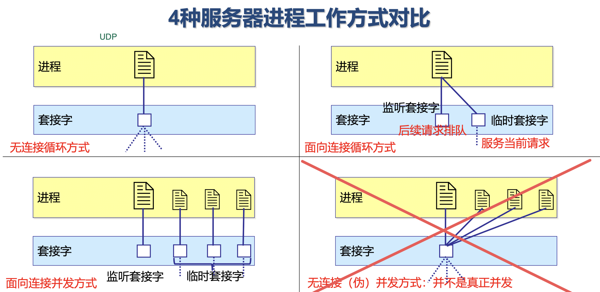

### P2P模式

对等 (P2P, Peer to Peer) 方式

对等方式是指两个进程在通信时并不区分服务的请求方和服务的提供方，只要两个主机都运行P2P软件，它们就可以进行平等、对等的通信

P2P方式从本质上看仍然是使用了C/S方式，但强调的是通信过程中的对等，这时每一个P2P进程既是客户同时也是服务器

P2P实体的特征：

1. 不需要总是在线

   虽然每个程序也扮演服务器角色，但与“客户端-服务器”中不同，不需要始终在线

2. 实体可以随时进入与退出

   可以动态改变IP地址，需要额外的管理开销

3. 任意两个实体之间可以直接通信

4. 易于扩展

   每个结点都贡献自己的计算资源，也消耗一部分资源


## WWW、Web对象、URL、静态Web对象、动态Web对象

> 只需掌握名词意思

WWW：WWW=World Wide Web=万维网，Web对象通过URLs定位，服务器与客户端之间执行HTTP协议

Web对象（包括：静态对象和动态对象）：可以是HTML文档、图像文件、视频文件、声音文件、脚本文件等

URL（统一资源定位符，Uniform resource locators）编址：协议类型：//主机名：端口//路径和文件名，不仅可以指向web对象，也可以指向别的对象，如ftp，本地file

静态web对象与静态网页：文本，表格，图片，图像和视频等多媒体类型的信息（实现语言：标记语言，如：HTML, XML, PHP)，包含字体、颜色和布局等风格类型的信息（实现语言：层叠样式表CSS）

动态web对象与动态网页：交互信息，比如，用户注册信息、登录信息等（实现：PHP/JSP等语言+MySQL等数据库）


## HTTP

HTTP为无状态协议，服务器端不保留之前请求的状态信息
无状态协议：效率低、但简单
有状态协议：维护状态相对复杂，需要维护历史信息，在客户端或服务器出现故障时，需要保持状态
的一致性等，比较复杂，http放弃有状态协议

但是HTTP从非持久连接逐渐演化为了持久连接

### HTTP1.x执行过程

非持久连接和持久连接：

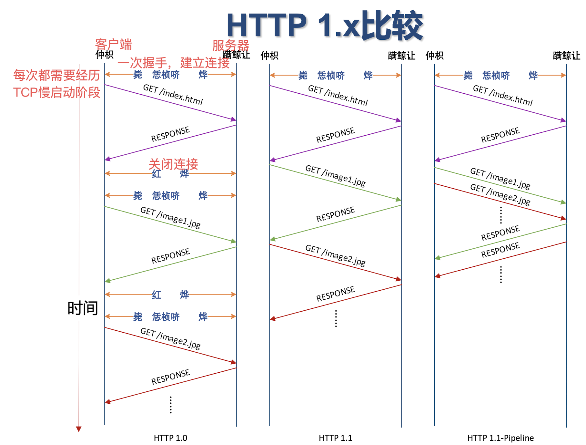

HTTP 2：服务器可以主动推送消息：确认客户端存活、预测资源请求

HTTP 3：主要是传输层变化，与应用层关系不大，将TCP替换UDP + QUIC

### 报文格式

>请求报文：Method 字段的取值只要求掌握GET与POST 的作用
>响应报文：掌握典型状态码

请求报文：

请求报文由三个部分组成，即开始行（请求报文中开始行又称请求行）、首部行和实体主体

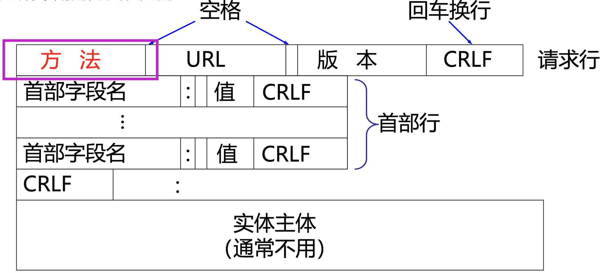

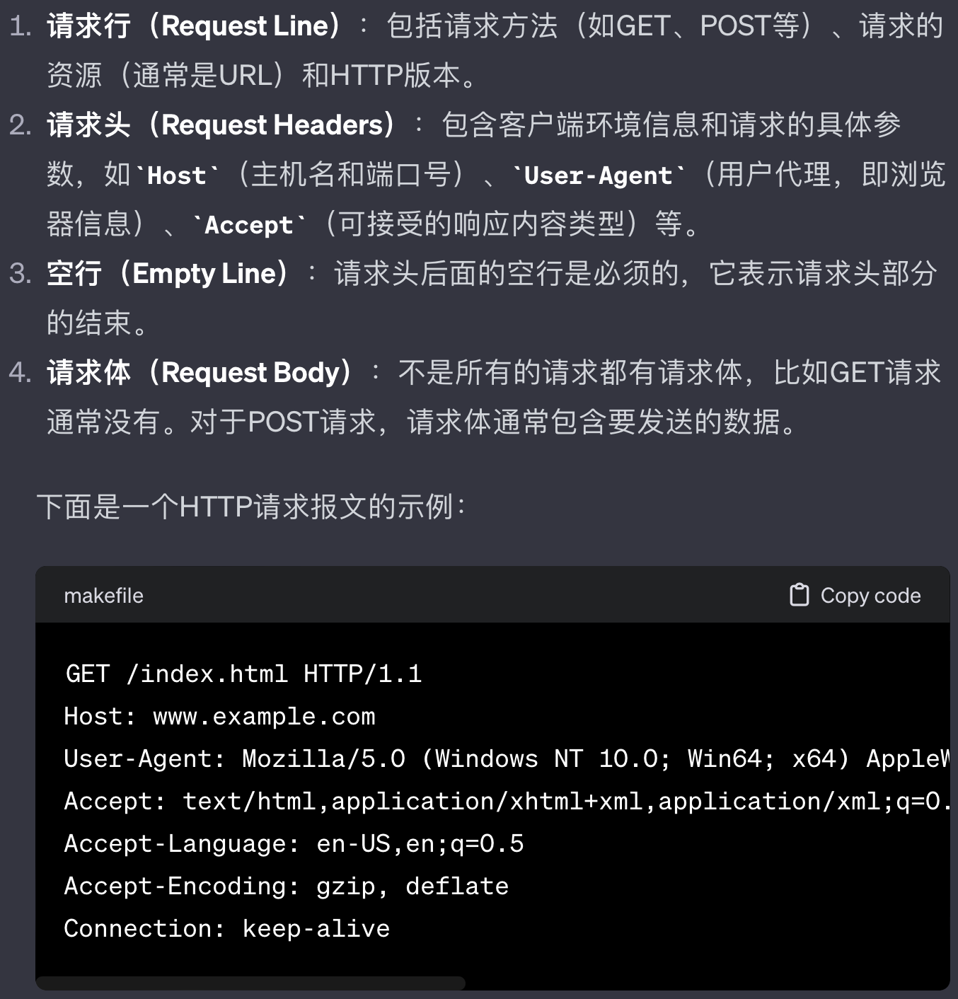

GET与POST方法的比较：POST方法也可以用于请求URL资源，但是GET方法参数在请求行URL，通常浏览器或服务器对URL长度有限制（2048字符），因此参数长度有限；POST方法的参数在实体主体中，参数长度没有限制


响应报文：

响应报文由三个部分组成，即开始行（响应报文中开始行又称状态行）、首部行和实体主体


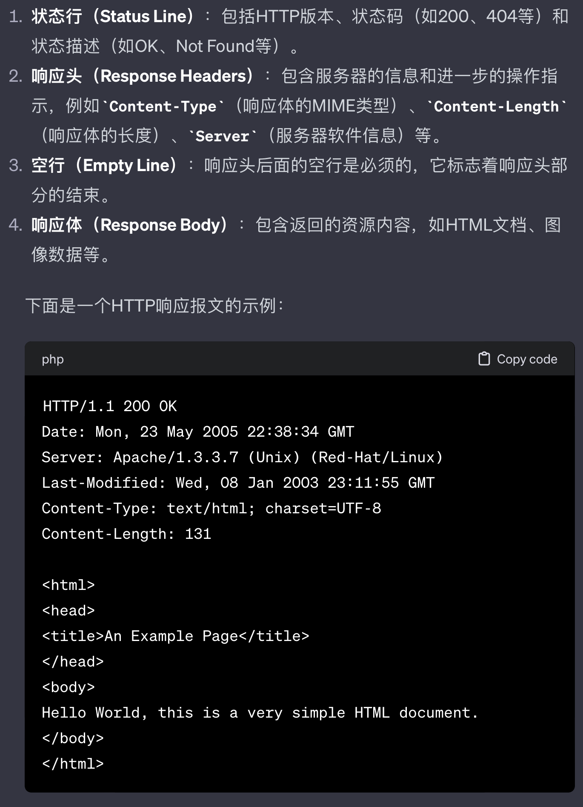

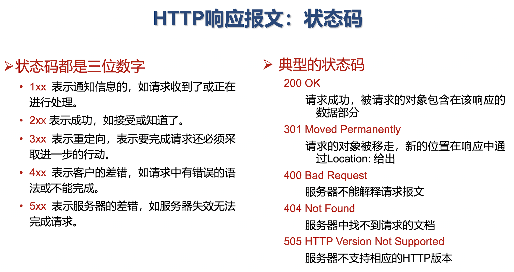


### 缓存

> 缓存部分：启发式策略不要求

分为浏览器缓存和代理服务器缓存

询问式策略：通过特殊的关键字头询问原始服务器，Web副本对应的原始Web页是否已更新

询问式策略：通过特的关键字头询问原始服务器，Web副本对应的原始Web页是否已更新

客户端：在发送的HTTP请求中指定缓存的时间，请求头包含If-modified-since： <date>

服务器：如果缓存的对象是最新的
• 在响应时无需包含该对象，响应头包含HTTP/1.1 304 NotModified,
• 否则服务器响应 HTTP/1.1 200 OK <data>


### Cookie

由于HTTP是无状态协议，需要用cookie保持用户状态

HTTP在响应的首部行里使用一个关键字头set-cookie：选择的cookie号具有唯一性
后继的HTTP请求中使用服务器响应分配的cookie：Cookie文件保存在用户的主机中，内容是服务器返回的一些附加信息，由用户主机中的浏览器管理Web服务器建立后端数据库，记录用户信息，cookie作关键字

例如：
• Set-Cookie: SID=31d4d96e407aad42; Path=/; Domain=example.com
• Cookie: SID=31d4d96e407aad42

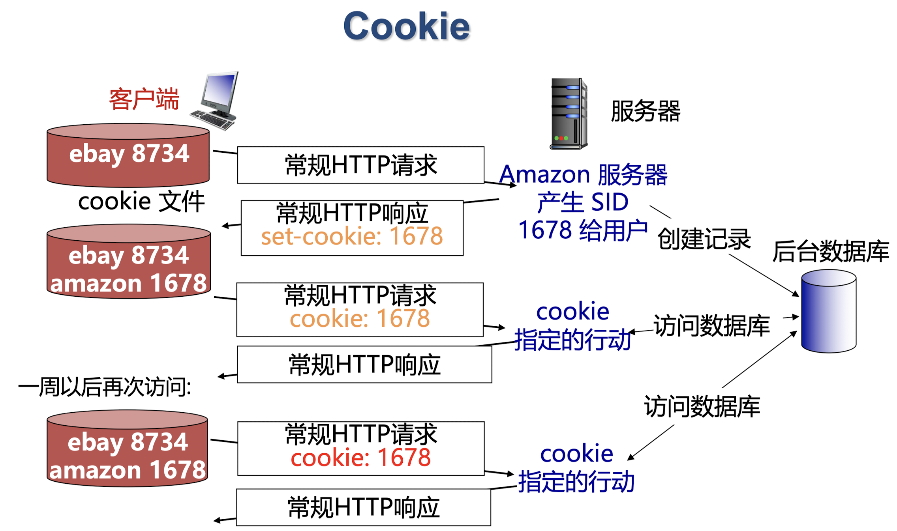

存放在浏览器上的Cookies一般包含5个字段

• 域指明Cookie来自何方，每个域为每个客户分配Cookie有数量限制

• 路径标明服务器的文件树中哪些部分可以使用该Cookie

• 内容采用“名字=值”的形式，是Cookie存放内容的地方，可以达到4K容量，内容只是字符串，不是可执行程序

• 过期代表过期时间

• 安全指示浏览器只向使用安全传输连接的服务器返回Cookie

Cookie技术好处：

•用Cookie在某网站标识用户信息，查找用户以前浏览网站记录
•用Cookie记录用户购物清单
•用Cookie可以保存4K内容，跟踪用户浏览网站的喜好
•用Cookie跨站点跟踪用户点击广告

Cookie技术坏处：

•能跟踪用户网络浏览痕迹，泄露用户隐私
•Cookie跟踪用户以前浏览过哪些网站，跟踪用户频繁浏览哪类网站
• Cookie收集用户信息，用户网络交互时关注的关键词

Cookie**<u>容易嵌入间谍程序，这是个误区</u>**，Cookie文件保存的只是文本串，没有可执行程序


## DNS
> 具体域名不考、域名管理机构不考
> 报文格式只需了解3个部分，每部分具体字段不要求（考试会给出）

域名系统（DNS,Domain Name System）：将域名映射成IP地址

1. 可以基于域名查询IP地址
2. 可以基于IP地址，反向查询域名

DNS提供的是与网络层有关的功能，但以应用层技术的方式实现，将复杂功能在网络边缘实现

多个域名映射到同一IP ：一台主机可能有多个名字（别名），以便于记忆，其中一个是叫“规范名” 最正确，最权威

一个域名对应多个IP：同一域名可以由多个主机进行服务，所以DNS起了延迟优化与负载均衡的作用


### 域名服务器

Internet的DNS：层次化、分布式数据库，若干个域名服务器（Domain Name Server），也叫名字服务器（Name Server）

分布式的好处
•避免单点故障
• 能够处理海量流量

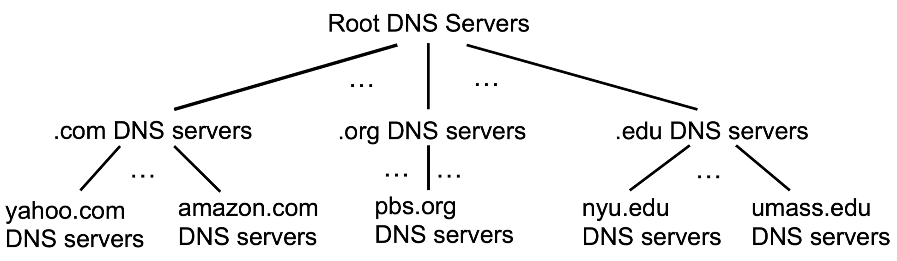

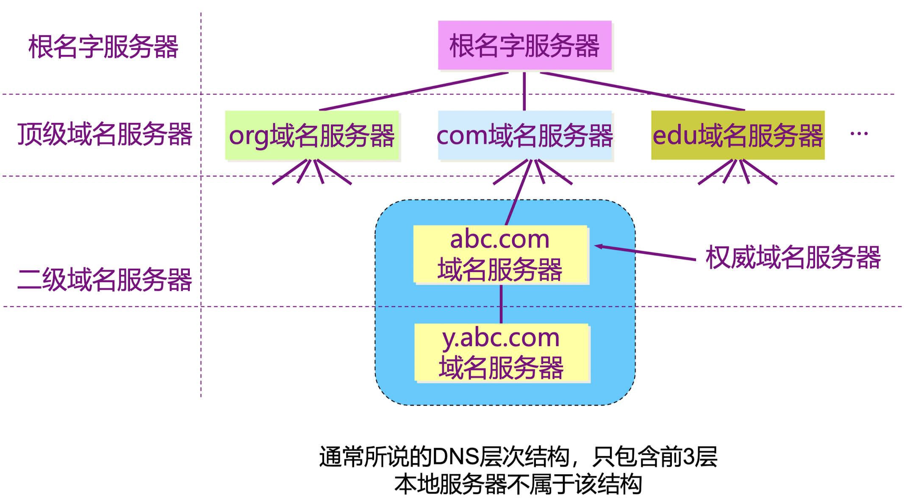

三级域及以下的名字服务器也统称为本地域名服务器（Local DNS Server） 或 迭代域名服务器

•每一个Internet服务提供者ISP（Internet Service Provider），都至少有一个本地DNS服务器（又称递归服务器），距离用户主机较近
•最简单的部署层次是只有一层本地域名字服务器，即三级域名字服务器
•实际部署中，解析请求路径上的递归服务器/本地域名服务器可能有多层

**<u>本地DNS服务器就是想要查询DNS的主机对应的DNS服务器</u>**


### 域名解析过程

当某一应用进程需要进行域名解析时，该应用进程将域名放在DNS请求报文（UDP数据报，目标端口号为53）发给本地DNS服务器

**<u>本地DNS服务器</u>**得到查询结果后，将对应IP地址放在应答报文中返回给应用进程

域名查询有递归查询（recursive query）和迭代查询（或循环查询，iterative query）两种方式
• 主机向本地DNS服务器的查询一般采用递归查询
•本地DNS服务器向更上层域名服务器可以采用递归查询，但一般优先采用迭代查询
•实际中，请求方与服务器有一定自主权选择哪种方式

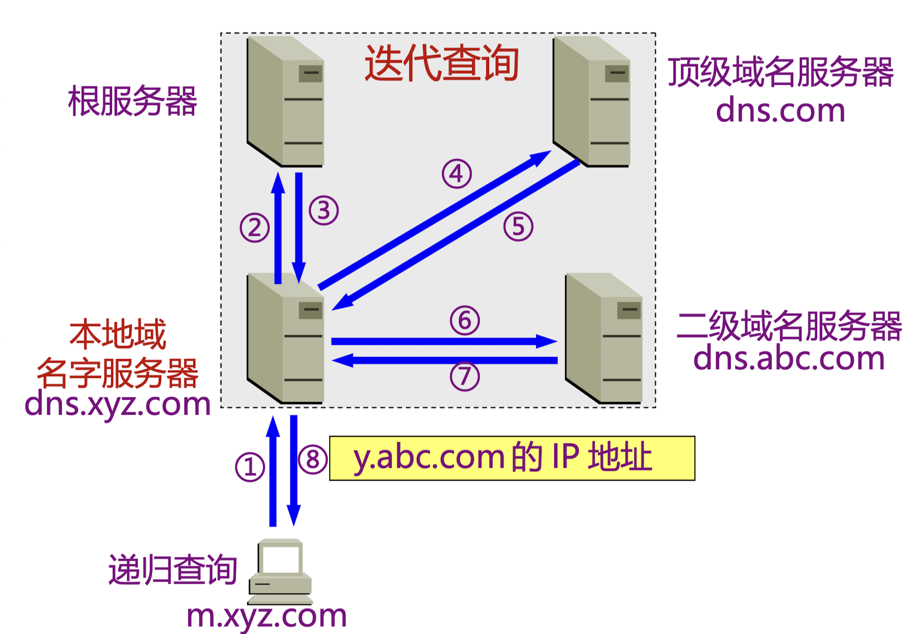

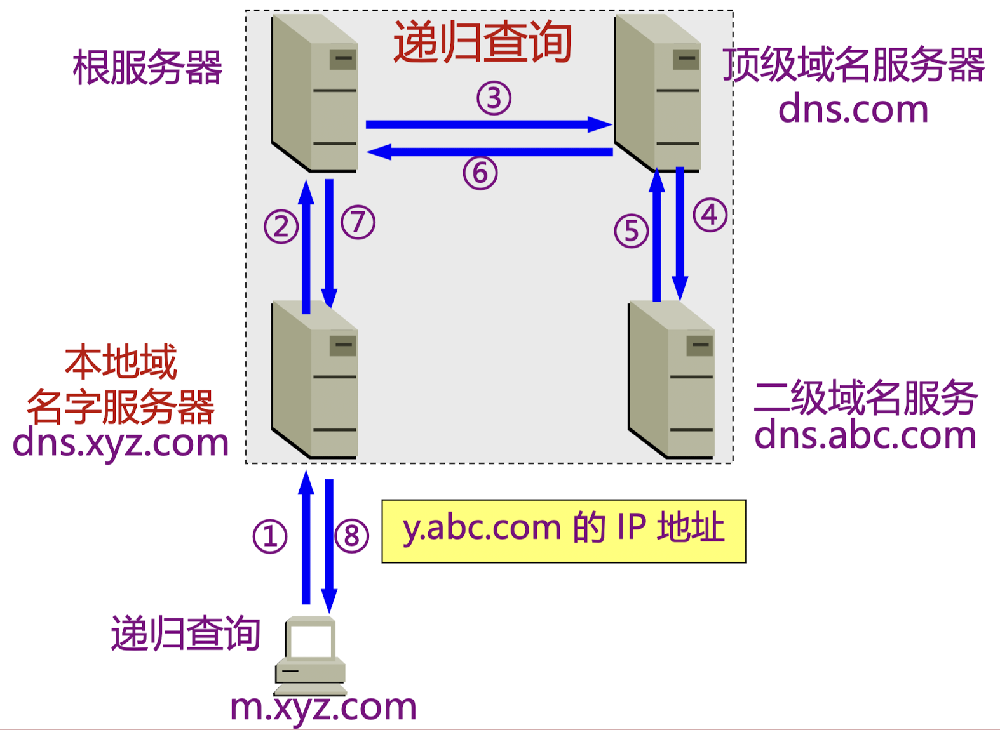

DNS报文格式分为三部分：基础结构（报文首部）、问题、资源记录（RR, Resource Record，只有响应报文才会出现）

报文类型分为查询请求（query）和查询响应（reply）两类，请求和响应的报文结构基本相同

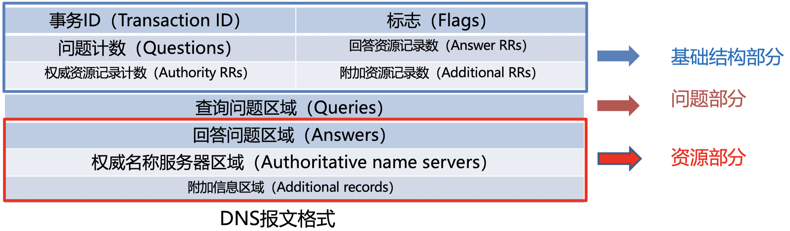


### DNS 安全

DNS协议设计之初没有过多考虑安全问题
导致DNS存在以下缺陷：几乎所有DNS流量都是**<u>基于UDP明文</u>**传输的，DNS的资源记录未加上任何的认证和加密措施

DNSSEC安全机制：

在DNSSEC的使用中
• 域名服务器用自己的私有密钥对资源记录（Resource Record, RR）进行签名
• 解析服务器用域名服务器的公开密钥对收到的应答信息进行验证
• 如果验证失败，表明这一报文可能是假冒的，或者在传输过程、缓存过程中被篡改了


1. **请求 `test.net` 的DS记录**：
   - 解析器向管理 `.net` 的服务器请求 `test.net` 的DS（委派签名，子域的公钥DNSKEY的哈希值）记录。
   - `.net` 的服务器返回 `test.net` 的DS记录和该DS记录的RRSIG（由 `.net` 的私钥签名）。

2. **解析器验证DS记录**：
   - 使用 `.net` 的公钥（一个可信的锚点）来验证DS记录的RRSIG。
   - 如果验证成功，这表明DS记录是真实的。

3. **请求 `www.test.net` 的信息**：
   - 解析器请求管理 `test.net` 的服务器提供 `www.test.net` 的信息。

4. **返回 `www.test.net` 的A记录和RRSIG**：
   - `test.net` 的服务器返回 `www.test.net` 的A记录和这个A记录的RRSIG（由 `test.net` 的私钥签名）。

5. **请求 `test.net` 的DNSKEY记录**：
   - 解析器请求 `test.net` 的DNSKEY记录。

6. **返回 `test.net` 的DNSKEY记录和RRSIG**：
   - `test.net` 的服务器返回它的DNSKEY记录和这个DNSKEY记录的RRSIG。

验证过程：

- **验证 `test.net` 的DNSKEY**：使用DS记录来验证 `test.net` 的DNSKEY。
- **验证 `www.test.net` 的A记录**：使用 `test.net` 的DNSKEY来验证A记录的RRSIG。

在这个过程中，解析器通过一系列步骤验证了从不同层级的DNS服务器接收到的DNS记录的真实性。这种验证机制是建立在信任链上的，从可信的锚点（如 `.net` 的DNSKEY）开始，逐步验证下一级域（如 `test.net`）的DNSKEY和其他记录。通过这种方式，DNSSEC确保了在域名解析过程中数据的安全性和可靠性。


**<u>我的总结：</u>**

我们会收到来自 `test.net` dns服务器的对 `www.test.net` 的dns解析报文和这个报文的签名，也就是：

从原数据 `A` 和 `RRSIG = t = RSA(SHA256(A), key_private)` 我们得到：`A'` 和 `t'`

我们需要验证：`RSA(A') == RSA'(t', key_public)` 就可以说明原数据 `A` 没有被篡改

但是万一 `key_public` 也被篡改了，那我们这样检测就不一定能确定 `A` 被篡改了，因为别人可以用自己的私钥生成数据 `A` ，这样我们一算就发现满足上述这个等式了，三个变量都是被篡改过的了

所以我们要确认 `key_public` 没有被篡改过，那么验证 `SHA256(key_public)` 是对的即可

以下使用 `.net` 的公钥验证 `.test.net` 的公钥 `key_public` 是对的


假设我们能够确认 `.net` 的公钥是对的，那我们可以从 `.net` 的dns服务器申请 `.test.net` 的dns服务器的公钥的哈希值，也就是：

从原数据 `DS = SHA256(key_public)`  和 `RRSIG = t = RSA(SHA256(DS), key_private_of_.net)` 我们得到 `DS'` 和 `t'`

我们需要验证：`RSA(DS') == RSA'(t', key_public_of_.net)` 就可以说明原数据 `DS` 没有被篡改

那么我们验证 `DS == SHA256(key_public)` 即可说明 `key_public` 没有被篡改


当然，实际过程是从上往下，我的描述是从下往上，只是为了方便说明思路


## 电子邮件

### 电子邮件系统的组成

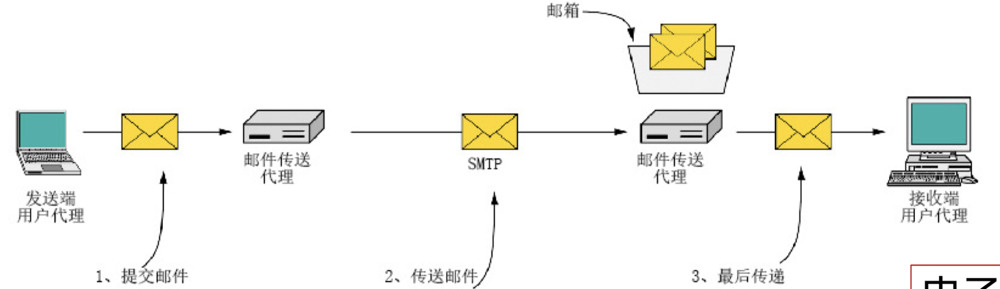


### 各个协议的功能

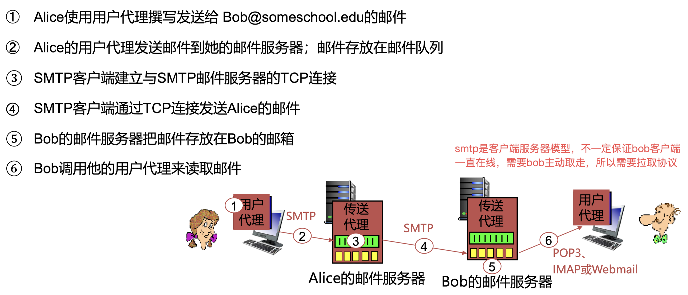

SMTP的不足：
•不包括认证
• 传输ASCII而不是二进制数据
• 邮件以明文形式出现

SMTP定义了如何传输邮件，但邮件本身也需遵循特定格式，首部（header）必须含有一个From：首部行和一个To：首部行，还可以包含 Subject：等其他可选的首部行，消息体（body）邮件正文

RFC 5322—Internet邮件格式
• 基本ASCII电子邮件使用RFC 5322
•最新修订的Internet邮件格式，其前身是RFC 822

RFC 5322为SMTP 提供指导：在使用SMTP传输电子邮件时，邮件的格式必须符合 RFC 5322的规定。这意味着 SMTP 服务器在处理邮件时，会参照 RFC 5322来解析和验证邮件的结构和头部信息。


MIME (Multipurpose Internet Mail Extensions) 多用途Internet邮件扩展
• 基本格式的多媒体扩展
• 可传输多媒体消息和二进制文件


为什么不能使用SMTP获取邮件？
•接收方的用户代理不能使用SMTP从传输代理获取邮件，因为取邮件是一个拉操作
•而SMTP 是一个推协议，需要推送目标在线
•通过引入最终交付（邮件访问）协议来解决这个问题。

最终交付（邮件访问）协议：从邮件服务器的邮箱中获取邮件
• POP3:Post Office Protocol-Version 3，第三版邮局协议
• IMAP: Internet Message Access Protocol,Internet邮件访问协议
• Webmail （HTTP）：基于Web的电子邮件


POP3由RFC1939定义，**<u>POP3使用客户/服务器</u>**工作方式，在接收邮件的用户PC机中必须运行POP客户程序，而在用户所连接的ISP的邮件服务器中则运行POP服务器程序。是一个非常简单的最终交付协议，当用户代理打开一个到端口110上的TCP连接后，客户/服务器开始工作
POP3的三个阶段：
•认证（Authorization）：处理用户登录的过程
•事务处理（Trnsactions）：用户收取电子邮件，并将邮件标记为删除
• 更新（Update）：将标为删除的电子邮件删除


IMAP—Internet邮件访问协议［RFC 2060］
• 用于最终交付的主要协议
• IMAP是较早使用的最终交付协议一POP3（邮局协议，版本3）的改进版
• 邮件服务器运行侦听端口143的IMAP服务器
•用户代理运行一个IMAP客户端
•客户端连接到服务器并开始发出命令

**<u>IMAP服务器把每个邮件与一个文件夹联系起来：</u>**
•当邮件第一次到达服务器时，它与收件人的INBOX文件夹相关联
•收件人能够把邮件移到一个新的、用户创建的文件来中，阅读邮件，删除邮件等

**<u>IMAP允许用户代理获取邮件某些部分</u>**，例如，一个用户代理可以只读取一个邮件的首部，或只是一个多部分MIME邮件的一部分，用户代理和其邮件服务器之间使用低带宽连接（如一个低速调制解调器链路）的时候，用户可能并不想取回邮箱中的所有邮件，其要避免可能包含如音频或视频片断的大邮件

IMAP的缺点是如果用户**<u>没有将邮件复制到自己的PC上</u>**，则邮件一直是存放在IMAP服务器上。因此用户需要经常与IMAP服务器建立连接


Webmail-基于Web的电子邮件
• 提供电子邮件服务的IMAP和SMTP替代方案
•使用Web作为界面，用户代理就是普通的浏览器
• 用户及其远程邮箱之间的通信通过HTTP进行

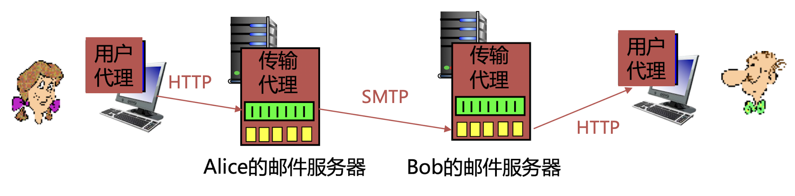


## P2P

### 基本概念

每个实体都是一个对等结点（peer），去中心化的连接与传输

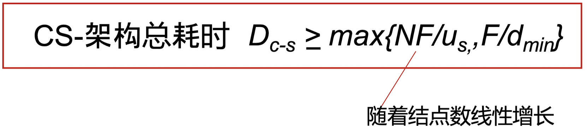

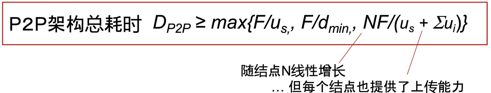

P2P协议中，资源索引都是最关键的问题
•目标：给定资源，查询拥有资源的peer
• Peer可以随时加入或者退出，也可以动态更改IP地址

中心化索引的问题
单点故障
性能瓶颈

解决方案：Query Flood（洪泛请求）
每个peer独立建立索引，记录自身拥有的资源
Peer之间形成一个图（graph）
•图中的边为**<u>TCP连接</u>**
•通常每个peer建立小于10个连接
•注意：peers与TCP连接形成的网络，又被成为**<u>Overlay网络</u>**，有别于IP网络
查找资源：
•每个peer向邻居peer查询，如果邻居peer没有该资源，则邻居peer向自身邻居递归查询，一旦查询到结果，沿查询路径返回最初的查询发起者

问题：产生大量网络消息，可扩展性有限


解决方案：混合索引，介于中心化索引与洪泛索引之间
将Overlay网络组织为层次化结构
•存在超级结点
•每个普通结点连向至少1个超级结点
•超级结点之间可以任意建立连接
普通结点与超级结点间，使用中心化索引
•超级结点扮演中心化服务器
•超级结点记录“资源->网络位置”映射
超级结点间采用去中心化的洪泛方式查询索引


### BitTorrent

BitTorrent是基于P2P思想的文件分发的一个协议，不是纯P2P架构，所有正在交换某个文件的peer，组成一个torrent（种子）

中心化的跟踪器（Tracker）：
• 一个独立服务器
•维护着一个正在主动上传和下载该内容的所有其他对等用户列表
• 对等方可以通过Tracker（跟踪器）找到其他对等方

文件被划分为256Kb大小的块（chunk），从跟踪器获取peer列表，同其他peer交换文件块，节点动态加入和退出，但是获取整个文件后，存在自私离开可能

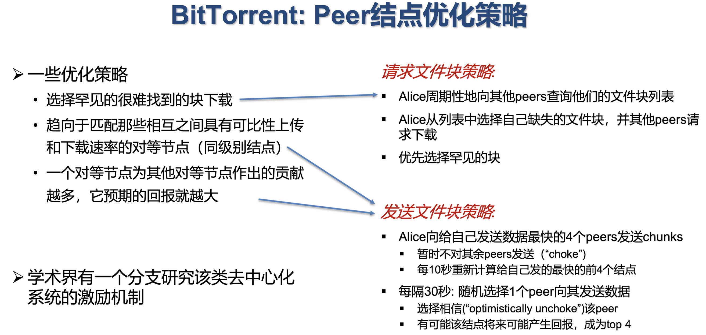


### 分布式哈希表

分布式哈希表 （distributed hash tables, DHTs）不需要中心化追踪器，就能查询每个key在哪个peers上，DHT是一个概念，具体有多种实现方式

基本思想：
• 对所有peers地址，以及keyi算哈希值
•哈希值取模后，排列在一个圆环上
•每个key由圆环上顺时针方向的下一个peer负责存储
•若查询失败，则继续沿着顺时针方向查询


新增Peer位于位置5：
1. 通知位置3与0上的Peers进行更新
2. 从Peer O将数据4与5迁移到新peer

问题1：负载均衡
•由于哈希值的不确定性，结点分布可能不均衡
问题2:Peer之间能力不一样
解决方案：将每个peer划分成更多虚拟结点


假设结点1存储资源最多
划分前：
数据4、5、6、7、0都存在结点0，结点1只存数据1
划分后：
结点1存储数据1、4、5、6


## Socket编程

### TCP

服务器：

```c
#include <stdio.h>
#include <stdlib.h>
#include <string.h>
#include <unistd.h>
#include <netinet/in.h>
#include <sys/socket.h>

#define PORT 8080  // 服务器监听的端口
#define BUFFER_SIZE 1024

int main() {
    int server_fd, new_socket;
    struct sockaddr_in address;
    int addr_len = sizeof(address);
    char buffer[BUFFER_SIZE] = {0};

    // 创建套接字
    if ((server_fd = socket(AF_INET, SOCK_STREAM, 0)) == 0) {
        perror("socket failed");
        exit(EXIT_FAILURE);
    }

    // 设置套接字选项，防止端口被占用
    int opt = 1;
    if (setsockopt(server_fd, SOL_SOCKET, SO_REUSEADDR | SO_REUSEPORT, &opt, sizeof(opt))) {
        perror("setsockopt");
        exit(EXIT_FAILURE);
    }

    address.sin_family = AF_INET; // 使用IPv4
    address.sin_addr.s_addr = INADDR_ANY; // 绑定到所有可用接口
    address.sin_port = htons(PORT); // 设置端口号

    // 绑定套接字到指定IP和端口
    if (bind(server_fd, (struct sockaddr *)&address, sizeof(address)) < 0) {
        perror("bind failed");
        exit(EXIT_FAILURE);
    }

    // 开始监听端口
    if (listen(server_fd, 3) < 0) {
        perror("listen");
        exit(EXIT_FAILURE);
    }

    // 接受连接
    if ((new_socket = accept(server_fd, (struct sockaddr *)&address, (socklen_t*)&addr_len)) < 0) {
        perror("accept");
        exit(EXIT_FAILURE);
    }

    // 读取数据
    read(new_socket, buffer, BUFFER_SIZE);
    printf("Received: %s\n", buffer);

    // 回送数据
    send(new_socket, buffer, strlen(buffer), 0);
    printf("Echoed back: %s\n", buffer);

    // 关闭套接字
    close(new_socket);
    close(server_fd);
    return 0;
}

```


客户端：

```c
#include <stdio.h>
#include <stdlib.h>
#include <string.h>
#include <unistd.h>
#include <arpa/inet.h>
#include <sys/socket.h>

#define PORT 8080  // 服务器端口
#define BUFFER_SIZE 1024

int main() {
    int sock = 0;
    struct sockaddr_in serv_addr;
    char buffer[BUFFER_SIZE] = {0};
    char *message = "Hello TCP Server!";

    // 创建套接字
    if ((sock = socket(AF_INET, SOCK_STREAM, 0)) < 0) {
        printf("\n Socket creation error \n");
        return -1;
    }

    serv_addr.sin_family = AF_INET;
    serv_addr.sin_port = htons(PORT);

    // 将地址转换为二进制形式
    if (inet_pton(AF_INET, "127.0.0.1", &serv_addr.sin_addr) <= 0) {
        printf("\nInvalid address/ Address not supported \n");
        return -1;
    }

    // 连接到服务器
    if (connect(sock, (struct sockaddr *)&serv_addr, sizeof(serv_addr)) < 0) {
        printf("\nConnection Failed \n");
        return -1;
    }

    // 发送消息
    send(sock, message, strlen(message), 0);
    printf("Message sent: %s\n", message);

    // 接收回声
    read(sock, buffer, BUFFER_SIZE);
    printf("Echo received: %s\n", buffer);

    // 关闭套接字
    close(sock);
    return 0;
}

```


### UDP

服务器：

```c
#include <stdio.h>
#include <stdlib.h>
#include <unistd.h>
#include <netinet/in.h>
#include <string.h>
#include <sys/socket.h>

#define PORT 8080  // 服务器监听的端口
#define BUFFER_SIZE 1024

int main() {
    int sockfd;
    char buffer[BUFFER_SIZE];
    struct sockaddr_in servaddr, cliaddr;

    // 创建套接字
    if ((sockfd = socket(AF_INET, SOCK_DGRAM, 0)) < 0 ) {
        perror("socket creation failed");
        exit(EXIT_FAILURE);
    }

    memset(&servaddr, 0, sizeof(servaddr));
    memset(&cliaddr, 0, sizeof(cliaddr));

    servaddr.sin_family = AF_INET; // IPv4
    servaddr.sin_addr.s_addr = INADDR_ANY; // 绑定到所有可用接口
    servaddr.sin_port = htons(PORT); // 设置端口号

    // 绑定套接字
    if (bind(sockfd, (const struct sockaddr *)&servaddr, sizeof(servaddr)) < 0 ) {
        perror("bind failed");
        exit(EXIT_FAILURE);
    }

    int len, n;
    len = sizeof(cliaddr);

    // 接收数据
    n = recvfrom(sockfd, (char *)buffer, BUFFER_SIZE, 0, (struct sockaddr *) &cliaddr, &len);
    buffer[n] = '\0';
    printf("Received: %s\n", buffer);

    // 回送数据
    sendto(sockfd, (const char *)buffer, strlen(buffer), 0, (const struct sockaddr *) &cliaddr, len);
    printf("Echoed back: %s\n", buffer);

    // 关闭套接字
    close(sockfd);
    return 0;
}

```


客户端：

```c
#include <stdio.h>
#include <stdlib.h>
#include <unistd.h>
#include <string.h>
#include <arpa/inet.h>
#include <sys/socket.h>

#define PORT 8080
#define BUFFER_SIZE 1024

int main() {
    int sockfd;
    char buffer[BUFFER_SIZE];
    char *message = "Hello UDP Server!";
    struct sockaddr_in servaddr;

    // 创建套接字
    if ((sockfd = socket(AF_INET, SOCK_DGRAM, 0)) < 0 ) {
        perror("socket creation failed");
        exit(EXIT_FAILURE);
    }

    memset(&servaddr, 0, sizeof(servaddr));

    servaddr.sin_family = AF_INET; // IPv4
    servaddr.sin_port = htons(PORT); // 设置端口号
    servaddr.sin_addr.s_addr = INADDR_ANY; // 目的地址

    int n, len;
    len = sizeof(servaddr);

    // 发送消息
    sendto(sockfd, (const char *)message, strlen(message), 0, (const struct sockaddr *) &servaddr, len);
    printf("Message sent: %s\n", message);

    // 接收回声
    n = recvfrom(sockfd, (char *)buffer, BUFFER_SIZE, 0, (struct sockaddr *) &servaddr, &len);
    buffer[n] = '\0';
    printf("Echo received: %s\n", buffer);

    // 关闭套接字
    close(sockfd);
    return 0;
}

```


## 流媒体

### 三种服务模式

常见的流媒体服务
• 媒体点播：提前录制好，边下载边播放（起始时延<10s；类VCR操作（例如拖动进度条）＜1~2s）
• 媒体直播：边录制边上传，边下载边播放（大规模直播往往有数秒的时延）
• 实时交互：双方或多方实时交互式通信（时延<400ms可接受，VR则需要<25ms）

### RTSP、RTP、RTCP 功能（工作过程不要求）

实时传输协议 RTP （Real-time Transport Protocol）
•使用**<u>UDP</u>**，快
•RTP 为实时应用提供端到端的数据传输，但**<u>不提供任何服务质量的保证</u>**
• RTP 对多媒体数据块，**<u>不做任何处理</u>**，处理指编码、解码、缓存等，这些都是媒体播放器负责

实时传输控制协议 RTCP （RTP Control Protocol）
• RTCP 是**<u>与 RTP 配合</u>**使用的控制协议
• RTCP 的主要功能：**<u>服务质量的监视与反馈、媒体间的同步</u>**、播组中成员的标识
• RTCP 分组也使用 **<u>UDP</u>** 传送
•可将多个 RTCP 分组封装在一个 UDP 用户数据报中
•RTCP 分组周期性地在网上传送，它带有发送端和接收端对服务质量的统计信息报告
**<u>RTP与RTCP很少直接使用，大多作为其他流媒体协议的基础</u>**

实时流式协议RTSP （Real-Time Streaming Protocol）
RTSP**<u>本身并不传送数据</u>**，是一个多媒体播放控制协议，通用性好
• 没有定义音频/视频的编码方案
• 没有规定音频/视频在网络中传送时应如何封装在分组中
• 没有规定音频/视频流在媒体播放器中应如何缓存
RTSP对播放情况进行控制，如：暂停/继续、后退、前进等，又称为“互联网录像机遥控协议"
RTSP是**<u>有状态的协议</u>**，它**<u>记录用户所处于的状态（初始化状态、播放状态或暂停状态）</u>**
RTSP控制分组**<u>既可在TCP上传送，也可在UDP上传送</u>**，使用UDP时，底层就是使用RTP+RTCP

# 3.传输层

## 传输层基本概念

传输层应提供进程之间通信的抽象，传输层=将快递从发送者手里取走，交给对应的接收者网络层= 两校快递站之间的传递，主机间通信与应用程序间通信的区别

传输层可以通过差错恢复、重排序等手段提供可靠、按序的交付服务，但无法提供延迟保证、带宽保证等服务

### 套接字

是app开发者和操作系统之间的api

### 端口号

由于tcp，udp是基于网络层的协议，所以其本身只需要比网络层多用端口号，所以tcp和udp报文中只包含端口号

端口号的分类：
• 熟知端口：0~1023，由公共域协议使用，http, server: 80
•注册端口：1024~49151，需要向IANA注册才能使用
•动态和/或私有端口：49152~65535，一般程序使用

### ★复用与分用

（发送端） 复用（multiplexing）：传输层从多个套接字收集数据，交给网络层发送 

（接收端）分用（demultiplexing）：传输层将从网络层收到的数据，交付给正确的套接字

UDP分用：

UDP套接字使用 <IP地址，端口号> 二元组进行标识

接收方传输层收到一个UDP报文段后：
•检查报文段中的目的端口号，将UDP报文段交付到具有该端口号的套接字
•＜目的IP地址，目的端口号>相同的UDP报文段被交付给同一个套接字，与<源IP地址，源端口号＞无关
•ip报文段中的源IP地址，udp报文段中的源端口号，被接收进程用来发送响应报文

> 也就是如果两个不同的地方（不同的源ip源port）给同一个目的port发，会传到同一个套接字
>
> 这也与UDP套接字只有服务套接字没有监听和连接套接字相印证，因为每一个连接套接字相当于对于每一个源ip源port开一个新的套接字，而UDP对于所有的源ip源port都传输到同一个套接字


TCP分用：

一个TCP服务器为了同时服务很多个客户，使用两种套接字

监听套接字：
•服务器平时在监听套接字上等待客户的连接请求，该套接字具有众所周知的端口号

连接套接字： 监听与连接套接字使用一个端口号
•服务器在收到客户的连接请求后，创建一个连接套接字，但使用原监听端口号
•每个连接套接字只与一个客户通信，即只接收具有以下四元组的报文段：
•源IP地址 =客户IP地址，源端口号=客户套接字端口号
•目的IP地址=服务器IP地址，目的端口号=服务器监听套接字的端口号

连接套接字需要使用<源IP地址，目的IP地址，源端口号，目的端口号>四元组进行标识，服务器使用该四元组将TCP报文段交付到正确的连接套接字


### 传输粒度与报文边界

UDP：以报文为单位进行传输，应用可以感知报文边界 


TCP：字节流传输，应用感知不到报文边界


## UDP

### UDP提供的服务

1. 对网络层接口进行最简单的封装：网络层＋多路复用与分解
2. 报文完整性检查（可选）：检测并丢弃出错的报文

### UDP报文段结构


### UDP checksum

将数据划分为一系列16-bit整数，将所有整数相加，如果相加结果最高位为1（16比特溢出），则将1加到低位16bit部分，将最终结果取反


计算UDP校验和时，要包括伪头、UDP头和数据三个部分


UDP伪头信息**<u>取自IP报头</u>**，包括：
•源IP地址，目的IP地址
•UDP的协议号
• UDP报文段总长度

计算校验和包含伪头信息，是为了避免由于IP地址错误等造成的误投递

**<u>UDP校验和是可选的</u>**，若不计算校验和，该字段填入0

UDP校验和校验的时候，接收方对UDP报文（包括校验和）及伪头求和，若**<u>结果为0xFFFF</u>**，认为没有错误

UDP校验和检测失败？即checksum仍有可能检测不出错误
•如：两个16位整数，在同一个bit位发生0-1翻转
•此时，由应用层负责发现、处理错误

为什么使用checksum？
•传输层发生错误**<u>概率非常小</u>**：链路层一般有检测、纠错功能，已经将大部分网络传输过程中的错误处理了；并且传输层错误一般来自于**<u>主机</u>**软件bug or 硬件故障->小概率事件
•计算开销小

### UDP缓冲区？

通常端系统的实现（如Linux）：无发送缓冲区、有接收缓冲区

发送方：从应用层获取的数据，传输层加上UDP头部后直接交给网络层
•长消息的分片、缓冲依赖于网络层、链路层提供

接收方：每个socket一个缓冲区，存储着来自不同发送方的报文
• 每次获得一个报文，下一次接收可能得到的是来自另一个发送方的报文
• 因此，应用层是可以感知到报文边界

### 为什么需要UDP？

1. 应用可以尽可能快地发送报文：
   •无建立连接的延迟
   •不限制发送速率（不进行拥塞控制和流量控制）
2. 报头开销小
3. 协议处理简单

### UDP适合哪些应用？

容忍丟包但对延迟敏感的应用：
• 如流媒体

以单次请求/响应主的应用：
• 如DNS

若应用要求基于UDP进行可靠传输：
• 由应用层实现可靠性


## ★一般性可靠传输

### 完美信道：rdt 1.0


### 有错但不丢包信道：rdt 2.0, rdt 2.1, rdt 2.2

自动重传请求（ARQ, Automatic Repeat reQuest）：基于反馈的重传
•三要素：（接收方）差错检测、（接收方）反馈、（发送方）重传


rdt 2.0：

发送方：发送一个数据包后暂停，等待ACK或NAK到达后发送下一个包

接收方
•若检测数据包有错，返回NAK
•否则，完成接收后，回复ACK

rdt2.0是最简单的ARQ协议，但是ACK与NAK的内容是不重要的：哑帧（dummy frame）

此类协议又称停-等式协议（stop-and-wait）：发送1个报文后就停下，等待后再发


rdt 2.0的缺陷：如果ACK或NAK出错，发送方不知道接收方的状况


rdt 2.1：如果ACK或NAK出错，发送方直接重传

使用序号seq区分当前数据包是否是前一次发送的重传


**<u>注意默认没有顺序错误，所以只可能接收到正确的包或者上一个包的重传，不可能出现接收到上上个包的重传的情况，所以只用01的seqnum即可</u>**


rdt 2.2：NAK就不再需要

当ACK出错或ACK.seq ！= seq，发送方进行重传


### 有错且丢包信道：rdt 3.0

仍然假设没有乱序！

发送方增加一个计时器（timer），如果经过一段时间没有收到确认，发送方将超时，于是再次发送该数据包


一个超时重传导致之后过早重传的例子：


### 停等式协议的效率

停止等待协议的发送工作时间是F/R，空闲时间是RTT
信道利用率 （line utilization）=F/（F+R•RTT）
当F/R<RTT 时：信道利用率＜50%


长肥网络（LFN,Long Fat Network）：如果 一个网络的带宽-延迟乘积（bandwidth-delay product）较高（>105 bits，约12kB），则可以被认为是长肥网络

在一个transit time=270ms的长肥信道中，利用率很低：每一帧的发送时间是1毫秒（1000 bits/（1,000,000 bits/sec）.由于传播延迟较长，发送者在541毫秒之后才能收到确认，信道利用率1/541

停止等待协议的问题是只能有一个没有被确认的帧在发送中，假如将链路看成是一根管道，数据是管道中流动的水，那么在传输延迟较长的信道上，停-等协议无法使数据充满管道，因而信道利用率很低

一种提高效率的方法：可以使用更大的帧，但是帧的最大长度受到信道比特错误率（BER，Bit Error Ratio）的限制，帧越大，在传输中出错的概率越高，将导致更多的重传


## ★一般性可靠传输的性能优化

### 流水线传输


根据“反馈+重传”的不同，有2种方法：回退N步（Go-back-N,GBN）、选择重传（Selective Repeat, SR)

限制最多有N个未确认数据包，N由多种机制共同决定，与后续内容有关：流量控制、拥塞控制


### 回退N算法（GBN）

思想
•当接收端收到一个出错帧或乱序帧时，丢弃所有的后继帧，并且不为这些帧发送确认
•发送端超时后，重传所有未被确认的帧

要点
•发送方保存所有未确认数据包，构成一个先进先出队列，seq值连续，只需维护seq的上下界
• 接收端无需保存数据包，只要记住下一个期望收到的seq

优劣
•优点：减轻接收端负担
•缺点：重传包数量大，增加发送端与信道负担

发送方保存所有未被确认数据包（最多N个）
• send_base：当前第一个未确认数据包
• next _seqnum：下一个发送数据包的seq值


ACK不是下一个想收到的（与 lab 要求的不同），就是已经收到的


### 选择重传算法（SR）

设计思想
• 接收方对每个数据包独立确认
•若发送方发出连续的若干包后，收到对其中某一包的ACK错误，或某一包的定时器超时，则只重传该出错包或计时器超时的数据包

要点
•发送端需要对每个包维护计时器
•接收端需要缓存已经接收的数据包，以便按顺序交付给上一层

优劣
•优点：减少重传数量
•缺点：接收端缓存、发送端逐包计时器，增加存储开销，减少带宽开销


复用seq对选择重传的影响：


解决方案：窗口大小不能超过seq取值空间的一半（证明）：举这个例子，两个窗口可能产生错位

思考题：在回退n中是否有这种要求（去年考题）：也有类似的要求，但是有所放宽，窗口大小要**<u>小于</u>**seq取值空间

### 一种极端场景（来自22年上课同学）

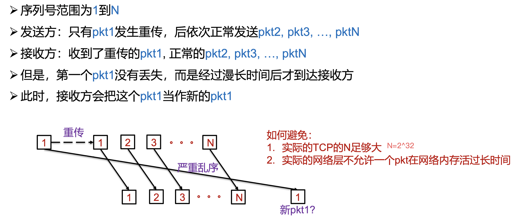


## ★TCP可靠传输

TCP 在不可靠的IP服务上建立可靠的数据传输

基本机制：流水线传输
-发送端：流水线式发送数据、等待确认、超时重传
-接收端：进行差错检测、确认接收

ACK值为下一个期望的字节序号，而非当前已经收到的最后一个字节，并且放在正常数据包里（捎带，piggyback）

乱序处理：协议没有明确规定实现方式

- 接收端不缓存：可以正常工作，处理简单，但效率低
- 接收端缓存：效率高，但处理复杂

双向传输的ack和seq例子：


一个高度简化的TCP协议：仅考虑可靠传输机制

<u>**发送方：**</u>
<u>**• 定时器的使用：仅对最早未确认的报文段使用一个重传定时器（与GBN类似）**</u>
<u>**• 重发策略：仅在超时后重发最早未确认的报文段（与SR类似，因为接收端缓存了失序的报文段）**</u>

<u>**接收方：**</u>
<u>**• 确认方式：采用累积确认，仅在正确、按序收到报文段后，更新确认序号；其余情况，重复前一次的确认序号（与GBN类似）**</u>
<u>**• 失序报文段处理：缓存失序的报文段（与SR类似）**</u>

> 除了缓存，别的都是最简单的处理

### TCP发送端
事件1：收到应用数据：
• 创建并发送TCP报文段
•若当前没有定时器在运行（没有已发送、未确认的报文段），启动定时器

事件2：超时：
•重传包含最小序号的、未确认的报文段
• 重启定时器

事件3：收到ACK：
• 如果确认序号大于基序号（已发送未确认的最小序号）：
• 	推进发送窗口（更新基序号）
•	 如果发送窗口中还有未确认的报文段，重启定时器，否则终止定时器

TCP通过采用以下机制减少了不必要的重传：
• 只使用一个定时器且只重发第一个未确认报文，避免了超时设置过小时重发大量报文段
• 利用流水式发送和累积确认，可以避免重发某些丢失了ACK的报文段

### TCP发送端优化1：如何设置超时值

平均RTT的估算方法（指数加权移动平均）：EstimatedRTT = (1 - a)EstimatedRTT + aSampleRTT，典型地，a = 0.125

瞬时RTT和平均RTT有很大的偏差：
• 需要在EstimtedRTT 上加一个“安全距离”，作为超时值
• 安全距离的大小与RTT的波动幅度有关

估算SampleRTT 与 EstimatedRTT的偏差（称DevRTT) :DevRTT = (1- ß)\*DevRTT +  ß\*|SampleRTT-EstimatedRTT]，典型地， ß= 0.25

设置重传定时器的超时值：TimeoutInterval = EstimatedRTT + 4*DevRTT

TCP确认的二义性问题：
• 重传的TCP报文段使用与原报文段相同的序号
•发送端收到确认后，无法得知是对哪个报文段进行的确认

二义性带来的问题：
• 对重传报文段测量的SampleRTT，可能不准确


解决方法1： 直接不算重传的
• 忽略有二义性的确认，只对一次发送成功的报文段测量SampleRTT，并更新EstimtedRTT
•当TCP重传时，停止测量SampleRTT

解决方法1的问题：
•重传意味着超时值可能偏小了，需要增大
•若简单忽略重传报文段（不更新EstimtedRTT），则超时值也不会更新，超时设置过小的问题没有解决


解决方法2：Karn算法
• 采用定时器补偿策略，发送方每重传一个报文段，就直接将超时值增大一倍（不依赖于RTT的更新）
• 若连续发生超时事件，超时值呈指数增长（至一个设定的上限值）

Karn算法结合使用RTT估计值和定时器补偿策略确定超时值：
• 使用EstimatedRTT估计初始的超时值
• 若发生超时，每次重传时对定时器进行补偿（超时值加倍），直到成功传输一个报文段为止
• 若收到上层应用数据、或某个报文段没有重传就被确认了，用最近的EstimatedRTT估计超时值

### TCP发送端优化2：快速重传

仅靠超时重发丟失的报文段，恢复太慢！

发送方可利用重复ACK检测报文段丟失：
•发送方通常连续发送许多报文段
•若仅有个别报文段丢失，发送方将**<u>收到多个重复序号的ACK</u>**
•多数情况下IP按序交付分组，重复ACK极有可能因丟包产生

快速重传：在定时器到期前重发丟失的报文段

TCP协议规定：当发送方收到对同一序号的3次重复确认时，立即重发包含该序号的报文段

### TCP接收端

接收端只需区分两种情况：
• 收到期待的报文段：发送更新的确认序号
• 其它情况：重复当前的确认序号

### TCP接收端优化1:推迟确认

为减小通信量，TCP允许接收端**<u>推迟确认</u>**：
• 接收端可以在收到若干个报文段后，发送一个累积确认的报文段（类似GBN）

推迟确认带来的问题：
•若延迟太大，会导致不必要的重传
• 推迟确认造成RTT估计不准确

TCP协议规定：
• 推迟确认的时间最多为500ms
• 接收方至少每隔一个报文段使用正常方式进行确认

TCP接收端的事件和处理：


## TCP 报文结构

> 不显式考，但会在其他部分涉及


初始序号的选取：每个TCP实体维护一个32位计数器，该计数器每4微秒增1，建立连接时从中读取计数器当前值（依赖具体实现，见连接管理）

## TCP 连接建立与关闭

建立一条TCP连接需要确定两件事：
• 双方都同意建立连接（知晓另一方想建立连接）
• 初始化连接参数（序号，MSS等）

### 两次握手建立连接：可能失败

SYN报文重传可能产生问题：服务器误以为客户端又想建立别的连接

失败的根本原因：客户端确认”服务器在线”，但服务器没有确认“客户端也在线”


### TCP三次握手建立连接

1. SYNbit=1, Seg=x
2. SYNbit=1, Seq=y
   ACKbit=1; ACKnum=x+1
3. ACKbit=1, ACKnum=y+1


1. 客户TCP发送SYN 报文段（SYN=1,ACK=0）
   •给出客户选择的起始序号
   • 不包含数据

2. 服务器TCP发送SYNACK报文段（SYN=ACK=1）（服务器端分配缓存和变量）
•给出服务器选择的起始序号
•确认客户的起始序号
• 不包含数据
2. 客户发送ACK报文段（SYN=0，ACK=1）（客户端分配缓存和变量）
• 确认服务器的起始序号
• **<u>可能包含数据</u>**

### 起始序号的选择

为什么起始序号不从0开始？若在不同的时间、在同一对套接字之间建立了连接，则新、旧连接上的序号有重叠，旧连接上重传的报文段会被误以为是新连接上的报文段

可以随机选取起始序号吗？若在不同的时间、在**<u>同一对套接字</u>**之间建立了连接，且新、旧连接上选择的**<u>起始序号x和y相差不大</u>**，那么新、旧连接上传输的序号仍然可能重叠

基于时钟的起始序号选取算法：
•每个主机使用一个时钟，以二进制计数器的形式工作，每隔∆T时间计数器加1
•新建一个连接时，以本地计数器值的最低32位作为起始序号
• 该方法确保连接的起始序号随时间单调增长

∆T取**<u>较小</u>**的值（4微秒）：
• 确保发送序号的增长速度，不会超过起始序号的增长速度，所以必然不会重合

使用较长的字节序号（32位）：
• 确保序号回绕的时间远大于分组在网络中的最长寿命

### 关闭TCP连接

客户端、服务器都可以主动关闭连接
•通过在TCP segment中设置FIN bit= 1

FIN消息需要被确认，原理：
•一旦发送FIN，就不能再发送数据，只能接收数据
•一旦收到对方的FIN之后，知道对方不再发送消息，可以在己方数据发送完后安全关闭

四次握手过程：
•2端各自发送FIN，也各自确认对方的FIN

优化：
•FIN与ACK可以一起发送


4次握手均可能丟包，处理方式：重传

客户端或者服务器端下线
•另一端不断重试
•重试失败若干次后：（取决于操作系统实现）放弃连接，or 等待重新建立连接

### TCP握手协议的安全隐患：SYN洪泛攻击

TCP的问题：
•服务器在收到SYN段后，发送SYNACK段，分配资源
•若未收到ACK段，服务器超时后重发SYNACK段
•服务器等待一段时间（称SYN超时）后丢弃未完成的连接，SYN超时的典型值为30秒～120秒

SYN洪泛攻击：
•攻击者采用伪造的源IP地址，向服务器发送大量的SYN段，却不发送ACK段
•服务器为维护一个巨大的半连接表耗尽资源，导致无法处理正常客户的连接请求，表现为服务器停止服务

### TCP握手协议的安全隐患：TCP端口扫描

TCP端口扫描的原理：
• 扫描程序依次与目标机器的各个端口进行TCP通信
• 根据获得的响应来收集目标机器信息

#### SYN扫描：

发送端向目标端口发送SYN报文段
•若收到SYNACK段，表明目标端口上有服务在运行
•若收到RST段，表明目标端口上没有服务在运行
•若什么也没收到，表明路径上有防火墙，有些防火墙会丟弃来自外网的SYN报文段

#### FIN扫描

FIN扫描：试图绕过防火墙，发送端向目标端口发送FIN报文段
• 若收到ACK=1、RST=1的TCP段，表明目标端口上没有服务在监听
• 若没有响应，表明有服务在监听（RFC973的规定）：你的seq number不对，服务器直接忽略
•有些系统的实现不符合RFC 973规定，如在Microsoft的TCP实现中，总是返回ACK=1、RST=1的TCP段

## TCP 流量控制

TCP接收端有一个接收缓存：
•接收端TCP将收到的数据放入接收缓存
•应用进程从接收缓存中读数据
•进入接收缓存的数据不一定被立即取走、取完
•如果接收缓存中的数据未及时取走，后续到达的数据可能会因缓存溢出而丢失

流量控制：
•发送端TCP通过调节发送速率，不使接收端缓存溢出

### 为什么UDP不需要流量控制？

因为UDP不保证交付：
• 接收端UDP将收到的报文载荷放入接收缓存
• 应用进程每次从接收缓存中读取一个完整的报文载荷
•当应用进程消费数据不够快时，接收缓存溢出，报文数据丢失，UDP不负责任

### 为什么GBN与SR时不需要流量控制？
在GBN与SR中，我们**<u>假设</u>**“正确、按序到达的分组被**<u>立即交付</u>**给上层”
•因此发送方根据确认序号就可以知道哪些分组已经被移出接收窗口
•但是，现实中的TCP：收到的数据等待应用程序读取

### TCP如何进行流量控制？

通过使用**<u>接收窗口</u>**


RcwWindow =RcvBuffer-(LastByteRcvd - LastByteRead)=RcvBuffer-（传输层接收的最后一个字节-应用层拿走的最后一个字节）

接收方将RcvWindow放在报头中，向发送方通告接收缓存的可用空间发送方限制未确认的字节数不超过接收窗口的大小

即：LastByteSent-LastByteAcked=发送方发送的-接收方ack的=发送但是没确认 ≤ RcvWindow

### 非零窗口

发送方/接收方对零窗口的处理：
•发送方：当接收窗口为0时，发送方必须停止发送
•接收方：当**<u>接收窗口变为非0</u>**时，**<u>接收方应通告</u>**增大的接收窗口

在TCP协议中，触发一次TCP传输需要满足以下三个条件之一：
• 应用程序调用
•超时
• 收到数据

对于接收方，只有第三个条件能触发传输

但是当发送方停止发送后，接收方不再收到数据，如何触发接收端发送“非零窗口通告”呢？

TCP协议规定：
•发送方收到“零窗口通告”后，可以发送“**<u>零窗口探测</u>**”报文段
•从而接收方可以发送包含接收窗口的响应报文段

### 糊涂窗口

当数据的发送速度很快、而消费速度很慢时
• 接收方不断发送微小窗口通告
• 发送方不断发送很小的数据分组
• 大量带宽被浪费

解决方案：
• 接收方启发式策略
• 发送方启发式策略

#### 接收方策略

Clark策略：
•通告零窗口之后，仅当窗口大小显著增加之后才发送更新的窗口通告，即窗口较小时，一直反馈零窗口
•什么是显著增加：窗口大小达到缓存空间的一半或者一个MSS（1460），取两者的较小值

与推迟确认结合：
•推迟发送ACK（但最多推迟500ms，且至少每隔一个报文段使用正常方式进行确认）
•寄希望于推迟间隔内有更多数据被消费

#### 发送方策略
发送方避免糊涂窗口综合症的策略：
•发送方应**<u>积聚足够多的数据再发送</u>**，以防止发送太短的报文段

问题：发送方应等待多长时间？
•若等待时间不够，报文段会太短
•若等待时间过久，应用程序的时延会太长
•更重要的是，TCP不知道应用程序会不会在最近的将来生成更多的数据

Nagle算法的解决方法：
•在新建连接上，当应用数据到来时，组成一个TCP段发送（那怕只有一个字节）
•如果有未确认数据，后续到来的数据放在发送缓存中
•当（1）数据量达到一个MSS且窗口大小大于等于MSS，或（2）**<u>收到所有已发数据的确认</u>**，用一个TCP段将缓存的字节全部发走

Nagle算法的优点：
•适应网络延时、MSS长度、发送方速度的各种组合
• 常规情况下不会降低网络的吞吐量

Nagle算法缺点：
•增加延迟，尤其与延迟确认共同使用时
• 不考虑接收端是否真的消费了数据

## ★TCP拥塞控制

### 流量控制与拥塞控制的异同

流量控制：限制发送速度，使不超过**<u>接收端</u>**的处理能力
拥塞控制：限制发送速度， 使不超过**<u>网络</u>**的处理能力

拥塞控制的常用方法，两种方法：

网络辅助的拥塞控制
•路由器向端系统提供显式的反馈，例如：
•设置拥塞指示比特
•给出发送速率指示

端到端拥塞控制
•网络层不向端系统提供反馈
•端系统通过观察丢包和延迟，自行推断拥塞的发生
• 传统TCP采用此类方法

TCP使用端到端拥塞控制机制，三个问题：
•发送方如何感知网络拥塞？丟包事件：重传定时器超时、发送端收到3个重复的ACK
•发送方采用什么机制来限制发送速率？发送方使用拥塞窗口cwnd**<u>限制已发送未确认</u>**的数据量
•发送方感知到网络拥塞后，采取什么策略调节发送速率？AIMD：乘性减 （Multiplicative Decrease），加性增（Additive Increase）

实际的拥塞策略由慢启动、拥塞避免、快速恢复3部分组成，近似实现AIMD

### 慢启动

与直接设定很高的cwnd相比，与无拥塞控制TCP按接收窗口发送数据的策略相比，采用慢启动后发送速率的增长较慢

慢启动：在新建连接上指数增大cwnd，直至检测到丟包 or 达到足够大发送速率（此时终止慢启动）

慢启动应当每经过一个RTT，将cwnd加倍，但是不知道RTT多大

所以慢启动的具体实施：
• 每收到一个ACK段，cwnd增加一个MSS（大致等价于每个RTT加倍）
• 只要发送窗口允许，发送端可以立即发送下一个报文段

慢启动指数增长到一定程度后，进入拥塞避免阶段

### 拥塞避免

将指数增长改成线性增长

cwnd=cwnd + MSS*(MSS/cwnd)，相当于每收到一个包，就加MSS的总包数分之一，这样收到一个RTT中的所有包之后就加了一个MSS

**<u>cwnd/MSS = 一个RTT内几个包</u>**

例子：MSS = 1460字节，cwnd = 14600字节
• 收到第一个ACK,cwnd增加1/10*MSS
•收到10个ACK后，cwnd大约增加MSS

### 区分慢启动与拥塞避免：用ssthresh

维护ssthresh阈值变量：

• 当cwnd <ssthresh，为慢启动阶段，cwnd指数增长
•当cwnd >= ssthresh，为拥塞避免阶段，cwnd线性增长
• ssthresh与cwnd一样，也根据网络状态动态调整

### 丢包之后？

超时和收到3个重复的ACK，它们反映出来的网络拥塞程度是一样的吗？当然不一样！
•超时：说明网络传输能力很差
• 收到3个重复的ACK：说明网络仍有一定的传输能力

因此，可以采用不同的方式处理超时与3个重复ACK

### Tahoe 算法与Reno 算法区别

1988年，TCP Tahoe 提出了（1）慢启动、（2）拥塞避免、（3）3个重复ACK判断丟包
•不区分收到3个重复ACK与超时，两种情况都重新开始慢启动

1990年，TCP Reno （RFC 5681）在 Tahoe 的基础上增加了（4）快速恢复

• 收到3个重复的ACK：进入快速恢复阶段
• 将ssthresh降低至cwnd/2
•将cwnd降至当前cwnd/2+3MSS
•采用新机制调节cwnd，直到再次进入慢启动或拥塞避免阶段

• 超时：重新开始慢启动
• 将ssthresh降低至cwnd/2
• cwnd=1MSS
•使用慢启动增大cwnd至ssthresh


### 快速恢复

当收到3个重复ACK时，才进入快速恢复阶段，此时cwnd比ssthresh大3MSS，因为接收到了3个新的重复ACK，**<u>相当于情形1进行了3次，就要加3</u>**，另外快速恢复只重传那个不停ack的包一次！

情形1：继续收到该重复ACK
•每次将cwnd增加1个MSS，为了保证一直能进行传输，不能停止传输。**<u>增加速度是固定的，不是指数增长</u>**，这是因为一直是一个ack，相当于cwnd限制了每次收到ack只能发一个新包，而不是慢启动那样收到一个ack能发两个新包

情形2：收到新ACK
• 降低cwnd至ssthresh
• 进入拥塞避免阶段

情形3：超时
•和之前一样，重新慢启动


### AIMD吞吐量


令W=发生丟包时的拥塞窗口，此时有：
throughput = W/RTT

发生丟包后调整cwnd=W/2（忽略+3），此时有：
throughput=W/2RTT

假设在TCP连接的生命期内，RTT 和 W几乎不变，有：
Average throughout=0.75 W/RTT

### AIMD公平性


### TCP公平性更复杂的情形

若相互竞争的TCP连接具有**<u>不同的参数</u>**（RTT、MSS等），不能保证公平性

若应用（如web）可以建立**<u>多条并行TCP连接</u>**，不能保证带宽在应用之间公平分配，比如：
•一条速率为R的链路上有9条连接
•若新应用建立一条TCP连接，获得速率 R/10
•若新应用建立11条TCP，可以获得速率 0.55R！


## 新型传输层技术

### BIC 与 CUBIC

> 算法基本思想

BIC算法发现这么多的拥塞控制算法都在努力找一个合适的cwnd，本质就是一个搜索的过程，因此BIC算法的核心思想使用二分查找来搜索合适的cwnd

Linux在采用CUBIC之前的默认算法

思想：
•如果发生丢包的时候，窗口的大小是W1，那么要保持线路满载却不丢包，实际的窗口最大值应该在W1以下，初始化Wmax=W1
•如果丢包后将窗口乘性减到了W2后，成功收到重传报文的ACK，那么实际的窗口值应该在W2以上（Wmin），初始化Wmin=W2

ACK驱动的查找：每经过一个RTT，若无丢包发生，便将窗口设置到Wmax和Wmin的中点，一直持续到接近Wmax，更新Wmin=中点，Wmax不更新

#### cwnd的二分查找方法，有可能因为网络波动，可以超过之前的 Wmax 也没有丢包

while (Wmin <= Wmax) {
inc = (Wmin+Wmax)/2 - cwnd;
if (inc > Smax)
inc = Smax;
else if (inc < Smin)
inc = Smin;
cwnd = cwnd + inc * MSS / cwnd;
if (no packet losses)
Wmin = cwnd;
else
break;}

#### 超过Wmax怎么办

既然cwnd度过了Wmax都没有丢包，说明新的Wmax还没有达到
BIC采取了一种非常简单直接的方法：按照逼近Wmax的路径倒回去，即采用与之对称的方案


**<u>cwnd = cwnd + inc * MSS / cwnd;</u>**

**<u>cwnd/MSS = 一个RTT内几个包</u>**

#### BIC的不公平性


#### Why CUBIC?

原因1：延迟ACK以及ACK丢失的问题，BIC算法实际实现要比理论情况复杂很多

原因2：BIC容易导致不公平性

#### CUBIC

核心思想：
•窗口增长函数仅仅取决于当前距离上次丢包经过的时间t
•从而，窗口增长完全独立于网络的时延RTT

CUBIC的RTT独立性质使得CUBIC能够在多条共享瓶颈链路的TCP连接之间保持良好的RTT公平性

CUBIC将BIC算法连续化，用三次函数拟合BIC算法曲线（CUBIC名字的由来）

### BBR：Bottleneck Bandwidth and Round-trip propagation time

> 算法优化目标（与传统 TCP 的差异），算法过程不要求

观测除了丟包之外更精准的拥塞情况

传统TCP拥塞控制：认为BDP + BtlneckBufSize是最优窗口大小

BBR：认为BDP是最优窗口大小
• 相比于传统TCP，BBR的目标更有优势
•相同的吞吐量
• 更低的延迟、更小的丢包风险

### DCTCP：面向数据中心的TCP

> 发送端、接收端、交换机各自任务（发送端计算公式不要求，如考到题目中会给出）

将缓冲区队列长度维持在一个较低的水平

根据网络拥塞程度精细地减小发送窗口：
•一旦发现拥塞，发送窗口减至原窗口的（1-a/2），a反映了拥塞程度
• 传统TCP中 a总为1

拥塞程度的衡量：ECN标记（explicit congestion notification）
• 当交换机队列的瞬时长度超过某个阈值时，交换机在报文头设置ECN标记
• 使用显式的拥塞反馈能够更好地控制突发流量

在ECN标记下，发送端、接收端、交换机各自任务：

#### 发送端

每个RTT更新一次发送窗口
a <- （1-g）a + aF，这个值反应了拥塞程度，其中F=# of marked ACKs / Total # of ACKs
Cwnd <- (1 - a / 2) * Cwnd

#### 接收端

仅当ECN报文出现或消失时才立即发送ACK，否则采取Delay ACK的策略

#### 交换机

当队列长度超过K时，给随后到来的包标记ECN

### QUIC

> 网络体系架构与优势，实现方式不要求

基于QUIC的传输架构
• QUIC替代TCP、TLS和部分HTTP的功能

QUIC实现在用户态中
• 底层基于UDP实现
• 拥塞控制是模块化的可以方便地使用各种TCP拥塞控制算法，如CUBIC等


优势：

1. QUIC第一段数据随密钥同时发送，建连仅需1RTT

2. QUIC：多字节流
   • 一个QUIC连接，可以用于传输多个字节流（streams）
   •每个QUIC报文，甚至可以包含来自多个stream的数据

3. QUIC利用了各个流相互独立的特性，仅保持了流内部数据的有序性（部分有序），减少了不必要的等待

4. 明确的包序号和更精确的RTT：

   1. 一个packet包含多个stream的frame，因此，QUIC分离确认接收与向上层交付数据
      • Packet Number:ACK中确认packet接收
      • Offset： 判断数据重复与顺序
   2. QUIC的packet number单调递增，对于重传包也会递增packet number
      每个packet number只会出现一次，ACK没有歧义！所以QUIC接收端记录收到包与发出ACK之间的时延，并发馈给发送端，方便发送端更准确地测量RTT

5. IP地址/端口切换无需重新建立连接

   QUIC使用Connection ID来表示每个连接，IP地址或端口的变化不影响对原有连接的识别，客户IP地址或端口发生变化时，QUIC可以快速恢复

6. QUIC易于部署和更新

   整个QUIC包被加密传输
   • 保护用户数据隐私
   • 避免被中间设备识别和修改

   QUIC在用户态实现
   •与操作系统解耦，从而能和应用一同快速迭代
   •如：预留接口，用户自定义拥塞控制

### 其余补充传输层技术不考

# 4.网络层

## 网络层基本概念

> ATM 相关内容不要求

网络层向传输层提供的接口类型？“面向连接”（电路交换）OR“无连接“（分组交换）

### 网络层关键功能

无论哪种网络层服务模型，都依赖于2个核心功能：

转发
• 将数据报从路由器的输入接口传送到正确的输出接口
•核心：转发函数
•类比：旅行时穿过一个城市（城市内部各个车站、机场间移动）

路由
• 选择数据报从源端到目的端的路径
• 核心：路由算法与协议
•类比：规划出发城市到目的城市的旅行路线（城市间移动）

### 数据平面 VS 控制平面

网络层的转发与路由功能，又把网络层进一步划分为数据平面与控制平面，是软件定义网络（SDN）技术兴起后，新引入的术语

数据平面：转发功能
• 单个路由器上局部功能
• 每个路由器独立对收到的
数据报文执行转发功能

控制平面：路由功能
• 全网计算：涉及多个路由器
• 2种实现方式：
•传统路由算法：多个路由器分布式协作计算
•软件定义网络（SDN）：由中心化控制器负责计算后，通知各个路由器

### 数据平面

执行转发函数：（输入端口，分组的目的地址）->（输出端口）

### （传统）单个路由器上的控制平面

每个交换机运行一个路由算法模块，互相协作完成全网“主机-主机”路径计算

### （SDN） 中心化控制平面

一个远程控制器与各个路由器交互
•每个路由器上维护一个轻量级控制代理（control agent，CA）负责交互，但不需要复杂计算能力
• 控制器本身是一个逻辑上的中心系统，实际上可能是由多个物理服务器组成的集群

## 路由器架构

路由器是互联网最主要的网络设备，包含2个核心功能
•控制平面（路由）：运行各种路由协议，学习去往不同目的的转发路径：路由表
•数据平面（转发）：根据上述路由表，将收到的IP分组转发到正确的下一跳链路


### 控制平面

路由器可同时运行多个路由协议
路由器也可不运行任何路由协议，只使用静态路由和直连路由
路由管理根据路**<u>由优先级，选择最佳路由</u>**，形成核心路由表
控制层**<u>将核心路由表下发到数据层，形成转发表</u>**（FIB）


若存在多个“去往同一目的IP”的不同类型路由，路由器根据优先级选择最佳路由，优先级数值越小，优先级越高

路由种类 路由优先级
直连路由 0
静态路由 1
eBGP路由 20
OSPF路由 110
RIP路由 120
iBGP路由 200

### 路由器数据平面

路由器中IP报文转发过程：
•链路层解封装，IP头部校验
• 获取报文目的IP地址
•用目的IP地址，基于最长前缀匹配规则查询转发表
•查询失败，丢弃报文
•查询成功
•IP头部“TTL"字段值減1，重新计算IP头部“校验和”
•获取转发出接口和下一跳链路层地址
•重新进行链路层封装，发送报文
注：普通IP报攻转发过程中，路由器不查看传输层及以上层协议的内容

IP报文在路由器转发前后的变化：
•链路层封装更新，IP头部“TTL”减1，IP头部“校验和”更新


数据报在不同硬件单元的处理：
输入端口：接口卡（interface card）
•**<u>物理层处理、链路层解封装</u>**
•转发表查询（该工作在输入接口卡处理）
•通过交换结构将报文排队发往目的接口卡（发送过快将产生拥塞）
交换结构
•从输入接口卡发往输出接口卡
输出端口：接口卡（interface card）
•从交换结构接收报文（排队进行后续处理，到达太快将产生拥塞）
•**<u>链路层封装、物理层处理</u>**
• 从输出接口发送报文

基于报文头部字段，在转发表中查找对应的输出端口，通过交换结构（switch fabric）最终传输到对应输出端口
•每个输入端口在内存里维护**<u>转发表</u>**
• 又称"匹配-动作（match-action）"模式

**<u>基于转发表的转发策略</u>**有2种
基于目的地址的转发
• 只根据目的IP地址
• 传统交换机中常用（受限于芯片计算能力）
通用转发
• 可以根据数据报文中任意字段的组合

### 输入端口：最长前缀匹配

为什么不用区间法？

现代网络的性能要求极高
•转发表查找需要在纳秒级时间内完成，因此使用TCAMS
现代路由器的转发表实现
• 基于ternary content addressable memories (TCAMs)
TCAM优势：
•可以对所有地址并行匹配，无论转发表多大只消耗1个时钟周期
•每个bit支持3类匹配值：0，1，dont care
• Cisco Catalyst交换机：TCAM支持百万级表项：一个IP和一百万个表项匹配，然后返回最长的那个


### 输入端口：排头阻塞（Head-of-the-Line blocking, HOL blocking）
队列中的报文，导致后续报文也需等待，即便后续报文对应的输出端口是空闲的

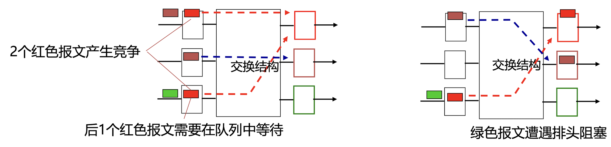

### 交换结构：共享内存

交换流程
•报文到达输入端口时，产生中断信号通知路由处理器
•路由处理器将报文复制到内存中，查询对应输出端口，再将报文复制到输出端口

性能瓶颈：内存拷贝

### 交换结构：共享总线

实现方式
•输入端口通过转发表后，给报文附加上“标签”，表明输出端口
•带标签的报文通过总线广播至所有输出端口
•每个输出端口通过标签判断报文是不是属于自己的，不属于则忽略

性能：总线1次只能广播1个报文，交换速率受总线带宽制约

### 交换结构：纵横式Crossbar

使用2N条总线连接N个输入端口与N个输出端口

优势：不重叠的交换路径，最多可以并行n工作，但是不能保证完全可以并行

### 输出端口

缓冲队列：交换结构的数据超过发送数据时
•与输入端口不同，**<u>可以不是FIFO模式</u>**

队列调度：从缓冲队列中选择数据报文
• 性能考虑：选择对网络性能最好的
• 公平性考虑：网络中立原则

输出端口的缓冲队列，也可能造成排队延迟甚至丟包

### 输出端口：缓冲区大小

RFC 3439建议：“典型” RTT （250 ms） 乘以链路带宽C
•若C=10 Gpbs，缓冲区大小25 Gbit
实际建议：交换机的报文分为N个流，则缓冲区大小为
RTT * C/√N
•流：相同网络地址的报文构成1个流
•二元组流：源IP地址+目的IP地址
•五元组流：源IP地址+目的IP地址＋源端口号+目的端口号＋传输层类型（TCP or UDP）

### 输出端口：调度机制

先进先出（FIFO）调度：根据入队顺序发送
• 简单，但仍有问题需要考虑
•缓冲区溢出时，如何选择丢弃报文
• Tail drop： 丟弃新来的报文
•Priority drop：根据优先级丢弃报文
• Random drop：随机丢弃

基于优先级调度（priority scheduling）：将数据报文分为不同优先级
•根据数据报文头部字段判断优先级（如IP地址，端口号）
•具体优先级由安全或者性能因素考虑
•总是先发送高优先级报文
实现：多个队列对应不同优先级
•为简化芯片设计，不采用复杂数据结构（如二叉堆），访问内存太多，对硬件设计不友好
缺点：公平性


轮询调度（round robin scheduling）
•将报文分类，进入多个队列
•在队列间轮询，若队列中存在报文，则发送

红色是一个队列，绿色是一个队列，因此不连续发送12，更公平一些


加权公平队列（weighted fair queuing, WFQ）
•更一般化的轮询方式
•每个队列拥有权重值
•轮询时考虑权重：权重高的队列，轮询到的次数更多


## IPV4报文格式

> IPV4报文格式各个字段不显式考，但会在其他部分涉及


版本：4bit，表示采用的IP协议版本
首部长度：4bit，表示整个IP数据报首部的长度
区分服务：8bit，该字段一般情况下不使用 
总长度：16bit，表示整个IP报文的长度，能表示的最大字节为2^16-1=65535字节
标识：16bit，IP软件通过计数器自动产生，每产生1个数据报计数器加1；在ip分片以后，用来标识同一片分片
标志：3bit，目前只有两位有意义；MF，置1表示后面还有分片，置0表示这是数据报片的最后1个；DF，不能分片标志，置0时表示允许分片
片偏移：13bit，表示IP分片后，相应的IP片在总的IP片的相对位置

生存时间TTL（Time To Live）：8bit，表示数据报在网络中的生命周期，用通过路由器的数量来计量，即跳数（每经过一个路由器会减1）
协议：8bit，标识上层协议（TCP/UDP/ICMP..）
首部校验和：16bit，对数据报首部进行校验，不包括数据部分
源地址：32bit，标识IP片的发送源IP地址
目的地址：32bit，标识IP片的目的地IP地址
选项：可扩充部分，具有可变长度，定义了安全性、严格源路由、松散源路由、记录路由、时间戳等选项
填充：用全0的填充字段补齐为4字节的整数倍

## IPV4报文分片

MTU（Maximum Transmission Unit），最大传输单元
•链路MTU
• 路径MTU （Path MTU）

分片策略
•允许途中分片：根据下一跳链路的MTU实施分片
• 不允许途中分片：发出的数据报长度小于路径MTU（路径MTU发现机制）

重组策略
•途中重组，实施难度太大
•目的端重组 （Internet采用的策略）
•重组所需信息：原始数据报编号、分片偏移量、是否收集所有分片


偏移以8字节作为单位

原始报文和分片报文具有相同的IP标识 （IP头部字段，标识：16bit，IP软件通过计数器自动产生，每产生1个数据报计数器加1；在ip分片以后，用来标识同一片分片）

IPv4分组在传输途中可以多次分片：源端系统，中间路由器，但是无论是否途中分片，IPv4分片只在目的IP对应的目的端系统进行重组

IPV6分片机制有较大变化（见IPV6部分的介绍）

## IP 地址

> 不考分类地址与特殊 IP 地址

IP地址按接口分配
接口之间通过链路层技术互相连接

IP地址：网络上的每一台主机（或路由器）的**<u>每一个接口都会分配</u>**一个唯一的32位的标识符
由两个字段组成：**<u>网络号（网络地址，全0主机地址）+主机号（主机地址）</u>**
网络号相同的这块连续IP地址空间称为地址的前缀，或**<u>网络前缀</u>**：比网络号少一些0

### 特殊IP地址


CIDR (Classless Inter-Domain Routing)
•网络地址可以是任意长度
•表示：将32位的IP地址划分为前后两个部分，并采用斜线记法，即在IP地址后加上“/”，然后再写上网络前缀所占位数

比如 200.23.16.0/23

### 分类编址下的子网划分

此时网络地址固定长度，但是为了更有效地利用IP地址空间。子网划分允许组织将其分配的IP地址范围分成更小的部分，可以更加灵活地分配给网络中的不同部分。

在进行子网划分时，网络管理员会借用一些主机位来作为子网位，这样就可以定义多个子网：


### CIDR地址聚合下的子网划分

CIDR子网内的地址，可以进一步划分为多个子网
•对外只暴露1个CIDR网络地址
• 这种地址的聚合常称为地址聚合 （address aggregation）或路由聚合 （route aggregation），把许多具有相同前缀的地址整合到一起

问题：200.23.18.0/23的数据报，该发往Fly-By-Night-ISP还是ISPs-R-Us？最长前缀：发往ISPs-R-Us


## ★路由器转发

问题：200.23.18.0/23的数据报，该发往Fly-By-Night-ISP还是ISPs-R-Us？最长前缀：发往ISPs-R-Us


最长前缀匹配 （Longest prefix match）

CIDR+路由聚合，需要最长前缀匹配，即IP地址与IP前缀匹配时，总是选取子网掩码最长的匹配项，主要用于路由器转发表项的匹配，也应用于ACL规则匹配等


IP地址：200.23.22.161（11001000 00010111 00010110 10100001），接口0
IP地址：200.23.24.170 ( 11001000 00010111 00011000 10101010），接口1


## ARP
> 掌握功能、交互流程

每个接口除了IP地址，还有硬件地址，即MAC地址

IP数据报经过不同链路时，IP 数据报中封装的IP地址不发生改变，而Mac帧中的硬件地址是发生改变的。


问题：报文转发根据IP地址还是MAC地址？

之前不是说最长前缀吗？那个是利用IP转发，但是有的时候用IP，有的时候用MAC：子网内部使用MAC地址转发，使用ARP协议将IP映射为MAC地址


具体操作流程：

IP数据包转发：从主机A到主机B
• **<u>检查目的IP地址的网络号部分</u>**
• 确定主机B与主机A属相同IP网络
•将IP数据包封装到链路层帧中，直接发送给主机B
•封装时，在帧头部填写A与B的MAC地址


问题：给定B的IP地址，如何获取B的MAC地址？因为IP是公开的，但是MAC地址不是

A已知B的IP地址，需要获得B的MAC地址（物理地址）
如果A的ARP表中缓存有B的IP地址与MAC地址的映射关系，则直接从ARP表获取
如果A的ARP表中末缓存有B的IP地址与MAC地址的映射关系，则A广播包含B的IP地址的ARP query分组，在局域网上的所有节点都可以接收到ARP query，B接收到ARP query分组后，将自己的MAC地址发送给A，然后A在ARP表中缓存B的IP地址和MAC地址的映射关系，超时时删除

### ARP工作流程

广播+单播


A创建IP数据包（源为A、目的为E）
在源主机A的路由表中找到路由器R的IP地址223.1.1.4
• R通常称为A的子网网关
A根据R的IP地址223.1.1.4，使用ARP协议获得R的MAC地址

A创建数据帧（目的地址为R的MAC地址），数据帧中封装A到E的IP数据包
A发送数据帧，R接收数据帧
R查找转发表，修改目的MAC地址（也许ARP查询），转发


### ARP安全问题

ARP Spoofing攻击：**<u>发送ARP响应来改变</u>**某个IP的ARP表，让这个IP发向某个IP的数据包都发给我
• 攻击者随意地发送ARP请求或ARP响应（可以使用任意源IP地址与MAC地址）
•ARP协议是无状态的：即使受害者之前没发过ARP请求，收到一个ARP响应时，也会更新ARP表
•受害者后续数据将被发往攻击者提供的MAC地址
•攻击者可以修改自己的IP转发功能，将截获的受害者数据继续转发，不拦截，发送和接受者都不知道有人中间拦截了信息

## DHCP

> 掌握功能、交互流程

IPv4地址如何获取？当主机加入IP网络，允许主机从DHCP服务器动态获取IP地址

新加入网络的主机：DHCP客户端，申请该网络IP地址，端口68发出请求
DHCP服务器：端口67监听


### DHCP工作过程

DHCP 客户从UDP端口68以**<u>广播</u>**形式向服务器发送发现报文(DHCP DISCOVER)
DHCP 服务器**<u>广播或单播</u>**发出提供报文（DHCP OFFER）
DHCP 客户从多个DHCP服务器中选择一个，并向其以**<u>广播</u>**形式发送DHCP请求报文（DHCP REQUEST）
被选择的DHCP服务器**<u>广播或单播</u>**发送确认报文（DHCP ACK）

DHCP服务不只返回客户机所需的IP地址，还包括：
• 缺省路由器IP地址
•DNS服务器IP地址
•网络掩码


### DHCP安全问题

DHCP耗竭攻击（DHCP StarvationAttack)

攻击者短时间内发送大量DHCP请求，将子网内可用IP地址全部占用后续主机无法获取新IP地址


流氓DHCP(Rogue DHCP attack)（通常在DHCP耗竭攻击之后）

攻击者启动自己的DHCP服务，给网络中的其他主机提供虚假的配置，包括DNS服务器IP与网关IP

## NAT

> 掌握功能、交互流程

网络地址转换（NAT）用于解決IPv4地址不足的问题，是一种将私有（保留）地址转化为公有IP地址的转换技术
私有IP地址：
• A类地址：10.0.0.0--10.255.255.255
• B类地址：172.16.0.0--172.31.255.555
• C类地址：192.168.0.0--192.168.255.255

### NAT 工作机制


所有从本地网络发出的报文具有相同的单一源IP地址：138.76.29.7

NAT根据不同的IP上层协议进行NAT表项管理
• TCP, UDP

传输层TCP/UDP拥有16-bit 端口号字段
•所以一个WAN侧地址可支持60,000+个并行连接

## ICMP

> 如何实现 PING与 Traceroute（了解流程，不要求具体编码值）

ICMP：互联网控制报文协议，是传输层协议，IP上层协议
•ICMP 允许主机或路由器报告差错情况和提供有关异常情况的报告
•由主机和路由器用于网络层信息的通信
•ICMP 报文携带在IP 数据报中：IP上层协议号为1

ICMP报文类型
•ICMP 差错报告报文：终点不可达：不可达主机、不可达网络，无效端口、协议
•ICMP 询问报文：回送请求/回答（ping使用）

### ICMP报文格式

ICMP报文的前4个字节包含格式统一的三个字段：类型、代码、检验和
相邻的后四个字节内容与ICMP的报文类型有关


类型、代码的对应：


### 差错报告报文


### Ping

PING (Packet InterNet Groper)
• PING 用来测试两个主机之间的连通性
•PING 使用了ICMP 回送请求与回送应答（类型为8或0）报文


思考：
如何利用Ping命令返回的TTL值（报文剩余跳数），来判断对方主机操作系统的类型？
TTL初始值是多少？
初始值与OS有关，大致可以猜出来对面TTL初始值，因为消耗的跳数不会很大，如图TTL=53，大概知道对面是Linux

### Traceroute

如何知道整个路径上路由器的地址？使用TraceRT命令

源向目的地发送一系列UDP段（不可能的端口号）
•第一个 TTL =1
• 第二个TTL=2，等等

当第n个数据报到达第n个路由器，路由器丢弃数据报，并向源发送一个ICMP报文（类型11，编码0，TTL过期），此时报文的源IP地址就是该路由器的IP地址

UDP段最终到达目的地，主机目的地返回ICMP"端口不可达（因为发送的UDP含有不可能的端口号）”分组（类型3，编码3），当源得到该ICMP，停止

## 网络路由：★距离向量
>  距离向量与链路状态掌握算法，具体的对应协议（RIP 与OSPF）不要求

每个结点x维护信息
•到达每个邻居结点v的开销：c（x,v）
•距离向量（DV）：Dx = ［Dx（y）：y ∈ N］，该结点x到网络中所有其他结点y的最小代价的估计

每个邻居结点v的距离向量，即对于所有邻居v，结点x保存D=［Dw（y）：Y ∈ N］

### 距离向量算法特点

异步：结点迭代频率不需要一致

迭代：每次某个结点上的迭代有2种触发
•本地链路代价发生改变
• 收到来自邻居的DV更新

分布式：结点直接互相协作
•每个结点当且仅当DV信息发生变化时通知其他结点
• 邻居结点根据需要通知自己的邻居

### 链路状态改变：代价变小

好消息快速传播

### 链路状态改变：代价变大


求y-x:

y-x=y-z-(old)x=6

z-x=z-y-x=z-y-z-(old)x=7

y-x=y-z-x=y-z-y-z-(old)x=8

……

### 链路状态改变：毒性逆转

毒性逆转 （poison reverse） 方法
如果某结点a到达c的下一跳为b，则a将通知b：“Da（c）=inf"

a——b——c，a告诉b我去不了c，所以b就不会回到a再去c


毒性逆转无法解决一般性的无穷计数问题

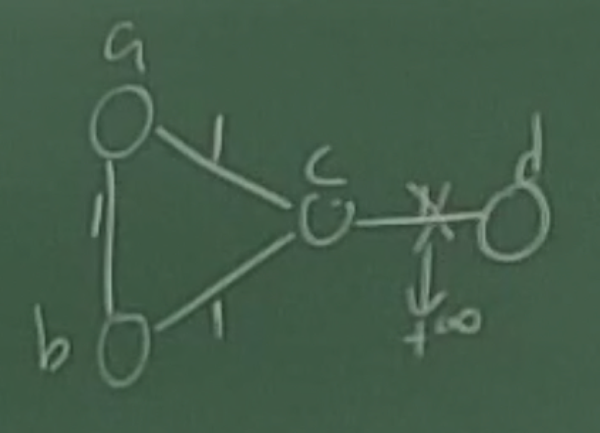

初始情况：

a: bd=2

b: ad=2

c: ad=∞, bd=∞（由于毒性逆转）

然后cd断开

由于c告诉a说cd=∞，那么a不能走a-c-a-c-d叠加一下到d

但是由于a认为bd=2，因此a认为ad可以是ab+bd=3

同理，由于b认为ad=2，因此b认为bd可以是ba+ad=3

ab两个节点就如此不停互相传输错误信息


## 网络路由：★链路状态

>  距离向量与链路状态掌握算法，具体的对应协议（RIP 与OSPF）不要求

每个结点都知道网络拓扑与链路开销
• 通过链路状态广播得到
• 所有结点都有相同的信息

每个结点计算以自己为源节点，到其他所有结点的最短路径
•生成该结点的转发表

### Dijkstra 算法例子


### 1.发现邻居，了解他们的网络地址

### 2.设置到每个邻居的成本度量
开销/度量/代价：
•自动发现设置或人工配置
•度量：带宽、跳数、延迟、负载、可靠性等

常用度量：链路带宽（反比）
•例如：1-Gbps以太网的代价为1，100-Mbps以太网的代价为10

可选度量：延迟
•发送一个echo包，另一端立即回送一个应答
•通过测量往返时间RTT，可以获得一个合理的延迟估计值

### 3.构造一个分组，分组中包含刚收到的所有信息
构造链路状态分组 （link state packet, LSP）
•发送方标识
•序列号
•年龄（存活时间）
•邻居列表：包含邻居与对应的链路开销


### 4.将LSP分组发送给其他的路由器
每个LSP分组包含一个序列号，且递增
路由器记录所收到的所有（源路由器、序列号）对
当一个新分组到达时，路由器根据记录判断：
• 如果是**<u>新分组，洪泛广播</u>**
• 如果是重复分组，丢弃
• 如果是过时分组，拒绝

### 5.计算到其他路由器的最短路径： Dijkstra算法

## 距离向量（DV）和链路状态（LS）比较

消息数量

DV：取决于收敛速度，链路代价不变时，收敛需要最多O（nE）条消息

LS：n个结点，E条链路，一共发送O（nE）条消息


收敛速度

DV：不确定，可能无穷计数问题

LS：消息传播完毕，每个结点O（n2）或O（nlogn）时间完成计算


可靠性：路由器或链路故障处理

DV： 影响大
• 传播计算后的结果，如果是错误的，可能会造成无穷计数问题
•取决于邻居的计算结果

LS：影响小
•传播链路开销
• 每个结点独立计算

## 网络路由：层次路由

层次路由产生原因：过于庞大的路由表存储、查找困难，路由信息交互开销高

互联网由大量不同的网络互连，每个管理机构控制的网络是自治的，所以产生了**<u>自治系统AS</u>**

自治系统（AS,Autonomous System），比如中国联通、中国移动
•一个管理机构控制之下的网络
•一个AS内部通常使用相同的路由算法/路由协议，使用统一的路由度量（跳数、带宽、时延…）
•不同的AS可以使用不同的路由算法路由协议
•每个AS有一个全球唯一的ID号：AS ID

自治系统内可以进一步划分层次

自治系统内部使用内部网关路由协议，Interior Gateway Protocols （IGP）
• 每个自治系统域内路由算法可不同
• 典型IGP协议：OSPF，RIP，IS-IS,IGRP，EIGRP⋯

自治系统之间之间使用外部网关路由协议，Exterior Gateway Protocols （EGP）
• 各自治系统域之间的路由需统一
• 典型EGP协议：BGP

### 层次路由的效果


<u>**路由协议**</u>
<u>**•内部网关协议 IGP：有RIP和、OSPF、ISIS 等多种具体的协议**</u>
<u>**•外部网关协议 EGP：目前使用的协议就是 BGP**</u>

## AS内部路由：OSPF（对应链路状态算法）

OSPF将AS内路由器进一步划分为区域

区域内部同步完整的区域内链路，区域之间只同步区域间链路

使用层次结构的区域划分，上层的区域叫做主干区域 （backbone area），其他区域都必须与主干区域相连

非主干区域之间不允许直接发布区域间路由信息

区域也不能太大，在一个区域内的路由器最好不超过200个


## AS内部路由：RIP（对应距离向量算法）

路由选择协议RIP（Routing Information Protocol）是基于距离矢量算法的协议，使用跳数衡量到达目的网络的距离
•RIP 认为一个好的路由就是它通过的路由器的数目少，即“距离短”
•RIP 允许一条路径最多只能包含 15 个路由器

RIP协议的基本思想
• 仅和相邻路由器交换信息
• 路由器交换的内容是自己的路由表
• 周期性更新：30s

## AS之间路由：BGP

BGP-外部网关路由协议

边界网关协议BGP （Border Gateway Protocol）
•目前互联网中唯一实际运行的自治域间的路由协议

BGP功能
• eBGP：从相邻的AS获得网络可达信息
•iBGP：将网络可达信息传播给AS内的路由器
• 基于网络可达信息和策略决定到其他网络的“最优”路由


1c同时运行eBGP, iBGP, IGP (比如OSPF或者RIP) 的内部和外部网关协议

### 路由通告

BGP会话：两个BGP路由器通过TCP连接交换BGP报文
• 通告到不同网络前缀的路径，即路径向量协议
• 路径向量：由一系列AS组成的序列


过程：

AS3的路由器3a向AS2的路由器2c**<u>使用eBGP</u>**通告路径〞AS3，X”，AS3向AS2承诺它会向X转发数据包

AS2的路由器2c从AS3的路由器3a接收到路径“AS3，X"，**<u>通过iBGP传播给AS2的所有路由器</u>**

根据AS2策略，AS2的路由器2a**<u>通过eBGP</u>**向AS1的路由器1c通告从AS3接收到路径“AS2,AS3，X"


一个路径通告信息经过的结点数是自治系统数的量级，每一个自治系统边界路由器的数目是很少的，20个左右
一个AS在 BGP 刚刚运行时，向相邻AS获取整个BGP路由表
• 以后只需要在发生变化时更新有变化的部分 增量更新，不是Ospf那样的周期性更新

BGP为每个AS提供：
• 从邻居AS获取网络可达信息（eBGP协议）
• 传播可达信息给所有的域内路由器（iBGP协议）
• 根据“可达信息”和“策略”决定路由

### 路由策略

路由器可能从多个对等体收到针对同一目的IP的路由
需要选择一条最佳路由，选择规则：自上向下，依次排序
• 本地偏好值属性：政策决策
•最短的AS-PATH
•最近的NEXT-HOP路由器
• 附加标准⋯
•最低路由器ID


BGP路由策略：AS间策略：

路由器使用策略决定接受或拒绝接收到的路由通告
路由器也会基于策略决定是否向其他相邻AS通告路径信息


例如：X连接到两个提供者网络（dual-homed）
•X为用户网络，X不希望从B到C的数据包经过X
•X则不向B通告到C的路由

A向B通告路径AW，B通告到目的W的路径为BAW，但是B是否向C通告路径BAW？
• 由于W和C都不是B的用户，B要迫使C通过A路由到W
• B只路由来自于或到达其用户的数据包


BGP路由策略：AS内策略：

各个AS决定
实际常用：“热土豆（Hot Potato）策略"
•选择最近的BGP出口，即最小化报文在本AS停留时间


## 广播

广播（Broadcasting）：源主机同时给全部目标地址发送同一个数据包

### 方法1：给每个主机单独发送一个数据包
•效率低、浪费带宽
•Server需要知道每个目的地址

### 方法2：多目标路由 （multi-destination routing）
•在需要转发的路由器线路复制一次该数据报
•网络利用率高
•Server依然需要知道所有的目的地址

### 方法3：泛洪（flooding）
• 一种将数据包发送到所有网络节点的简单方法
• 将每个进入数据包发送到除了进入线路外的每条出去线路

用途
•保证性：一种有效广播手段，可确保数据包被传送到网络中每个节点
•容错性：即使大量路由器被损坏，也能找到一条路径（如果存在）
•简单性：仅需知道自己的邻居

环路可能导致广播风暴，即使利用跳数来限制，也会出现成倍爆炸

解决方法：受控制的泛洪（每个路由器进行有选择的泛洪）

1. 序号控制泛洪（sequence-number-controled flooding）
    ①广播数据包X从接口1到达路由器R
    ②R查看数据包来源S和广播序号n，比对R的序号表
    ③序号表中有该数据包的记录吗？
        是，丢弃（曾经已经收到并转发过）
        否，在序号表中记录，并在接口2和3转发

2. 逆向路径转发 (reverse path forwarding, RPF)
   假设R的路由表中表示了到达各网络的最优路径
   ①广播数据包X从接口1到达路由器R
   ②R查看数据包来源S，比对R的路由表
   ③X的来源是N1吗？
   是-> X是从最佳路径来的，向接口2和接口3转发
   否->X是重复包，丟弃

   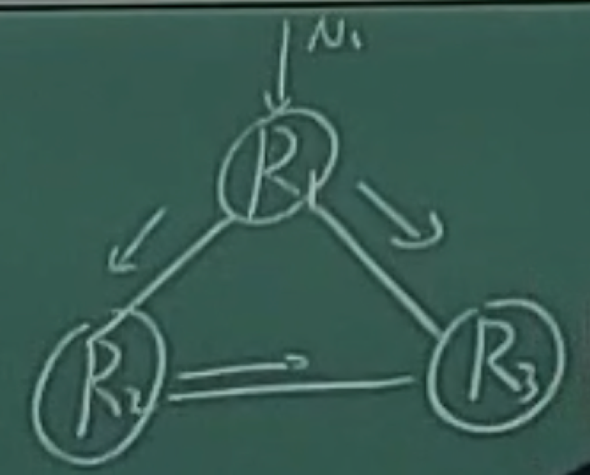

    R3仍然会接收到重复的数据包，但是不会产生回路了

### 方法4：生成树 （spanning tree）
•源节点向所有属于该生成树的特定链路发送分组
•改进了逆向路径转发
•没有环路
•最佳使用带宽
•最少副本，消除了冗余分组
•—个路由器可以不必知道整颗树，只需要知道在一颗树中的邻居即可


## 组播

> 组播部分只要求掌握基本步骤，生成树算法不考

组播 （multicasting）：源主机给网络中的一部分目标用户发送数据包

例：服务器希望将体育直播视频发送给某些网络中的个别用户，怎么办？


组播（multicasting）路由算法的目标：
•为每个组建立转发树（到达该组所有成员的路径树）
•每个组成员应当只收到多播分组的一个拷贝
•非本组成员不应收到多播分组
•从源节点到每一个组成员节点的路径应当是最佳的（最短路径）

### 组播路由：步骤1

确定组成员：边缘路由器通过与主机交互，了解到从它的某个端口可以到达哪些组的成员—主机与路由器之间的组成员关系协议

IGMP (Internet Group Management Protocol)
•主机可以加入或者退出组播组
•路由器查询该子网的组播组成员

常用组播地址段：224.0.0.0/24
局域网组播地址（一跳子网内使用）
• 224.0.0.1 LAN上所有设备
• 224.0.0.2 LAN上所有路由器
• 224.0.0.5 LAN上所有OSPF路由器
• 224.0.0.251 LAN上所有DNS服务器

### 组播路由：步骤2

生成树——路由器与路由器之间的协议
•建立在我们已经学习过的广播路由方案基础之上
• 数据包沿生成树发送
• 源点树：为每个组播源计算生成树
•核心树：多个组播源共享组成共享树

构建源点树协议：MOSPF、DVMRP、PIM-DM

但是基于源点树（source-based trees） 存在的问题：
•大型网络中，组播源很多时，路由器需生成多颗棵树，工作量巨大
•路由器需要大量空间来存储多颗树


选择一部分结点作核心，所有流量先汇聚到核心，再进行分发

实线为核心树实际使用的链路，虚线为没有用到的链路


存在的问题：
•可能无法达到最优
• 如果只有一个发送者，将发送者作为核心是最优的

例如，组播源Server2的数据，如果采用基于源点树的方法，可能到达目的主机所需跳数更少


组播的应用：

音频/视频会议
共享电子白板
数据分发
实时数据组播：音频视频点播、网络收看体育比赛直播、股票行情•
游戏与仿真：同时有大量参与者的网络游戏

## 选播

选播 （Anycast）：和报警找警察局很相似
•将数据包传送给最近的一个组成员
•在有多个服务器的情况下，用户希望快速获得正确信息，而不在乎从哪个服务器获得
•与单播、广播、组播的区别


选播的典型应用：DNS
•在没有指定DNS服务器的情况下，用户将始终连接到“最接近”（从路由协议角度来看）服务器，可以減少延迟，并提供一定程度的负载平衡
•可以提供一定程度的高可用性，一旦服务器发生故障，用户请求将无缝转发到下一个最接近的DNS实例，而无需任何手动干预或重新配置
•可以水平缩放，如果一台服务器负载过重，只需在一个位置部署另一台服务器，以承担一部分重载服务器的请求，且不需要客户端配置


## 软件定义网络：流量工程

流量工程：根据对传输流量的预测，规划流量的传输路径
•目的：提高带宽利用率、避免拥塞

基于最短路的路由对单个路由器局部最优，但未必全局最优，全局最优通常需要线性规划、网络流算法


回题1：如何让 u-to-z 的流量经过路径uvwz,x-to-z 的经过路径xwyz？

方案a：采用基于最短路的传统路由，调整路径代价（如：将ux，vx设置为无穷大）
• 并不总是可行 因为把路径代价设置为无穷大会影响别的路由器的结果
方案b：采用新的流量工程方法计算路径
• 需要更多输入数据（如“源-目标”主机的流量信息）
• 传统分布式路由器架构：实现困难、代价巨大

问题2：如何让u-to-z 的流量划分到 uvwz 与 uxyz 两条路径进行传输
传统基于最短路的路由算法无法计算得到该结果


问题3：如何让路由器w区别对待红色与绿色两组流量
基于目的地址转发的传统路由方式无法区分


## 软件定义网络：SDN 思想与基本概念

### SDN技术要点

1. "基于流表（flow table）”的通用转发（如OpenFlow接口）

2. 控制平面与数据平面分离
2. 中心化控制平面
2. 应用程序可编程开发

### SDN优势

（数据平面）数据平面与控制平面分离：数据平面提供开放接口
•允许对网络设备进行“**<u>编程</u>**”

（控制平面）中心化控制器：全局网络视角，更好的网络管理
• **<u>加快链路状态传播</u>** and/or 路由**<u>收敛速度</u>**
• **<u>支持流量工程</u>**：全局更优的路径选择
• 避免路由器故障导致的网络配置错误
• 让**<u>网络编程</u>**更加容易

### SDN 交换机

简单、高性能的交换机架构
• 流表架构：“流量匹配-动作”
• 实现通用的数据平面处理功能
交换机流表提供API （e.g.， OpenFlow）
• 允许程序定义部分流表功能
流表由控制器计算并安装
交换机流表与控制器通过开放协议交互(e.g., OpenFlow)
网络中的SDN交换机可以来自不同产商

### SDN控制器（网络操作系统）

维护全网状态信息

与数据平面SDN交换机交互
• 通过“南向接口（southbound API）”，如OpenFlow

为上层网络应用提供接口，类似系统调用
• 称为"北向接口（northbound API）”

以分布式系统的形式实现
• 高性能、可扩展、故障容错

可以与SDN交换机来自于不同产商

### SDN应用程序

基于北向接口，实现各类网络功能

可以由第三方开发者提供，不仅仅是网络设备产商

### SDN现状

SDN： 不是一种具体的技术，更像一种思想或理念

具体技术
•数据平面：OpenFlow（最早的sdn数据平面接口）、P4、OpenVSwtich
•控制平面：OpenDayLight、OpenStack、网络功能虚拟化

发展
•狭义SDN:Openflow
•广义SDN：所有控制与转发分离的网络技术

挑战
•高校、标准组织ONF的市场影响力和工程背景都太弱
• 牵涉到太多利益关系传统厂商不买账

## 软件定义网络：数据平面


每个路由器维护一张流表（flow table） ，流表由控制器计算后写入每个路由器

流表的形式可以是任意的，每个流表项通常包含3个部分
头部：用于匹配报文
计数器：表项统计信息
动作：匹配成功后执行的操作


### OpenFlow

目前最流行的流表结构是OpenFlow所定义的流表
• 最早的SDN技术

OpenFlow的流表项由4部分组成
• 模式：报文头中的匹配值
•动作：对于成功匹配的报文所进行的操作，包括转发、修改、丢弃、送往控制器
•优先级：当一个报文有多个匹配成功项时，定义优先顺序
•计数器：报文数、字节数


OpenFlow的“匹配-动作”：可以统一实现各类网络设备：

网络层路由器
• 匹配：最长目的IP地址前缀
•动作：转发到输出端口

链路层交换机
•匹配：目的MAC地址
•动作：转发到输出端口或者复制到所有端口

防火墙
• 匹配：特点IP地址或端口取值
• 动作：允许通过或丢弃

NAT
• 匹配：IP地址与端口
• 动作：修改IP地址与端口，并转发


这种“基于开放网络设备，实现各类网络功能”的技术，又称为网络功能虚拟化


例子：


## 软件定义网络：控制平面


### OpenFlow协议

用于控制器与支持OpenFlow的交换机交互

使用TCP传输消息
• 可选项：加密消息

OpenFlow定义了2类消息
• 控制器-＞交换机
• 交换机->控制器

### OpenFlow协议：控制器->交换机

读状态：控制器查询交换机状态或数据，交换机需回复

配置：控制器设置交换机相关参数

修改状态：添加、删除、修改交换机流表项

Packet-out：控制器通过交换机某个接口，发送数据报，即流量注入

### OpenFlow协议：交换机->控制器

流删除：通知流表项已经删除
•流表项删除由控制器触发，或者超过存货周期

端口状态：上报交换机某个状态或统计信息

Packet-in： 将报文发送给控制器（通常用于匹配失败的报文）

## 软件定义网络：SDN数据平面/控制平面整体例子


① 交换机 S1发生链路故障，使用“端口状态”消息通知控制器
② SDN控制器收到该消息，更新数据库里的链路状态消息
③ 某个Dikstra’s 路由算法应用通过北向接口注册了对链路状态的监听。此时，回调该路由算法。
④ Dikstra's 路由算法访问相关链路状态数据、网络拓扑数据，重新计算新路径

## IPv6

> IPv6协议（不显式考报文格式）、与IPv4兼容（只要求隧道技术）、SRv6不考

IPv6 （Internet Protocol version 6） 是IETF设计用于替代IPv4的下一代协议

初始动机：应付“32-bit地址空间耗尽"问题（CIDR和NAT都无法从根本上解决地址短缺问题），增加地址空间

后续动机
•简化头部，加快处理与转发
• 提升服务质量

IPv6地址
•地址长度为128bit，是IPv4地址长度的4倍
• IPv6地址空间数量约为3*10^38
•IPv6地址表示法，冒分十六进制，X:X:X:X:X:X:X:X
•简化方法：每个x前面的0可省略，可把连续的值为0的x表示为“::”，且“"只能出现1次
•简化前地址，2001:0DA8:0000:0000:200C:0000:0000:00A5
•简化后地址，2001:DA8:0000:0000:200C:A5

IP数据报文
•固定**<u>40字节</u>**头部长度
• 不允许传输途中分片（fragmentation）

### IPv6头部

版本：4bit，协议版本号，值为6
流量类型：8bit，区分数据包的服务类别或优先级
流标签：20bit，标识同一个数据流
有效载荷长度：16bit，IPV6报头之后载荷的字节数（含扩展头），最大值64K

下一个首部：8bit，IPv6报头后的协议类型，可能是TCP/UDP/ICMP等，也可能是扩展头
跳数限制：8bit，类似IPv4的TTL，每次转发跳数減1，值为0时包将会被丢弃
源地址：128bit，标识该报文的源地址
目的地址：128bit，标识该报文的目的地址


IPv6头部长度固定40字节
• 所有“选项”字段都在IPv6扩展头部分（位于头部字段后面），通过“下一个首部”字段表明

与IPv4头部的比较
• 去除“首部长度”（首部长度固定为40字节）
• 去除“首部校验和”（**<u>传输层校验会涉及伪头部信息</u>**），提升转发速度
• 去除分片字段：“标识”“标志”“片偏移”，移至扩展头（分段头）

IPv6分片机制
• IPv6分组**<u>不能在传输途中分片</u>**，只在源端进行分片
•IPv6设计了专门的分片扩展头，分片字段不存在IPv6头部中
•IPV6支持Path MTU发现机制

### 扩展头

如有多个扩展头，需按规定顺序出现
•逐跳选项头，转发路径上每个节点都需检查该扩展头的信息
•路田头，指明转发途中需经过哪些节点，类似于IPv4的源路由机制，允许发送者指定数据包在网络中传输路径的方法
•分段头，包含类似IPv4分片处理信息：片偏移、“更多段”标志、标识符
•目的地选项头，目的端系统需要确认的信息

### 隧道技术

隧道技术：2个相同类型网络的设备，跨越中间异构类型网络进行通信
• 将一种网络的数据包作为另一种网络的数据载荷进行封装

隧道类型：

应用层隧道 
•SSH隧道：客户端的原始数据（如HTTP、FTP或数据库查询请求）被封装在SSH协议 的数据包中，HTTPS隧道：把流媒体封装在https协议

传输层隧道
• TCP隧道，UDP隧道

网络层隧道
• 4 in 6, 6 in 4
•GRE，通用路由封装隧道

链路层层隧道
•L2TP协议，链路层隧道
•PPTP协议，点对点隧道


报文长度在传输途中增大导致分片问题
•途中分片与重组对传输性能影响较大
Ipv4支持途中分片，但是对性能影响大

解决方法
• 提前分片，需要Path MTU发现机制，所以ipv6可以事先考虑好不要分片

### IPv4/IPv6翻译：逐个字段翻译

IPv4报头和IPv6报头翻译
• 各字段对应，包括IP选项翻译
传输层校验和转换，涉及IPv6地址
ICMP翻译
•ICMPv6重新设计了类型值和代码值
其它应用层协议翻译
•FTP（命令名称变化，内嵌IP地址）
•内嵌IP地址的其它应用层协议
DNS处理
• 域名记录修改

协议翻译困难

应用层部分协议有差异(DNS，比如给你一个IPv4的IP，但是你是IPv6的，那就用不了了)
传输层内嵌IP地址问题传输层校验涉及IP地址（伪头部）
网络层IP地址格式和报头格式字段变化（扩展头如何转换？）

## 网络服务质量：数据包调度、流量工程、漏桶算法、令牌桶算法、综合服务、区分服务

### 数据包调度

路由器输出端口决定：把缓冲区中的哪些数据包发送到输出链路上
• 先来先服务FCFS （First-Come First-Serve）
•公平队列算法（Fair Queueing）
• 加权公平队列算法（Weighted Fair Queueing）
•优先级调度（Priority Scheduling）

### 流量工程

流量工程：根据对传输流量的预测，规划流量的传输路径
•目的：提高带宽利用率、避免拥塞

通常需要线性规划、网络流算法

需要其他技术（如MPLS或者SDN）配合，进行流量区分

### 流量整形

流量整形（raffic shaping）：其作用是限制流出某一网络的某一连接的流量与突发，使这类报文以比较均匀的速度向外发送

流量整形算法包括漏桶算法和令牌桶算法

漏桶算法 （Leaky Bucket Algorithm）：
•平滑网络上的突发流量
• 突发流量可以被整形以便为网络提供一个稳定的流量

令牌桶算法（Token Bucket Algorithm）：
•允许突发数据的发送，但控制流速

#### 漏桶算法

漏桶算法原理：

到达的数据包被放在缓冲区（漏桶）中

漏桶最多可以容纳b个字节。如果数据包到达的时候漏桶已经满了，那么数据包应被丟弃

数据包从漏桶中发出，以常量速率（r字节/秒）注入网络，因此平滑了突发流量

#### 令牌桶算法

令牌桶算法工作原理：

产生令牌：周期性的以速率r令牌桶中增加令牌，桶中的令牌不断增多。如果桶中令牌数已到达上限，则丢弃多余令牌	

消耗令牌：输入数据包会消耗桶中的令牌。在网络传输中，数据包的大小通常不一致。大的数据包相较于小的数据包消耗的令牌要多

判断是否通过：输入数据包经过令牌桶时存在两种可能：
• 当桶中的令牌数量可以满足数据包对令牌的需求，则将数据包输出
• 否则将其丟弃

### 综合服务

综合服务 （IntServ: Integrated Services）

特点1：（面向连接）基于资源预留协议RSVP，在主机间建立传输流的连接
特点2：（预留资源）逐节点建立或拆除流的状态和资源预留状态，根据QoS进行路由

要求：需要所有的路由器支持综合服务，在控制路径上处理每个流的消息，维护每个流的路径状态和资源预留状态，在路径上执行基于流的分类、调度、管理

现实：难以实现

### 区分服务

区分服务 （DiffServ: Differentiated services）
在IP报头的8位区分服务字段（DS字段）中使用6位区分服务码点（DSCP）进行分组分类，指明分组的类型
路由节点在转发这种包的时候，只需根据不同的DSCP选择相应的调度和转发服务即可


问题：DS字段的使用无法控制->网络“公地悲剧”

## 面向连接服务：虚电路与 MPLS

> 转发过程

### 虚电路

面向连接服务：如打电话
•通信之间先建立逻辑连接：在此过程中，如有需要，可以预留网络资源
•结合使用可靠传输的网络协议，保证所发送的分组无差错按序到达终点

虚电路是逻辑连接，建立在Internet分组交换之上
•虚电路表示这只是一条逻辑上的连接，分组都沿着这条**<u>逻辑连接按照存储转发方式传送</u>**，而并不是真正建立了一条物理连接
•注意，**<u>电路交换的电话通信是先建立了一条真正的连接</u>**
•因此，虚电路和电路交换的连接只是类似，但并不完全相同

面向连接的方法也不一定能完全保证数据的可靠传输，链路中的任何一个组成环节仍有可能失效，而这种失效是严重的，可能导致所有数据丟失

虚电路的转发策略：虚电路转发决策**<u>基于分组标签，即虚电路号</u>**


除了R1，路由器只能决定输入标签，输出标签要由下一个路由器在反向传播确认分组的时候决定

最后发送方发送拆除分组

虚电路与数据报网络的比较：


### MPLS

MPLS是虚电路的实际实现

思想：基于IP转发-＞基于标签转发
•标签是指每个分组被分配一个标签，路由器根据该标签对分组进行转发
•交换是指标签的交换，MPLS 报文交换和转发是基于标签的

MPLS的核心思想是在**<u>网络包头部添加一个短小的标签，用于快速的数据包转发和路径选择</u>**
高效的数据转发：由于路由决策是基于简短的标签而不是复杂的IP头部信息，因此数据包的转发更快


"给IP 数据报加标签”其实就是在链路层的帧首部和IP数据报的首部之间插入一个4字节的 MPLS 首部，有了IP数据包，再加一小段MPLS报文头

MPLS又称为2.5层协议

#### MPLS核心要素

标签交换路由器LSR
• 支持MPLS的路由器
•具备标签交换、路由选择两种功能

MPLS域
• 所有相邻的支持MPLS技术的路由器构成的区域

标签分配协议LDP
•用来在LSR之间建立LDP会话并交换Label映射信息


#### MPLS基本操作

加标签
•在MPLS域的入口处，给每一个IP数据报加上 标签，然后对加上标记的IP数据报用硬件进行转发

标签交换
•MPLS域内每台路由器，对加上标记的IP 数据报修改标签并转发称为标签交换

去标签
•当分组离开 MPLS 域时，MPLS 出口路由器把分组的标签去除。后续按照一般IP分组的转发方法进行转发

#### MPLS标签

标签仅仅在两个LSR 之间才有意义，LSR会维护一张转发表

表项含义：从入接口 0收到一个入标记为3的IP数据报，转发时，应当把该IP数据报从出接口1转发出去，同时把标记对换为1


#### MPLS转发等价类

不可能对每个报文分配各自标签

如果一组报文在网络上被以同样的方式处理，则构成一个转发等价类FEC通常对一个FEC分配唯一的标签

FEC有多种定义方式：
• 属于某特定组的组播报文
• 目的IP地址匹配了一个特定前缀的报文
• 有相同Q0S策略的报文
• 属于同一个VPN的报文（MPLS VPN中）
• 报文的目的IP地址属于BGP学习到的路由，并且下一跳相同
• 其他

#### MPLS应用：VPN


## 面向连接服务：VPN

> 背景、原理（只要求基于隧道）

许多机构希望建立**<u>专用网络</u>**
• 连接该机构各部分网络
• 与Internet隔离的路由器、链路、以及DNS、DHCP等基础服务
• 缺点：代价昂贵

虚拟专用网 （Virtual Private Network, VPN）
•建立在Internet之上
•通过加密与认证机制，保持**<u>逻辑上的隔离</u>**

### VPN的原理

VPN指利用公用网络架设专用网络的远程访问技术
VPN通过隧道技术在公共网络上模拟出一条点到点的逻辑专线，从而达到安全数据传输的目的


### VPN的实现


### VPN的安全性

VPN对数据机密性和完整性的保护：使用电子签名


# 5.数据链路层

## 基本概念

数据链路层的作用是在**<u>物理相连</u>**的两个结点间进行数据传输

2层数据包：帧，封装了3层数据包，第四层是segment段，或者叫datagram

### 数据链路层特点：差异性

不同链路上采用不同协议：
• 如：第一个链路为以太网链路，中间链路为帧中继，最后一跳为802.11无线链路不同的链路层协议提供不同的服务
• 如：可靠 vs 不可靠

### 数据链路层实现的位置

每一台主机与网络内部设备都需要实现链路层

链路层的实现通常包括硬件、固件（可以被修改的物理模块）、软件部分

硬件与固件：链路层主要功能在“网络适配器”（又称网络接口卡 Network Interface Card，NIC)，NIC包括数据链路层+物理层，NIC通过数据总线（buses）接入系统，与链路层软件部分交互

软件：给网络层提供接口、中断处理等

### 数据链路层提供的服务

成帧 (Framing) ：将比特流切分成帧
•将比特流划分成“帧”的主要目的是为了检测和纠正物理层在比特传输中可能出现的错误，数据链路层功能需借助“帧”的各个域来实现

差错控制 (Error Control)
•处理传输中出现的差错，如位错误、丢失等

流量控制（Flow Control）
•确保发送方的发送速率，不大于接收方的处理速率，避免接收缓冲区溢出

**<u>无确认 无连接</u>** 服务（Unacknowledged connectionless ）
• 接收方不对收到的帧进行确认
• 适用场景：误码率低的可靠信道；实时通信；很可靠所以不用确认，但是也是因为不确认，所以理论上是不可靠的
•网络实例：**<u>以太网</u>**

**<u>有确认 无连接</u>**服务（Acknowledged connectionless ）
• 每一帧都得到单独的确认
• 适用场景：不可靠的信道（无线信道）；但是因为有确认，所以理论上是可靠的
• 网络实例：**<u>802.11</u>**

有确认 有连接服务（Acknowledged connection-oriented）
• 适用场景：长延迟的不可靠信道，海底光缆

### 分组（packet）与帧（frame）的关系


头标 （Header）：
•头标通常包含地址信息，它指明了帧的源地址和目的地址。这使得接收方能够识别发送方，并决定是否接受帧。
•另外，头标还可能包含其他控制信息，如同步信息（帮助接收方确定帧的开始），类型字段（指示帧中数据的类型或协议），以及流控制和错误检测信息。

尾标（Trailer）：
•尾标主要用于确保帧的完整性。它通常包含一个或多个错误检测字段，如循环冗余检查（CRC）字段，用于检测帧在传输过程中是否遭受损坏。
•在某些协议中，尾标还可能包含帧结束标志，以帮助接收方确定帧的结尾。

关键问题：如何标识一个帧的开始？
•接收方必须能从物理层接收的比特流中明确区分出一帧的开始和结束，这个问题被称为帧同步或帧定界
•关键：选择何种定界符？定界符出现在数据部分如何处理？

成帧（framing）的方式
• 字节计数法（Byte count）
• 带字节填充的定界符法（Flag bytes with byte stuffing）
• 带比特填充的定界符法（Flag bits with bit stuffing）
• 物理层编码违例（Physical layer coding violations）

## 成帧：字节计数法

无差错传输才可以


问题：如果某个计数字节出错会发生什么情况？破坏了帧的边界，导致一连串帧的错误

## 成帧：带字节填充的定界符

带字节填充的定界符法
•定界符（FLAG）：一个特殊的字节，比如 01111110，即 0x7E，用于区分前后两个不同的帧


**<u>注意FLAG不算帧的一部分，因为FLAG不是一个帧拥有的，是两个帧之间的</u>**


问题：如果有效载荷部分包含与“定界符”相同的字节会有什么问题？使用转义字节解决这个问题

依次扫描识别FLAG，但是**<u>遇见转义字节就删除它然后不扫描下一个字节</u>**，这样之后如果再遇见FLAG就说明帧结束了


带字节填充的定界符法：接收方的处理

• 逐个检查收到的每一个字节

• 收到ESC，则后一字节无条件成为有效载荷，不予检查

• 收到FLAG则为帧的边界


问题：效率不高

## 成帧：带比特填充的定界符

带比特填充的定界符法
•定界符：两个0比特之间，连续6个1比特，即01111110，0x7E


问题：如果有效载荷部分包含与“定界符”相同的位组合如何解决？

若在有效载荷中出现连续5个1比特，则直接插入1个0比特，打断连续的6个1，这样只要遇到了连续6个1就说明完成了1帧


若出现连续5个1比特
- 若下一比特为0，则为有效载荷，直接丢弃0比特
- 若下一比特为1，则连同后一比特的0，构成定界符，一帧结束


## 成帧：物理层编码违例

> 只要求4B/5B

核心思想：选择的定界符不会在数据部分出现

4B/5B编码方案
• 4比特数据映射成5比特编码，剩余的一半码字（16个码字）未使用，可以用做帧定界符
• 例如：00110组合不包含在4B/5B编码中，可做帧定界符

## ★差错控制：基本概念

链路层存在的一个问题：**<u>信道的噪声</u>**导致数据传输问题
• 差错（incorrect）：数据发生错误
• 丟失（lost）：接收方未收到
• 乱序（out of order）：先发后到，后发先到，对性能影响最大
• 重复（repeatedly delivery）：一次发送，多次接收

解决方案：差错检测与**<u>纠正</u>**、**<u>确认重传</u>**
• 确认：接收方校验数据（差错校验），并给发送方应答，防止差错
• 定时器：发送方启动定时器，防止丢失
• 顺序号：接收方检查序号，防止乱序递交、重复递交

### 差错检测和纠正

如何解决信道传输差错问题
• 通常采用增加冗余信息（或称校验信息）的策略
•简单示例：每个比特传三份，如果每比特的三份中有一位出错，可以纠正，蓝牙1/3 FEC采用这种方法


携带2/3的冗余信息！冗余信息量大！

### 保证一定差错检测和纠错能力的前提下，如何减少冗余信息量？

考虑的问题
• 信道的特征和传输需求
• 冗余信息的计算方法、携带的冗余信息量
• 计算的复杂度等

两种主要策略
•检错码（error-detecting code）误码率低的路线使用，光纤，因为**<u>误码率低所以重传开销小，所以检测错误即可</u>**
•纠错码（error-correcting code）误码率高的路线，无线

选择策略具体策略取决于信道特征，如：
• 误码率较高的无线链路
• 误码率较低的光纤链路

### 检错码 (error-detecting code)
• 只能使接收方推断是否发生错误，但不能推断哪位发生错误，接收方可以请求发送方重传数据
•主要用在高可靠、误码率较低的信道上，例如光纤链路
•偶尔发生的差错，可以通过重传解决差错问题

### 纠错码 （error-correcting code） 

**<u>虽然纠错码开销比检错码开销大，但是开销最大的是重传</u>**

• 接收方能够判断接收到的数据是否有错，并能纠正错误（定位出错的位置）
•主要用于错误发生比较频繁的信道上，如无线链路
•也经常用于物理层，以及更高层（例如，实时流媒体应用和内容分发）
•使用纠错码的技术通常称为前向纠错（FEC,Forward Error Correction）

前向：不需要重传就能纠正的意思

## ★差错控制：奇偶校验 (Parity Check)

1位奇偶校验：增加1位校验位，可以检查奇数位错误


问题：考虑二维奇偶校验，是否可以进行纠错？

二维奇偶校验：可以检测并纠错单个比特错误

## ★差错控制：校验和 (Checksum)

TCP/IP体系中主要采用的错误检测方法（具体见UDP部分讲义）


## ★差错控制：循环冗余校验 (CRC, Cyclic Redundancy Check)

CRC校验码计算方法
•设原始数据D为m位二进制串
•如果要产生r位CRC校验码，事先选定一个r+1位二进制串G（称为生成多项式，收发双方提前商定），G的最高位为1
•将原始数据D乘以2（相当于在D后面添加 r 个0），产生m+r位二进制串
•用G对D*2^r做模2除，得到余数R（r位，不足r位前面用0补齐）即为CRC校验码

接收端校验：收到<D，R>
•**<u>将<D，R>除以G（模2除），若余数为0，则通过校验</u>**

模2除：加法不进位，減法不借位，因为是模2除，不用取反就是0


CRC校验能检测出少于r+1位的错误

### CRC例子

• D = 1010001101，r= 5
• G = 110101（或写成多项式G = X5+ X4+ X2+1）
• R = 01110
• 实际传输数据：101000110101110


### 如何选择生成多项式G？
四个国际标准生成多项式
• CRC-12 = ×12+×11+×3+×2+×+1
• CRC-16 = ×16+×15+×2+1
• CRC-CCITT = ×16+×12+×5+1
• CRC-32 = x32+x26+x23+x22+x16+x12+x|1+x10+x8+x7+x5+x4+x2+x+1
例如，以太网、无线局域网使用CRC-32生成多项式

## ★差错控制：纠正单比特错误所需校验位下界

码字（code word）：一个包含m个数据位（信息位）和 r 个校验位的n位单元，描述为（n,m）码， n=m+r

码率（code rate）：码字中不含冗余部分所占的比例，可以用m/n表示（有用的比例）

海明距离 （Hamming distance）：两个码字之间不同对应比特的数目，0000000000 与0000011111的海明距离为5

如果两个码字的海明距离为d，则需要d个单比特错就可以把一个码字转换成另一个码字

为了检查出d个错（比特错），可以使用海明距离为d+1 的编码，因为任意两个合法的码字之间距离是d+1，如果出错d位也不会变成另一个合法的码字

为了纠正d个错，可以使用海明距离为 2d+1 的编码，因为任意两个合法的码字（包含校验位）之间距离至少是2d+1，这样就算出错d位也能通过找距离最近的码字来纠错


例如：
•一个只有4个有效码字的编码方案：0000000000, 0000011111, 1111100000, 1111111111
•海明距离为5，可以检测4位错，纠正2位错
•如果已知只有1位或2位错误，接收方接收0000000111，则可知原码字为：0000011111
•如果发生3位错误，例如0000000000变成0000000111，接收方无法纠正错误，但可以检测出错误

### 纠正单比特错误的最低要求
• 目的：m个信息位，r 个校验位，纠正单比特错
• n个比特一共可以有 $2^n$ 个码字，包含有效码字与无效码字
• 每个m位有效信息，除了本身的n位有效码字，与该有效码字距离为1的n个码字必须无效
• 否则，当单比特错误发生时，无法判断是否出错
• 同时，任何两个有效码字，它们距离为1的无效码字没有重叠
• 否则，无法判断错误的码字离哪个有效码字更近
• 因此，每个m位有效信息，实际上消耗至少 n+1 个码字，即：$\mathrm{(n+1)~2^m\leq2^n}$
• 利用n=m+r，得到 $(\mathrm{m}+\mathrm{r}+1)\leq2^\mathrm{r}$
• 在给定m的情况下，利用该式可以得出r的下界，并且该下界可以达到，如：海明码

## ★差错控制：海明码

海明距离（Hamming distance）：两个码字之间不同对应比特的数目

目标：以奇偶校验为基础，如何找到出错位置，提供1位纠错能力

理解海明码编码过程，以（15， 11）海明码为例
• 15位=11个数字位+4个校验位
•校验位：2的幂次方位（记为p1，p2, p4, p8）
•每个校验位对数据位的子集做校验，缩小定位错误的范围

例如：11比特的数据01011001101
• 11比特数据按顺序放入数据位


海明码缺省为偶校验（也可以使用奇校验）

偶校验：每个校验位对应的子集中总共有偶数个1


### 海明码例子


错误位导致P1、P2、P4校验失败，所以错误位为第1+2+4=7位

## ★差错控制：RS (Reed-Solomon Code) 编码不考


## ★多路访问控制：概念

### 为什么需要访问控制

信道：信号的通道
•比如：双绞线、铜缆、光纤、卫星、空气等

点到点信道：信道直接连接两个端点
• 比如：家中计算机通过modem连接到电信公司端局

多点访问信道：多用户共享一根信道
•右图是以太网的典型拓扑，早期连接核心是集线器，现在几乎都是交换机
• 早期使用集线器的以太网是总线式的，信道是共享的
•其他例子：WiFi

共享一根信道（别称：广播信道、多路访问信道、随机访问信道）


问题：可能两个（或更多）站点同时请求占用信道，产生冲突 （collisions）

解决办法：介质的多路访问控制
在多路访问信道上确定下一个使用者（信道分配）
本质上是分布式算法

挑战：结点间协同，本身也需要使用信道，但是没有专门用于分布式访问控制的信道

### 理想的多路访问控制
已知：广播信道速率 R bps

目标：
•  性能：当只有一个结点需要传输时，能够以速率R进行发送
• 公平：当M个结点需要传输时，每个结点发送速率R/M
• 去中心化
•不需要结点协调传输
• **<u>不需要全局时钟</u>**或者其他全局信息
• 简单、易实现

## ★多路访问控制：信道划分

### TDMA

TDMA: time division multiple access

划分出等长时间片（长度为报文传输时间），时间片依次分给各个站点，但是未使用的时间片处于空闲，利用率不高

例子：6-站点共享信道，站点1, 3, 4有数据包要发送，时间片2,5,6空闲


### FDMA

FDMA: frequency division multiple access

将信道分为多个频段,每个站点分配得到1个固定的频段，每个频段带宽相同，未使用的频段处于空闲

例子：6-站点共享信道，站点13,4有数据包要发送，频段2,5,6空闲


### CDMA

CDMA: Code Division Multiple Access

为每个站点分配一种编码
即使冲突发生，接收方也能进行解码
主要用于无线通信（后续无线部分会讲到）

### 静态分配的性能分析

静态分配方法：TDM、FDM


先考虑只有一个信道的情况：

静态分配的排队论分析（M/M/1排队系统模型）
•M（顾客到达时间间隔分布）
• 帧到达时间间隔服从指数分布
•平均到达率（输入率）：$\lambda$ 帧秒
• M（服务时间分布）
•帧长度服从指数分布，平均长度 $\frac1\mu$ 位
•信道容量为C位秒，则信道服务率为 $\mu C$ 帧/秒
• 1（并列服务台个数）

根据排队理论，可证明：单信道平均延迟时间T（顾客在服务系统中的逗留时间）为：
$$
\begin{aligned}T=\frac1{(\mu C-\lambda)}\end{aligned}
$$


然后将这个信道平均分，对应TDMA, FDMA：
$$
T_{FDMA}=\frac1{\mu(C/N)-(\lambda/N)}=\frac N{\mu C-\lambda}=NT
$$


信道划分越细，延迟越高，因为空闲变多

### 静态分配的特点

问题
• 资源分配不合理，不满足用户对资源占用的不同

需求
•有**<u>资源浪费</u>**，效率低
•**<u>延迟时间增大N倍</u>**

适用情况
• 适于**<u>用户数量少</u>**且用户数目固定的情况
• 适于通信量大且**<u>流量稳定</u>**的情况
•不适用于突发性业务的情况

设计动态分配的方法
• 目的1：更好地满足需求
• 目的2：提高信道利用率

## ★多路访问控制：随机访问

> 不考：基于泊松分布的 ALOHA 效率分析、CDMA/CD 效率分析、自适应树协议

当任意站点有数据要发送时
• 以信道带宽R全速发送
•不需要事先协调

当2个或更多站点同时发送时，产生冲突

随机访问的多路信道需要注意：
•冲突检测
•从冲突中恢复（如：等待一段时间后重发）

典型例子：
• 纯ALOHA
• 时隙ALOHA (slotted ALOHA)
• CSMA
• CSMA/CD
• CSMA/CA

### 纯ALOHA

原理：想发就发！
• 每个站点收到上层数据包，立即向信道发送
• 没有任何同步或信道检测

特点
• 冲突：某个时刻有两个或以上的帧
• 随时可能冲突
• 冲突的帧被完全破坏
• 破坏了的帧要重传

#### 纯ALOHA的效率

效率的指标：N个站点时，信道传输成功的概率

假设：
• 传输时间为1单位时间
• N个站点，每个站点在单位时间内的传输概率为p，也就是任意一个长度为1的时间区间，某个站点开始传输的概率是p

P（某个站点传输成功概率）= P（该站点在t0开始传输）（这里是时间点的概率，但是假设的是时间段内的概率，不够数学严谨）* P（其他站点在［t0-1,t0］ 未发生传输）* P（其他站点在［t0，t0+1］ 未发生传输）

= $p\cdot(1-p)^{2(N-1)}$ 

信道传输成功概率 = $Np(1-p)^{2(N-1)}$

选取最优的p 并使得 N一inf

信道传输成功概率 = 1/2e

### 分隙ALOHA

假设所有帧大小一样，将时间划分为等长的时间槽，每个时间槽刚好可以传输1个帧

站点只能在时间槽开始时发起传输
•冲突只在时间槽起点发生

所有站点的时钟是同步的

操作
•当站点有帧需要发送时，在下一个时间槽开始时进行传输
•如果直到传输完毕都没有冲突，则完成
•如果发生冲突，以概率p在下一时间槽重传


#### 分隙ALOHA的效率

效率的指标：N个站点时，信道传输成功的概率

假设：
• 传输时间为1单位时间
• N个站点，每个站点在单位时间内的传输概率为p，也就是任意一个起始点，某个站点开始传输的概率是p

P（某个站点传输成功概率）= P（该站点在t0开始传输）（这里是时间点的概率，但是假设的是时间段内的概率，不够数学严谨）* P（其他站点在 t0 未发生传输）

= $p\cdot(1-p)^{(N-1)}$ 

信道传输成功概率 = $Np(1-p)^{(N-1)}$

选取最优的p 并使得 N一inf

信道传输成功概率 = 1/e

### 载波侦听多路访问协议

CSMA: Carrier Sense Multiple Access

特点：“先听后发”
• 如果信道空闲，则发送
• 如果信道忙，则推迟发送

类比：会议上有人说话时，不要打断

听完之后，决定如何发送有不同策略：非持续式、1-持续式、P-持续式

### 非持续式CSMA

特点
•①经侦听，如果介质空闲，开始发送
•②如果介质忙，则等待一个随机分布的时间，然后重复步骤①

好处：等待一个随机时间可以減少再次碰撞冲突的可能性

缺点：等待时间内介质上如果没有数据传送，这段时间是浪费的

### 1-持续式CSMA

步骤
•①经侦听，如介质空闲，那么立刻发送
•②如介质忙，持续侦听，一旦空闲重复①

好处：持续式的延迟时间要少于非持续式

问题：如果两个以上的站等待发送，一旦介质空闲就一定会发生冲突
•原因：只要空闲就发送，这种方式又被称作1-持续式

### p-持续式CSMA

步骤
•①经侦听，如介质空闲，那么以**<u>p的概率立刻发送</u>**，以（1-p）的概率推迟一个时间单元再进行处理
•②如介质忙，持续侦听，一旦空闲重复①
•③如果发送已推迟一个时间单元，再重复步骤①

注意
• 1-持续式是p-持续式的特例

CSMA：如侦听到介质上无数据发送才发送，发送后还会发生冲突吗？肯定会！
两种情形
• （1）刚好同时传送；（2）来自其他站点的传播延迟时间


### 冲突检测 （Collision Detection）

动机：冲突仍然可能发生，一旦冲突发生，造成浪费信道

原理：“先听后发、边发边听”
•发送时持续侦听信道
•一旦传输过程中监听到冲突，立刻中止传输，减少信道浪费

类比
•有礼貌的绅士：说话过程中如果听到其他人也在说话，就马上停下

### CSMA/CD =1-持续式+冲突检测

流程
•①经侦听，如介质空闲，则发送
•②如介质忙，持续侦听，一旦空闲立即发送
•③发送过程中，进行冲突检测
•④如果发生冲突，立即中止发送，然后发送Jam（强化）信号
•⑤等待一个随机分布的时间再重复步骤①

注意
•非持续式、1-持续式、p-持续式关注的是发送前的操作
• 冲突检测关注的是发送后的操作
•因此，非持续式、1-持续式与p-持续式都可以选择与冲突检测进行结合
•实际的CSMA/CD，特指1-持续式＋冲突检测，理论上也可以有p持续+冲突检测，但是没用，会造成信道的浪费

中止传输等一段随机时间不是直接不发了，而是用JAM告诉别人，**<u>防止除了这两个人之外的别人发了</u>**

#### 以太网中的CSMA/CD：二进制回退（Binary exponential backoff）

发生冲突，中止之后：基于**<u>二进制回退</u>**决定随机等待时间
•第n次发生碰撞，从｛0，1,2，⋯，2^n-1｝随机选择一个数K，等待512*K比特数据所需的发送时间

在截断二进制指数后退算法中，如果发生冲突，站点会在一个随机的时间窗口内选择一个随机数来等待。这个时间窗口的范围是从0到\(2^n - 1\)，其中\(n\)是发生的冲突次数，但这个数值有一个最大限制。

通常在以太网的CSMA/CD协议中，这个最大限制被设定为10，意味着即使冲突次数超过10次，时间窗口的大小仍然是在\(2^{10} - 1 = 1024 - 1 = 1023\)范围内。因此，即使发生了12次冲突，由于使用了截断算法，所选的随机数仍然是在0到1023之间。

#### 以太网中的CSMA/CD：如何边发边听？

冲突检测模块比较来自Tx的信号与来自Rx信号，不同则有冲突

在有线信道中容易实现，无线信道较难（无线信道尽量一开始就避免冲突，即CSMA/CA）

#### 传播延迟对载波侦听的影响

信号传输速度：0.65C
to时刻：甲侦听后发送，到达乙约需5微秒
t时刻：乙侦听后发送
t时刻：冲突
tg时刻：乙检测到冲突（需要时间t3-t1）
t时刻：甲检测到冲突（需要时间t4-t0）
所以，自然要求帧发出后侦听的时间不能太短


#### 冲突窗口

从发出帧到检测发现冲突所需要的最长时间：一个RTT
• 意味着发出后需要侦听一个冲突窗口才能确保没有冲突

数值上：等于最远两站传播时间的两倍，即2D（D是单边延迟）
•2D相当于1个来回传播延迟RTT:Round Trip Time

## ★多路访问控制：轮流协议

### 轮询协议（polling protocol）：外部指定谁发

在站点间选择一个主节点

主节点给其他站点分配信道使用权
•通常轮流通知每个站点，可以传输多少帧
•传输完成后，通知下一个站点

问题：
• 轮询本身占用带宽
•通知引入延迟
•单点故障

不是去中心化的，扩展性不好

### 令牌传递：挨个发

令牌：发送权限
• 只有获得令牌的站点可以发送数据
• 令牌通过特殊的令牌消息进行传递

将站点组织成一定结构，使得可以安排顺序
• 令牌环：环形拓扑
• 除了环，也可以运行在其它拓扑上，如令牌总线

令牌的运行：
• 一个站点获取到令牌后，就可以发送帧，然后把令牌交给下一个站点
• 如果没有帧要发，直接传递令牌

缺点：
• 令牌的维护代价
• 令牌本身的可靠性

### 位图协议（预留协议）：举手示意资源预留

竞争期：在自己的时槽内发送竞争比特
•举手示意资源预留

传输期：按序发送
• 明确的使用权，避免了冲突


#### 位图协议的利用率

假设
•有N个站点，需N个时隙，每帧d比特

信道利用率
•k个站点需要实际发送数据，利用率为kd / （kd + N）
•在低负荷条件下（K << N）：d/（d+N），N越大，站点越多，利用率越低
•在高负荷条件下（k~N）：d/（d+1），接近100%

缺点
• 位图协议无法考虑优先级

### 二进制倒计数协议

站点：编序号，序号长度相同
竞争期：有数据发送的站点从高序号到低序号排队，高者得到发送权
• 每个站点发送序号中的某1位比特
• 如果发现有更高优先级的站点也要发送（自身比特0，其他站点比特1），则放弃
•最后决出优胜站点，进行发送

#### 例子：站0010、0100、1001和1010都试图要获得信道


#### 二进制倒计数协议的信道效率分析


## ★局域网内数据传输

> 链路层交换、逆向学习、MAC地址表转发

相当于一跳就能到达，因为只用mac地址经过switch（别名网桥bridge）或者hub（集线器）就能到达同一个子网内部别的主机

### 链路层交换

理想的交换机是透明的
• 即插即用，无需任何配置
• 网络中的站点无需感知交换机的存在与否

### 逆向学习

MAC地址表的构建-逆向学习源地址

记录帧到达时间
设定老化时间（默认300s）
当老化时间到期时，该表项会被清除。

### MAC地址表转发

A又发，如果交换机发现MAC_A已在表中！
更新该表项的帧达到时间，重置老化时间

小结：MAC地址表的构建
•增加表项：帧的源地址对应的项不在表中
•删除表项：老化时间到期
•更新表项：帧的**<u>源地址在表中</u>**，更新时间戳

MAC地址表会满而溢出吗？
不同的交换机的MAC地址表的大小不同，越是高端的交换机的表空间越大
直连主机的接入交换机（access switch） ，表空间基本在8K左右，1000个MAC地址左右

### 数据链路层交换原理：处理数据帧

#### Forwarding（转发）

找到匹配项！从对应端口2转发出去

#### Filtering（过滤）

找到匹配项！入境口=出境口，丢弃！

#### Flooding（泛洪）

找不到匹配表项！从所有端口（除了入境口）发送出去

一个网段的数据被发送到无关网段，存在安全隐患，浪费网络资源

这也是存在网络层的路由算法的用处，不会频繁地转发。

这里可以逆向学习是因为局域网设备少


两种目的地址的帧，需要泛洪：
•广播帧：目的地址为FF-FF-FF-FF-FF-FF的数据帧
•未知单播帧：目的地址不在MAC地址转发表中的单播数据帧

### 链路层交换机：交换模式

#### 交换模式1：存储转发
•特点：转发前必须接收整个帧、执行CRC校验
•缺点：延迟大
•优点：不转发出错帧

存储转发模式，高延迟，过滤所有错误帧

#### 交换模式2：直通交换
• 特点：一旦接收到帧的目的地址，就开始转发
•缺点：可能转发错误帧
•优点：延迟非常小，可以边入边出

直通模式，低延迟、无错误检查

#### 交换模式3：无碎片交换
•特点：接收到帧的前64字节，即开始转发
•缺点：仍可能转发错误帧
•优点：过滤了冲突碎片，延迟和转发错帧介于存储转发和直通交换之间

过滤了冲突导致的碎片帧，但是无法处理01翻转，当前最常用的模式

### 链路层交换机：使用方式

####  传统LAN分段
•交换机端口通常与集线器连接；
•使用交换机把LAN分段为更小的冲突域。


#### 现代LAN分段
直连PC，微分段，创建无冲突域，现在就不需要使用CSMA/CD处理冲突的技术了，因为都是全双工了


## ★局域网间数据传输

> 联系网络层内容

A传输数据到B需要知道的信息：
B的IP地址
A的最近路由器R的IP地址：R为A的网关，A通过静态配置或者DHCP得到R的IP
R的MAC地址（通过ARP得到）

### A创建网络层数据报、链路层帧


### 帧从A发往R，R收到帧，去除链路层帧头，交给网络层


### R 根据目的IP B 查询转发表，决定下一跳；R 封装链路层帧，目的MAC地址为B的MAC地址


### R将数据发往B


### B提取IP报文


### 关于路由器R
有2个接口，每个接口都有自己的IP地址与MAC地址
•属于不同的子网

**<u>2个接口的ARP功能独立</u>**
• ARP表分别记录2个不同子网的“IP->MAC”映射

## IEEE 802.3 以太网

> 帧格式不显式考，以太网发展历史不考

### 以太网帧


Preamble（前同步码）：8个字节
•前7个字节值均为10101010：用于同步发送方与接收方的时钟频率
•以太网有多种频率：10Mbps、100Mbps、1Gbps、 10Gbps
• 频率可能会发生偏移
• 第8个字节值为10101011：真正的定界符（**<u>字节填充</u>**的定界符）
**<u>物理层交付链路层时</u>**，8字节的前同步码不需要保留，也不计入帧头长度；链路层交付给物理层的时候是要加上这8个字节的

目的地址、源地址：各6字节
•当目的地址与自身地址相同，或者目的地址为一个广播地址，才将帧的data交付给网络层
•否则，丢弃帧 因为是链路层，只允许一跳
•特殊情况：网卡开启混杂模式，可以接收目的MAC地址不是本网络接口的帧
•用途：Hacker、网络分析

类型：2字节，上层（网络层）的报文类型
• 大部分情况下为0x0800，表示网络层为IP协议
• 也可以有其他取值

CRC：接收方用于校验
• 使用CRC32计算除了校验和以外的其他字段

对于检查出的无效MAC帧就简单地丢弃。以太网**<u>不负责重传</u>**丢弃的帧。

#### 长度限制

<u>**payload<=1500**</u>

<u>**64<=帧长**</u>

<u>**所以帧长<=1518，46<=payload**</u>

数据字段不足46字节，需要填充整数字节（Padding在payload）至46字节，以保证以太网MAC帧不小于64


以太网规定最短有效帧长为64字节，凡长度小于 64 字节的帧都是由于冲突而异常中止的无效帧。
•如果发生冲突，就一定是在发送的前64字节之内
•由于一检测到冲突就立即中止发送，这时已经发送出去的数据一定小于64 字节
• So, why 64B?

802.3规范中的10Mbps以太网，最大长度为2500米，具有4个中继器，在最差情况下往返一次时间大约是50微秒，在这个时间内能发送500bit，加上安全余量增加至512bit，即64Bytes。
RTT=50微秒


#### 以太网提供的服务
无连接：两个NICs之间无需建立连接即可通信

**<u>不可靠：接收方不发送ACK或者NACK</u>** （但是CSMA/CA有ACK）
• 接收方CRC校验失败或者目的地址不符合都直接丢弃数据，并且不通知发送方
• 依赖上层协议（如TCP）进行丢失数据恢复

多路访问控制：CSMA/CD
• 回退时，基于二进制回退决定随机等待时间

## 虚拟局域网

交换机上连接多组用户

问题1：为每一组用户建立各自局域网，但不添置新交换机

问题2：为每一组用户建立各自**<u>广播域</u>**
• ARP，DHCP，未知MAC地址都会产生广播
• 安全/隐私要求
• 性能要求

### 虚拟局域网的类型
可以通过配置交换机，在一套物理交换机设备上，运行多个虚拟局域网（VLAN）
•每个虚拟局域网，有一个**<u>单独的广播域</u>**

虚拟局域网的类型
•基于端口的VLAN（最常见）
•基于MAC地址的VLAN
• 基于协议的VLAN
• 基于子网的VLAN

### 虚拟局域网-类型1：基于端口

将端口分为不同组

每一组如同一个独立的交换机，即一个VLAN

好处1-流量隔离：发往/来自端口1-8的帧，最终只能到达端口1-8

好处2-动态配置：可以动态变更端口属于哪个VLAN

VLAN之间的数据传输：通过网络层路由（如同2个独立局域网之间）
•现代路由器/交换机同时支持链路层与网络层传输，所以新加入不用路由器了


### 虚拟局域网 -类型2：基于MAC地址


MAC地址决定了成员身份

### 虚拟局域网-类型3：基于协议


通常需要主机的参与

### 虚拟局域网-类型4：基于子网


一个子网就是一个VLAN

## 生成树协议、PPP、PPPOE均不考

> 都不考！

## ★无线网络

> 不考：蓝牙、LTE QoS

### 无线网络的分类


### 无线链路特征

递减的信号强度
•信号穿过物体时，强度将减弱
• 即使自由空间中，随着距离增加也会衰減（称为路径损耗 path loss）

其他信号源的干扰
•如：2.4GHz 无线LAN与2.4GHz 无线电话
•微波、电动机等等

多路径传播：电磁波反射后，通过不同路径到达接收端


信噪比 （Signal-to-noise ratio,SNR）：收到信息强度与噪声强度的相对值
•单位：分贝
•信噪比越高，越容易提取信息
比特差错率（BER）：接收方收到的错误比特的比例

物理层：不同传输速率、不同BER vs SNR
• 给定物理层：**<u>增加传输功率->增加SNR</u>**->降低BER
• 给定信噪比：增加传输速率-> 增加BER

信噪比和功率是正相关的

### 无线链路中的多路访问问题

问题1：隐藏终端
• B与A可以互相听到
• B与C可以互相听到
• A与C之间存在障碍，无法听到对方存在

问题2：信号衰减
• B与A可以互相听到
• B与C可以互相听到
• A与C之间收到的对方信号极为微弱

更无法知道双方在B处互相干扰，也就是可能根本不知道有竞争

### 码分复用 Code Division Multiple Access （CDMA）

本质上将所有可能编码的集合划分给用户
• 所有用户采用同样的信道频段
• 每个用户拥有各自的编码机制（称为码片 code chipping）

允许用户同时传输数据
•通过编码机制的设计，尽量减少干扰的影响（称为编码正交性）


### IEEE 802.11无线局域网（又称WiFi）

所有都使用 CSMA/CA 进行多路访问控制
所有都支持基础设施模式与自组网模式

802.11a
5 GHz频段
• 最高速率 54 Mbps，wifi**<u>专用，所以更快</u>**

#### 无线局域网架构

网络由基本服务集（Basic Service Set，BSS） 组成
基本服务集包含：	
•无线主机
•接入点（access point, AP）：基站的角色
•	主机间通过AP进行通信
•	只在基础设施模式下存在
•自组织模式：只有无线主机

#### 信道与关联

每个无线主机在能够发送或接收网络层数据之前，必须与一个AP关联（association）


首先要部署AP

AP的部署（802.11b为例）
• 管理员为每个AP配置一个服务集标识符（SSID）
• 802.11b频段范围 2.4GHz-2.485GHz spectrum，被划分为11个信道
• 管理员为AP选择一个信道
• 冲突不可避免：不同的AP可能选择相同信道、信道可能重叠


然后主机连接AP：

主机**<u>被动扫描</u>**关联AP的过程
• **<u>AP周期性发送信标帧</u>**（beacon frame），包含AP的SSID与MAC地址
• 主机扫描信道，监听信标帧
• 收到多个AP的信标帧时，选择1个进行关联
• 没有明确的选择算法
• 关联时，需要身份验证（可选）、分配IP（通常用DHCP）

被动扫描：
（1） AP发送信标帧
（2） H1向选择的AP发送关联请求帧
（3） 被选择的AP向H1回复关联响应帧


**<u>主动扫描</u>**：
（1） H1广播探测请求帧
（2） AP返回探测响应帧
（3） H1向选择的AP发送关联请求帧
（4） 被选择的AP向H1回复关联响应帧

#### 多路访问控制

目标：避免冲突，即防止多于1个站点同时在信道内传输数据

发送前侦听信道
• 避免干扰正在使用信道的其他站点

发送时不再进行冲突检测（有别于以太网CSMA/CD），因为检测也没用
•由于信号强度衰减，发送时很难收到冲突信号
• 无法解决所有场景：隐藏终端，信号衰減
• CSMA/CA （colision avoidance）：**<u>发送前就尽量避免冲突</u>**

#### CSMA/CA

802.11 发送方

1. 如果发送前信道空闲时间达到DIFS，则发送整个帧
   发送时不进行冲突检测
2. 如果发送前检测到信道忙，则选择一个随机值作为计时器 DIFS 1
   信道空闲时，计时器递减
   信道忙时，计时器不变
3. 计时器减为0时，发送，并等待ACK
4. 收到ACK后，若马上有下一帧发送，进入步骤2；若未收到ACK，进入步骤2准备重传，并且使用更大的随机值

802.11接收方
如果收到1个正确的帧，等到SIFS时间后，发送ACK（由于隐藏终端，ACK是必要的）必须要有ack才能确定没有receiver没有被干扰，因为存在隐藏终端，sender不确认信道有没有被干扰


#### CSMA/CA：采用倒计时的原因

**<u>避免冲突的机制1</u>**

CSMA/CD：一旦空闲，立刻发送
CSMA/CA：一旦空闲，递减计时器

防止某个帧传输结束时，多个发送者马上发送冲突，因为对于csmacd可以通过侦听来解决冲突，但是由于无线传输的限制，Csma/ca产生冲突不好解决

#### 802.11：预约机制

**<u>避免冲突的机制2</u>**，因为即使随机倒计时也很大可能冲突

核心思想：允许发送者“预约保留"信道，而不是随机访问，避免大帧传输的冲突


DIFS（分布式协调功能间隔，Distributed Inter-Frame Space）和SIFS（短间隔帧间隔，Short Inter-Frame Space）

1. **SIFS（短间隔帧间隔）**：
   - SIFS 是无线网络中最短的时间间隔。
   - 它用于优先传输特定类型的帧，如确认帧（ACK）和某些管理帧。
   - SIFS 的目的是确保在数据帧和它的确认帧之间有足够的快速响应，这样就可以有效地维持通信。

2. **DIFS（分布式协调功能间隔）**：
   - DIFS 比 SIFS 长，是用于数据帧之间的标准间隔。
   - 当一个设备想要发送数据时，它会先监听空中是否有其他传输。如果它检测到空气中有一段时间内没有信号（即DIFS时间），则开始传输数据。
   - DIFS 有助于减少数据包之间的碰撞，因为它提供了一个时间缓冲，让其他设备有机会发送它们的数据。

简而言之，SIFS 和 DIFS 是无线网络中用于确保数据传输顺序和减少碰撞的两种不同时间间隔。SIFS 用于更高优先级的传输，如确认帧，而 DIFS 用于常规数据帧的传输。


预约过程：

1. 步骤1：发送者先使用CSMA/CA发送一个小报文RTS（request-to-send） 给基站
   • RTS报文仍然可能发生冲突
   • 发生冲突时重试
   • 代价可以接受：RTS很小
2. 步骤2：基站广播CTS（clear-to-send）消息，作为对RTS的回复
3. 步骤3：所有站点都会收到CTS
   • 发送者开始传输
   • 其他站点推迟传输 
4. 步骤4：其他站点在传输完成后也能收到ACK 
   • 开始传输

完全避免数据传输时信道冲突问题，只在RTS预约时冲突，而RTS预约冲突重传开销不大


预约之后多长时间再发数据帧：

发送 CTS（Clear To Send）帧后，节点在发送第一个数据帧之前通常会等待一个 SIFS（短间隔帧间隔）的时间。这是因为 SIFS 是无线网络中用于特定控制帧和响应帧的最短时间间隔，其目的是确保网络中的高优先级消息可以迅速传输。

流程通常如下：

1. **RTS/CTS 机制**：在某些无线网络协议中，如 IEEE 802.11，节点在发送数据前先发送一个 RTS（Request To Send）帧以请求发送权限。
   
2. **接收到 CTS**：周围节点接收到 RTS 后停止发送数据，等待一段时间。然后，目标节点发送 CTS 帧回应，表示它已经准备好接收数据。

3. **发送数据帧**：发送 RTS 的节点在接收到 CTS 帧后，会等待一个 SIFS 时间间隔，然后开始发送数据帧。

所以，**<u>发送 CTS 帧后等待的时间通常就是 SIFS 的长度</u>**。SIFS 的具体时间长度取决于所使用的无线标准和物理媒介，但通常它是非常短的，以确保快速响应。例如，在 IEEE 802.11b 标准中，SIFS 约为 10 微秒，DIFS约为 50 微秒。


例子：其中只有RTS需要DIFS时间才能发，别的都是SIFS


#### 802.11：地址字段


注意AP传输给路由器的时候MAC源地址是最开始的主机，而不是自己的AP地址

#### 同一子网下的移动

H1从基本服务集BBS 1移动到基本服务集BBS 2
BBS 1与BBS 2属于同一子网，其AP连到同一交换机不同端口

移动后，H1仍在同一子网内，IP地址不变
交换机：通过逆向学习，知道H1连向哪个端口


从教学楼回宿舍，校园网突然卡一下，就是因为AP设备不同了，转发表还没更新，所以临时没网了

#### 802.11其他功能：自适应传输速率

•根据无线主机的移动，信噪比SNR发生变化（与功率有关）
•基站与无线主机都将动态调整传输速率
•通过改变物理层的调制技术

总目标是控制BER


1. 主机远离基站-> 功率降低->SNR 降低->BER上升
2. 想要控制BER不要太大
3. 当BER超过一定阈值->选择有更低传输速率但BER也更低的物理层方案


#### 802.11其他功能：功率管理

无线主机在睡眠/唤醒两种状态间切换，睡眠状态下节省能耗
问题：睡眠状态下，AP无法向主机发送帧

流程：
•主机->AP：通知将进入睡眠状态，直到下一个信标帧到来
•	在802.11帧首部将功率管理比特置1
•	信标帧每隔100ms发送一次
•AP：在下一个信标帧之前，不再给该主机发送帧，而是进行缓存
•	信标帧：列出了有帧缓存的无线主机
•如果有帧缓存：接收信标帧后主机进入唤醒状态，接收帧
•如果没有帧缓存：接收一个信标帧，继续睡眠
•唤醒时间：250us，没有缓存帧，也要唤醒主机250us，因为得接收信标帧


### 蜂窝网

核心思想：通过移动电话网络，提供移动数据传输

小区（cell）：覆盖某个地理区域
基站（base station, BS）：类似 802.11 AP，移动用户通过基站连接到网络

移动交换中心MSC：将小区连接到有线网络，管理呼叫建立，处理移动性


#### 蜂窝网的第一跳
这是2345G的区别主要的地方

空中接口 （air interface）：将无线设备连接到基站

2G：组合使用FDMA与TDMA
•将信道划分內频段
•每个频段划分为时间片

3G: CDMA
• W-CDMA（欧洲）
•CDMA-2000（美国）
• TD-SCDMA（中国）

4G：正交频分复用

5G：非正交频分复用 +MIMO

#### 2G网络架构

1. 完全使用语音网络

2G又称GSM


#### 3G网络架构：

1. 语音＋数据网络
2. 单独的数据网络

核心特点：
• 语音网络核心架构不变
• **<u>单独的数据网络</u>**并行运作


Serving GPRS Support Node (SGSN)
Gateway GPRS Support Node (GGSN)

#### 4G LTE网络架构

1. 没有语音网络
2. 控制平面与数据平面分离

统一的全IP架构：语音、数据都封装在IP报文中，在基站-网关间传输，**<u>不再有语音网络</u>**

**<u>控制平面与数据平面分离</u>**


HSS（不在图中）：存储用户相关信息
MME： 管理用户状态

用户状态的简化模型：


IDLE状态：没有数据发送，有大量数据来就变成DCH

DCH：终端拥有单独信道，高速传输（能耗大）

FACH：终端与其他终端共享信道，低速传输（能耗小）

### 管理移动性的一般方法

#### 移动性概念

无移动性：用户在相同的无线接入网中接入

中移动性：用户在接入网之间移动，但移动时断开连接

高移动性：用户在接入网间移动，同时保持连接


归属网络：每个移动设备有个长期的归属网络，一般不更换（如：128.119.40/24）

归属代理：归属网络中，代表移动设备执行移动性功能的实体

永久地址：移动设备在归属网络中的地址，可以总是访问到该移动设备（如：128.119.40.186）


被访网络（或外部网络）：移动设备当前所在的网络（e.g. 79.129.13/24）

外部代理：外部网络中，代表移动设备执行移动性功能的实体

转交地址care-of-address （COA）：移动设备在被访网络内的地址(e.g., 79,129.13.2)

通信者：希望与移动设备通信的实体

#### 设备注册

移动设备进入访问网络时，连接外部代理，申请转交地址

外部代理通知归属代理：（有时候，也可以由设备自身通知归属代理）
1. 该设备属于自己的访问网络
2. 该设备的转交地址

结果：
• 外部代理知道该设备的存在
• 归属代理知道该设备的位置

#### 注册之后移动设备如何通信

通过路由解决：网络中路由器为移动设备的永久地址创建路由表项，**<u>发送到这个永久地址的时候就转发到不同的访问网络</u>**
•通过交换路由信息创建（标准网络路由过程）
•路由表说明了该移动设备的位置（属于哪个外部网络）

但是路由方法无法处理大量信息


通过代理解决：

•间接路由：通信者 归属代理 外部代理 移动设备

对于通信者而言，设备移动、访问网络改变、转交地址改变是透明的，所以设备与通信者的**<u>连接仍然可以保持</u>**！

三角路由问题：效率低下，特别当**<u>通信者与移动设备在同一访问网络</u>**时，本来不用绕圈，但是间接路由还是绕圈了


•直接路由：通信者 外部代理 移动设备，但是仍需要通过归属代理，获取移动设备的转交地址

对通信者不透明：通信者必须从归属代理获取转交地址

解决了三角路由问题


如果设备移动到其他访问网络？使用锚外部代理保持连接

使用锚外部代理（anchor foreign agent）：第一个访问网络中的外部代理
通信者数据始终发往锚外部代理，由锚外部代理转发到当前访问网络

当设备到达新的访问网络时：
•向新的外部代理注册（步骤3）
• 新的外部代理向锚外部代理提供新的转交地址（步骤4） 第一个访问网络


### 移动IP、蜂窝网的移动性管理

#### 移动IP下的代理发现

代理通告-外部代理/归属代理通过广播ICMP报告（typefield=9），通告代理服务的存在
代理请求—设备发送代理请求报文 （ICMP typefiled=10），然后代理广播通告

#### 移动IP下的代理注册


#### 蜂窝网的移动性管理

归属网络：设备订购服务的网络（如：中国移动、中国联通、中国电信）
•归属位置注册器（HLR）：一个数据库，记录了用户当前位置、电话号码以及各类用户信息（订阅服务、账单、使用偏好）
• 归属MSC：即之前提到的网关MSC
•归属MSC+归属HLR=归属代理

被访网络：用户设备当前所处网络
•访问者位置注册（VLR）：一个数据库，记录访问者信息
•VLR+被访网络的MSC=外部代理
•被访网络有时与归属网络是同一网络

#### GSM间接路由


#### GSM切换：同一MSC，不同基站

切换：将呼叫路径从一个基站转移到另一个基站

原因：GSM没有规定切换策略（即何时切换），只规定切换机制（即如何切换）
• 新基站信号更强
• 负载均衡：释放旧基站的信道（GSM采用组合FDM/TDM）

**<u>切换由旧基站发起，而不是像直接路由的锚外部代理那样，主机连接到新基站再由新基站发起切换</u>**


1. 旧基站通知被访MSC即将发起切换，并提供包含至少1个新基站的列表

2. MSC选择新基站，设置到新基站的路径，分配相应路由资源，通知新基站
3. 新基站分配无线信道给该设备
4. 新基站通知MSC与旧基站，并提供与设备的关联信息
5. 旧基站告诉无线设备，即将进行切换
6. 移动设备与新基站交换信息，激活信道
7. 移动用户通知新基站与MSC，完成激活。
8. MSC通知基站释放资源


#### GSM切换：MSC之间

锚MSC：第一个被访网络中的MSC，后续呼叫都经过锚MSC

设备向新MSC注册时，新MSC通知锚MSC设备位置信息


### LTE （4G）中的移动性管理

GSM：电话网络中，设备始终处于激活状态

4G：设备可能处于休眠状态

休眠状态下，从一个基站移动到另一个基站，网络无法获知位置移动
解决方案：寻呼（paging），基站定期广播报文，确认设备仍然存在

切换过程：与2G、3G类似
•新基站与MSC准备
•执行切换
•完成切换


